# PV017 Řízení informační bezpečnosti

**Use at your own risk**

# [Přednáška #1](https://is.muni.cz/auth/el/fi/podzim2022/PV017/um/PV017_01.pdf)

- Co se rozumí bezpečností a informační bezpečností zvláště
- Koncept a anatomie informační bezpečnosti

## „Safety“ X „Security“

- Popsáno standardy rodiny ISO/IEC 27xxx a 15408

### Safety, bezpečí

- Stav bytí, kde za definovaných podmínek někdo či něco nezpůsobí škodu.
- Bezpečí se mnohdy chápe jako chránění proti **nahodilým** událostem.

### Security, bezpečnost

- Ochránění proti úmyslným škodám na aktivech.

**Bezpečnost** = zajištění, jak něco NEDĚLAT.

- Abychom bezpečnost zajistili efektivně, **musíme znát co se nesmí dělat**.
- Nelze se bránit proti účinkům škodících akcí realizovaných na bázi dosud
  neexistujících/neznámých technologií - **musíme znát, jak opatření zajišťující bezpečnost dělat**

## Informační bezpečnost

- Ochrana proti úmyslným škodám, nežádoucím akcím na informačních aktivech.

ISO standardy na kterých tu stavíme:
$-$ `ISO/IEC 27001`: 2014 – IT – Bezpečnostní techniky – Systémy řízení bezpečností informací – Požadavky
$-$ `ISO/IEC 27002`: 2014 – IT – Bezpečnostní techniky – Soubor postupů pro opatření bezpečnosti informací
$-$ `ISO/IEC 27003`: 2018 – IT – Bezpečnostní techniky – Systémy řízení bezpečnosti informací – Pokyny
$-$ `ISO/IEC 27004`: 2018 – IT – Bezpečnostní techniky – Řízení bezpečnosti informací – Monitorování, měření, analýza a hodnocení
$-$ `ISO/IEC 27005`: 2019 – IT – Bezpečnostní techniky – Řízení rizik bezpečnosti informací
$-$ `ISO/IEC 27014`: 2021 – Bezpečnost informací, kybernetická bezpečnost a ochrana soukromí – Správa a řízení bezpečnosti informací
$-$ `ISO/IEC 15408`

ISO/IEC 27002

- Dle standardu je informace je bezpečná, když je **Přístupná, Modifikovatelná a Dostupná** (do stanovené doby) pouze oprávněným subjektem

Informace je bezpečná, když je zajištěná její:

- **Důvěrnost** (confidentiality, C),
  - zpřístupnění přístupu k informacím pouze oprávněným uživatelům
- **Integrita** (integrity, I),
  - Integrita zdroje - změny zdroje smí provádět pouze autorizované subjekty a autorizované mechanismy
  - Integrita dat - data nesmí být nevhodně, náhodně a/nebo záměrně nějakou škodlivou činností změněna
  - Integrita původu - data skutečně pochází od osoby/subjektu, který je validně poskytuje, nikoli od podvodníka
- **Dostupnost** (availability, A).
  - Informační zdroje musí být dostupné autorizovaným subjektům

Další možné požadované vlastnosti

- Autenticita - Subjekt provádějící operace s daty se prokázal - prošel autentizací
- Zodpovědnost - Každý subjekt, který pracuje s informacemi, má za ně specifickou odpovědnost
- Nepopiratelnost - Nepopiratelně lze určit subjekt nebo mechanismus, který akci provedl
- Spolehlivost - Bezporuchovost

### Pojmy informační bezpečnosti

- **Aktivum** (Assets)
  - Cokoliv hodnotného, užitečného, co účastník prostředí vlastní/využívá
  - Hlavní tři kategorie aktiv: data, lidské zdroje, systémy a komunikační infrastruktra.
  - Hmotná, nehmotná
  - <u>Informační aktivum</u>
    - Informace nebo služba, kterou zpracovává nebo poskytuje informační nebo komunikační systém
    - Technické vybavení, komunikační prostředky
  - Aktivum nelze nahradit bez vynaložení nákladů, času, úsilí
  - Aktiva musí být individuálně identifikovatelná
- **Zranitelnost** (Vulnerability)
  - Slabina využitelná ke způsobení škod
  - *Zranitelné místo*: Slabina v návrhu, implementaci, provozu…
  - *Zranitelnost*: Existence zranitelného místa + potenciálních útočníků
- **Hrozba** (Threat)
  - Potenciální možnost využití zranitelného místa k útoku útočníkem
  - Hrozby je nutné identifikovat, pokud je cílem jejich eliminace
- **Útok (Bezpečnostní incident)** (Attack)
  - Útok provádí útočník využitím zranitelnosti informačního aktiva (realizovaná hrozba)
  - Přírodní katastrofy/Externí útoky/Interní útoky/Lidské chyby
- **Riziko** (Risk)
  - pravděpodobnost, že se v daném zranitelném místě uplatní hrozba.
  - **Velikost rizika** je daná pravděpodobností provedení útoku * výší škody vzniklé útokem
  - Známe hrozby jimž jsou vystavena aktiva a odpovídající rizika – **analýza rizik**
- **Opatření** (Control)
  - Nástroj, služba pro snížení/eliminaci rizika
  - Typicky kombinace technologie, chování a procedury
  - Podmínka efektivnosti opatření: cena opatření <= výše škody
- **Bezpečnost**
  - zamezení škodám eliminací zranitelných míst nebo útočníků
  - **Perfektní bezpečnost** - absolutní eliminace všech rizik
  - **Systém bude úspěšný** (bezpečný), když bude zajišťovat ochranu proti všem možným útokům, a to vč. útoků, které se v době jeho tvorby dosud nevyskytly
  - Útočník bude úspěšný, když pro útok využije jedinou nedokonalost v bezpečnostních ochranách
  - Skutečně dosahovaná úroveň informační bezpečnosti se odvozuje od chápání informační bezpečnosti legislativou uživateli a provozovateli bezpečnostních, operačních, komunikačních a dalších typů systémů
  - Splnění nutné podmínky dosažení bezpečnosti informací je nekonečný proces
- **Účastník** prostředí: Vlastník aktiva
- **Škoda**: Důsledek (dopad) útoku na aktivum/hodnotu aktiva
- **Mechanismus**: (Obecná) metoda/technologie zajištění ochrany (např. šifrování, zákon, ochrana přístupu, …)

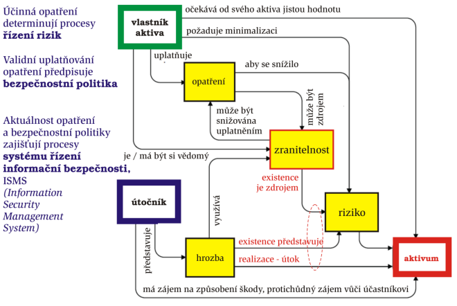

### Mechanismy pro implementaci opatření zajišťujících důvěrnost

- Využívá se **šifrování** pomocí klíčů
  - Klíč je rozsáhlý řetězec bitů (náhodné čísla, prvočísla)
- **Symetrické šifrování**
  - Blokové/Proudové
  - Stejný klíč pro Alici i Boba
  - 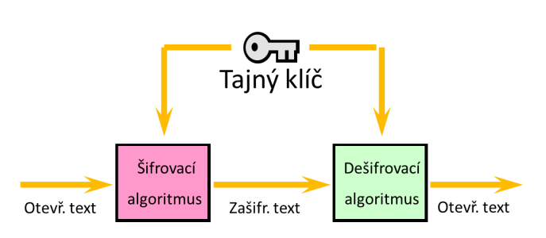
- **Asymetrické šifrování**
  - Privátní klíč (Podpis, dešifrování)
  - Veřejný klíč (Ověření podpisu, šifrování)
  - 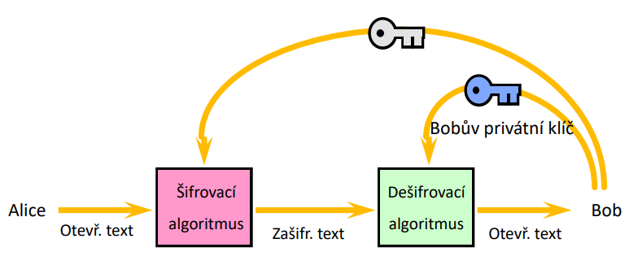

### Mechanismy pro implementaci opatření zajišťujících integritu

- **Hashování**
  - Ke zprávě je připojen otisk zprávy
  - Otisk zprávy je vytvořen hashovací funkcí
    - Požadavek na hashovací funkce:
      - rychlost výpočtu, jednosměrnost, bezkoliznost
      - při změně (1 bitu) se změní nejméně 50 % otisku
  - Ochrana proti pasivnímu útoku
- Message authentication code (MAC)
  - Ochrana proti aktivnímu útoku proti integritě a/nebo autentizaci
- Asymetrické šifrování
  - **Digitální podpis** (zajišťuje i nepopiratelnost)

### Mechanismy pro implementaci opatření zajišťujících autentizaci

- Autentizace entit
  - Něco co znám - heslo, klíč kryptografie, PIN
  - Něco co mám - karta, občanka, řidičák
  - Něco co jsem - otisk prstu, zornička, hlas, podpis
  - Dvoufaktorová autentizace
- Autentizace dat
  - šifrování
  - Jednosměrně pomocí symetrické kryptografie
    - Alice zašle požadavek o komunikaci, Bob zašle náhodné číslo Alici, Alice náhodné číslo zašifruje a zašle ho Bobovi. Bob si dešifruje zprávu a pokud je tam dané číslo, Bob ví, že se jedná o držitele klíče (Alice).
    - Aby se prokázal i Bob, tato komunikace se provede zrcadlově opačně
    - 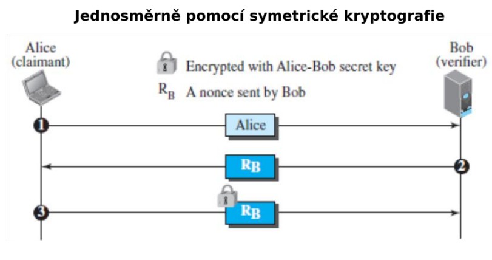
  - Jednosměrně pomocí asymetrické kryptografie
    - Alice zašle požadavek o komunikaci, Bob zašle náhodné číslo a identifikátor, které jsou zašifrovány veřejným klíčem Alice. Alice si tuto zprávu dešifruje pomocí svého soukromého klíče. Alice odstraní identifikátor a číslo pošle zpět.
    - 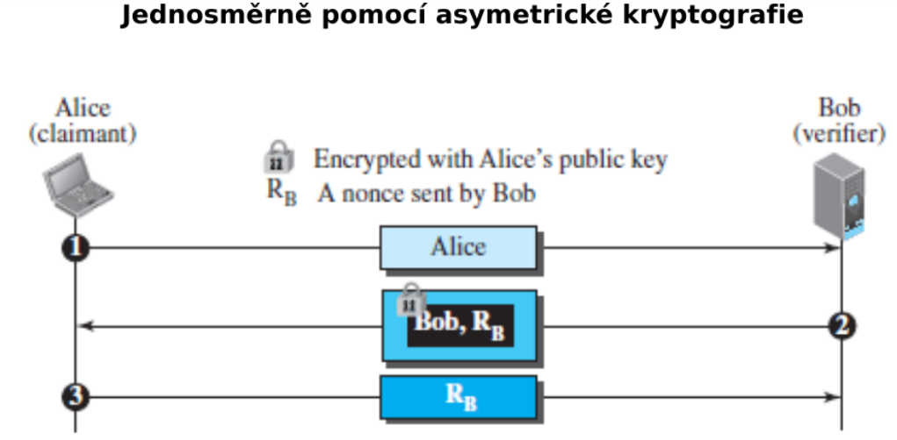
  - Jednosměrně pomocí podpisu
    - Alice zašle požadavek o komunikaci, Bob zašle náhodné číslo. Alice provede podpis identifikátoru a náhodného čísla. Podpis zašle s identifikátorem zpět. Ověření probíhá pomocí věřejného klíče Alice.
    - 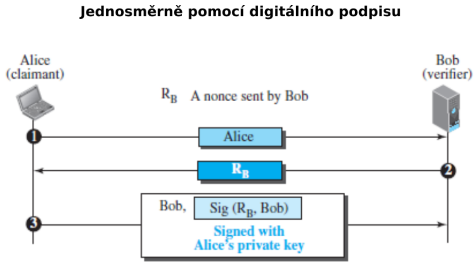

### Správa klíčů

- Pro symetrickou kryptografii
  - Key Distribution Center
  - Drží klíče a generuje klíče pro komunikaci dvou subjektů
- Private Key Infrastructure, Certifikační autorita
  - Pro Asymetrickou kryptografii
    - Private Key Infrastructure
    - Certifikační Autorita
      - Vydává Certifikát -> Dokument držící veřejný klíč a informace o certifikátu, vlastníkovi a certifikačí autoritě
      - Je vytvořena hierarchie certifikačních autorit

## Politika

> Pravidla řídicí dosažení cílů určenými způsoby

- Obvykle dokument implementovaný jako procedura.

### Bezpečnostní procedury

- Dokumenty popisující
  - akce, které se mají provést při útoku
  - role osob vystupujících v bezpečnostních procedurách

### Politika informační bezpečnosti (IT Security Policy)

- Definuje
  - bezpečné používání IT v rámci organizace
  - třídu (sílu) útočníků, vůči kterým se informace organizace zabezpečují
- Stanovuje
  - co jsou citlivá informační aktiva, jejich klasifikaci a odpovědnosti za jejich stav
  - bezpečnostní infrastrukturu organizace z pohledu informační bezpečnosti
  - koncept inf. bezp. org. v horizontu 5-10 let
- nezávislá na konkrétně použitých IT prostředcích.

### Bezpečnostní politika

- Pravidla uplatňování opatření v daném prostředí
- BP říká
  - co proti čemu/komu se chrání
  - stanovuje bezpečnostní cíle a jak jich dosáhnout pomocí opatření
  - jak se tato ochrana prosazuje
- Pro validní prosazování informační bezpečnosti IS je nutné definovat BP odpovídající hrozbám a rizikům pro daný IS
- Nižší BP
  - Plán zvládání rizik IS
  - Dokument stanovující konkrétní opatření
  - Horizont 1 až 2 let
- Vyšší BP
  - Konceptuální zavádění informační bezpečnosti
  - Dokument vymezující chráněnou oblast a základní bezpečnostní cíle
  - Horizont 5 až 10 let

Chceme, aby byly BP důvěryhodné (**trustworthy**; tj. aby prokazatelně jejím uplatňováním docházelo k dosažení požadované úrovně ochrany), a ne jen **trusted** (něco co dostává důvěru ať už zaslouženě nebo ne).

**Politiky organizace** jsou prohlášení o celkovém záměru a směru podnikání vyjádřené vedením organizace

## Anatomie informační bezpečnosti

### Klasifikace aktiv (zákonem o kybernetické bezpečnosti)

- Dle **důvěrnosti** aktiv
  - Nízká
    - Aktiva veřejně přístupná
    - Není vyžadována žádná ochrana
  - Střední
    - Nejsou veřejně přístupná
    - Není vyžadována žádná ochrana
    - např. Know-how
  - Vysoká
    - Nejsou veřejně přístupná, jejich ochrana je vyžadována právními předpisy
    - Přenosy informací jsou chráněny kryptografickými prostředky
  - Kritická
    - nejsou veřejně přístupná a vyžadují nadstandardní míru ochrany
    - Pro ochranu důvěrnosti je požadována evidence osob, které k aktivům přistoupily, a metody ochrany zabraňující kompromitaci ze strany administrátorů
- Dle **integrity** aktiv
  - Nízká
    - Aktivum nevyžaduje ochranu z hlediska integrity
  - Střední
    - Aktivum může vyžadovat ochranu z hlediska integrity
    - Ochrana integrity: standardní nástroje např. omezení přístupových práv pro zápis
  - Vysoká
    - Aktivum vyžaduje ochranu z hlediska integrity
    - Ochrana integrity: prostředky sledující historii provedených změn a zaznamenat identitu osoby provádějící změnu
  - Kritická
    - Aktivum vyžaduje ochranu z hlediska integrity
    - Ochrana integrity: prostředky jednoznačné identifikace osoby provádějící změnu např. pomocí technologie digitálního podpisu
- Dle **dostupnosti** aktiv
  - Nízká
    - Narušení dostupnosti aktiva není důležité a v případě výpadku je běžně tolerováno delší časové období pro nápravu (cca do 1 týdne)
    - Ochrana dostupnosti: pravidelné zálohování
  - Střední
    - Narušení dostupnosti aktiva by nemělo překročit dobu pracovního dne
    - Ochrana dostupnosti: běžné metody zálohování a obnovy
  - Vysoká
    - Narušení dostupnosti aktiva by nemělo překročit dobu několika málo hodin
    - Ochrana dostupnosti: záložní systémy a obnova poskytování služeb může být podmíněna zásahy obsluhy či výměnou technických aktiv
  - Kritická
    - Narušení dostupnosti aktiva není přípustné
    - Ochrana dostupnosti: záložní systémy a obnova poskytování služeb je krátkodobá a automatizovaná

### Zranitelnosti

- Mohou se nacházet v hardware, v software, v datech, v návrhu architektury, fyzickém uspořádání, personální politice, logických a technických opatření..

### Hrozby

#### Typy

- **Uchvácení**
  - Zpožďování provedení služby, odmítnutí poskytnutí služby, Denial of Service (DoS)
- **Podvod**
  - Modifikace dat, falšování identity, popírání autorství
  - Maškaráda - Útočník vystupuje jako legitimní uživate
  - Diseminace zlomyslného software (Planting) - Trojský kůň, vir
  - Modifikace systému, příprava pro příští útoky
- **Odhalení**
  - Slídění, špehování
  - Analýza komunikačního provozu
- **Narušení**
  - Modifikace (dat, programu, chování technického prostředku, …)
    - Neautorizovaná osoba získá přístup do systému a modifikuje v něm uložená data, neoprávněně používá zdroje,

#### Klasifikace hrozeb pro organizaci

- **Vnitřní** hrozby
  - Zdroj hrozby (útočník) se nachází uvnitř (zranitelné) organizace
  - Nezkušený zaměstnanec
- **Vnější** hrozby
  - Zdroj hrozby (útočník) se nachází mimo vnitřní síť organizace
  - Hackeři na Internetu, konkurence, cílení či náhodní nepřátelé

#### Hrozba sémantických útoků

- Nejslabší článěk bezpečnosti je člověk
  - Pouze amatér útočí na počítače a software
  - Profesionál útočí na lidi
- Ochrana proti sémantickým útokům musí být cílená na sociální řešení, ne na matematicko-logická (a technická) řešení
- Nastupuje fenomén kyberprostoru, je nutné fenomén informační bezpečnosti rozšířit na fenomén kyberbezpečnosti
  - Informační bezpečnost řeší narozdíl od kyberbezpečnosti i data na papíře.
  - Kyberbezpečnost řeší i věci nad rámec informační bezpečnosti, neřeší pouze data samotná, ale i lidi

### Útočník

#### Klasifikace útočníka

- slabý (stačí jen slabá opatření)
  - amatér, náhodný útočník
  - bez znalosti systému, využívají pouze existující nástroje, pokus/omyl
- středně silní (středně silná opatření)
  - hacker, vandal, hračička
  - často má znalosti, ale ne zázemí
- silní (nutná silná opatření)
  - profesionál-kriminálník: často se zázemím, motivovaný
- dobře financované organizace
  - schopné utvořit týmy specialistů s top financováním a top nástroji
  - schopné detailních analýz systému a vytváření nových typů útoku
- Dle firmy IBM:
  - cript kiddies, chytří nezasvěcení útočníci, dobře vybavení lidé z venku, zasvěcení insideři, dobře finančně podporované organizace

#### Model útočníka

- Atributy protivníka, které je třeba zvážit
  - Cíle
    - často naznačují cílové aktiva vyžadující zvláštní ochranu
  - Metody
    - techniky útoku nebo typy útoků
  - Schopnosti
      - - výpočetní zdroje, znalosti, dovednosti
  - Úroveň financování
    - ovlivňuje odhodlání útočníka, metody a schopnosti
  - Outsider vs. insider

### Opatření

- nástroj pro snižování rizik
- Typicky kombinace technologie, chování a procedury
- Podmínka efektivnosti opatření: cena opatření <= výše škody
- **Detekční opatření**
  - cílem odhalit a napravit selhání (kterému nešlo zabránit preventivně)
- **Reakční opatření**
  - cílem zajistit správné chování během incidentu a po něm (ohodnocení rozsahu, akce k minimalizaci dopadu, reportování o incidentu)

#### Klasifikace

- **Podle technologie implementace**
  - administrativní
    - standardy pro návrh, kódování, testování a údržbu SW, směrnice pro tvorbu hesel, licenc. podmínky
  - logická (software)
    - funkce řízení přístupu, dig. podpis, antivir, šifrování
  - technická (hardware)
    - tokeny, ID karty, šifrovače, archiv. pamě
  - fyzická
    - trezory, zamčené. dveř
- **Podle koncepce**
  - preventivní:
    - hlavně velká rizika, opatř. jsou drahá
    - autentizace, autorizace, šifrování, řízení přístupu
  - heuristické: pro střední rizika
  - detekční a opravné:
    - povoluje riziko a pak ho řeší
    - detekce útoků, virů, detekce ohně
  - podpůrná
    - identifikace, správa krypto-klíčů
- **Podle oblasti jejich nasazení**
  - Technická opatření
    - arch. systémů, mix HW, SW a firmware
    - Preventivní technická opatření
      - Autentizace, autorizace, řízení přístupu, podpisování, ochrana komunikací,
    - Detekční technická opatření
      - Audit, detekce útoků, návraty do bezpečného stavu, detekce virů
    - Podpůrná technická opatření
      - Identifikace, správa krypto-klíčů
  - Řídící opatření
    - politiky, návody, standardy
    - Preventivní řídicí opatření
      - Přidělení adresné odpovědnosti za bezpečnost kritických podnikatelských procesů
      - Průběžné bezpečnostních školení
    - Detekční řídicí opatření
      - Periodické zkoumání efektivnosti bezpečnostních opatření
      - Vedení průběžného řízení rizik pro ohodnocování a zvládání rizik
    - Opravná řídicí opatření
      - Plán zachování kontinuity činnosti po havárii
      - Plán činnosti po detekci incidentu
  - Provozní opatření
    - Preventivní provozní opatření
      - Virové ochrany
      - Protipožární ochrana
      - Řízený fyzický přístup k datovým médiím
    - Detekční provozní opatření
      - Zajištění fyzické bezpečnosti a bezpečnosti prostředí

### Bezpečnostní mechanismy

- Opatření musíme účinnou formou implementovat vhodnými (bezpečnostními) mechanismy
  - Mechanismy administrativního, technického, logického, … charakteru
  - Opatření řešící problém nepopiratelnosti - digitální podpis
    - mechanismus = asymetrická kryptografie
  - Opatření řešící řízení přístupu
    - mechanismus = fyzické klíče, identifikační karty, biometriky
  - Opatření řešící problém důvěrnosti
    - mechanismus = šifrování, trezory, smluvní závazek (NDA)

#### Klasifikace

- Mechanismy základní síly, slabé bezpečnostní mechanismy
  - Ochrana proti náhodným, neúmyslným útokům, amatérům
- Bezpečnostní mechanismy střední síly
  - Ochrana proti „běžným“ útokům
- Silné bezpečnostní mechanismy
  - Ochrana proti profesionálům, točníkům s vysokou úrovní, znalostí, s velkými příležitostmi, s velkými prostředky

## Generické rysy zabezpečování informací

- Minimalizovat prostor využitelný pro útok
- Jako implicitní řešení používat bezpečná řešení
- Princip nejmenších práv
- Každý externí systém vůči bezpečné aplikaci musí být implicitně považovaný za nedůvěryhodný
- Chybný je koncept „Security through Obscurity“
  - Spoléhá na utajení vnitřních mechanismů před útočníkem – např. ukrytí klíče pod rohožkou
- Separace rolí
- V jednoduchosti je síla, Správně opravovat chyby

# [Přednáška #2](https://is.muni.cz/auth/el/fi/podzim2022/PV017/um/PV017_02.pdf)

- Jak významná je role standardů, bez nich ani ránu
- Legislativní rámec
- Co se rozumí řízením rizik
- Kdo má v instituci na starosti dosažení informační bezpečnosti

- Cíl přednášky
  - Co to jsou standardy, normy, doporučení?
  - Jak vznikají standardy a doporučení?
  - Kdo je kdo ve světě standardů a doporučení ?
  - Které standardy informační bezpečnosti jsou reprezentativní ?

## Standardy (normy) informační bezpečnosti

> Dokument - Dohoda o technické specifikaci nebo jiném stanoveném kritériu

- Používají se abychom mohli dosáhnout určité kvalitativní úrovně systémů a podpořit jejich interoperabilitu
- Standardy lze použít jako měřítko pro porovnávání
- Standard x Norma x Doporučení
  - V Česku se tradičně používá pojem „norma“, celosvětově standard
  - Doporučení - termín používaný některými organizacemi

Produkt, služba, proces, … může **vyhovovat standardu** (prohlášení, že splňuje podmínky standardu) nebo může být **certifikovaný** (existuje certifikát vydaný neutrální třetí stranou, který potvrzuje, že to vyhovuje standardu).

### De facto standard

- Standard vypracovaný v rámci jisté komunity
- před jeho vydáním odsouhlasí, že standard odpovídá jí stanoveným cílům
- De facto standard reprezentuje spíše liberální pohled na svět
- Vyzrálé de facto standardy, které se ukázaly jako efektivní, se často přepracovávají/přebírají na de iure standardy
- Např. standardy RFC (Internet standardy), ISACA (Výpočetní systémy), OWASP (Web aplikace), ISF (Informační bezpečnost)
- Firemní, proprietární standardy
  - Např. PKCS (Public-Key Cryptography Standards) publikovaný RSA Labs

### De iure standard

- Standard „podle práva“
- Schválený autoritou (státní)
- De iure standard reprezentuje silně konzervativní pohled na svět
- Vydávají se pomaleji jak Dfs

### Závaznost standardů

- Žádný standard **není** sám o sobě **právně závazný**.
- Právní předpis může stanovit povinné vyhovění standardu
  - V tom případě se obvykle dává přednost de iure standardům

### ISO Standardy

- ISO (International Organization for Standardization)
- Důležitá rodina standardů ISO/IEC 27000
  - V současnosti celosvětové uznávaný základní standard zajišťování informační bezpečnosti

#### Životní cyklus ISO standardu

- Odpovědnost za tvorbu norem v dílčích oblastech mají technické výbory, Technical Committees, TC
- Návrh nové pracovní položky $\rightarrow$ Committee Draft (2 měsíce) $\rightarrow$ Draft International Standard (6 měsíců) $\rightarrow$ Final Draft International Standard (2 měsíce)
- Obvykle pětiletá perioda hodnocení mezinárodního standardu
  - Když se odhalí vada standardu , jsou přijímána opatření, aby standardy byly revidovány i dříve

#### ISO/IEC 27001 - Systémy řízení bezpečností informací – Požadavky

Definuje požadavky na funkcionalitu a vlastnosti systému správy (řízení) informační bezpečnosti

- Standard je detailním popisem požadavků, které musí/má ISMS splnit, pokud ISMS chce standardu vyhovět
- Je nezávislý na technologii, určený pro organizace všech typů, velikostí a podstat, působících v jakémkoli sektoru, kdekoli ve světě
- 27001 nařizuje použít 27002 jak zdroj návodů pro volbu a implementaci opatření, nezakazuje použití i dalších zdrojů

#### ISO/IEC 27002 - Soubor postupů pro opatření bezpečnosti informací

Doporučení jak navrhovat, implementovat, udržovat a vylepšovat opatření prosazující informační bezpečnost.

#### ISO/IEC 27003 Systémy řízení bezpečnosti informací – Pokyny

Ozkoušené rady pro implementování ISO rodiny 27000, detailnější vysvětlení částí 27001.

### NIST Special Publications (SP)

- rodina `SP 800 Computer security`: guidelines o počítačové/kybernetické/informační bezpečnosti, doporučení a materiály
- rodina `SP 1800 NIST Cybersecurity Practice Guides`: doplňuje rodinu SP 800, soustředí se na konkrétní výzvy kybersecurity, praktické návody jak adoptovat přístupu ke kybersecurity založené na standardech
- rodina `SP 500 Computer Systems Technology`: obecnější

## Legislativa informační bezpečnosti

TODO: Po půlsemestrálce

## Řízení rizik

- Popsáno v **ISO/IEC 27005** - Bezpečnostní techniky – Řízení rizik bezpečnosti informací

### Rizika

- Reprezentují negativní dopad na systém využitím zranitelnosti
- Riziko se vyjadřuje
  - **pravděpodobnost uplatnění hrozby**
  - V pojmech charakterizujících **dopad hrozby**
    - velikost škody způsobené útokem
  - Generické kombinované vyjádření úrovně rizika
    - **úroveň rizika = F(pravděpodobnost útoku) × F´(dopad útoku)**
- Rizika se zvládají volbou a uplatňováním vhodných opatření
- **Faktory určující riziko**:
  - hrozba, zranitelnost, id, osoba zodpovědná za zvládání rizika
  - výše možné škody, pravděpodobnost útoku, typ útočníka.
- Standard `ISO/IEC 27001` požaduje, aby organizace přistupovala k výběru a k provozování bezpečnostních opatření **na základě** znalosti rizik.

### Procesy řízení rizik

1. **Ustanovení kontextu**
   - Vymezení účelu provedení řízení rizik
   - Zajištění zdrojů pro řízení rizik
   - Stanovení kritérií pro vyhodnocení dopadů útoků, úrovní rizik, akceptovatelnosti rizik
2. **Ohodnocení rizik**
    - Výstupem ohodnocení rizik je
      - seznam ohodnocených rizik, řazený podle kritérií hodnocení rizik
      - Prohlášení o aplikovatelnosti vhodných opatření řešících snižování/eliminaci ohodnocených rizik
    - **Identifikace rizik**
    - **Analýza rizik** - určení velikosti rizik
    - **Vyhodnocení rizik**- určení úrovní rizik porovnáním vůči stanoveným kritériím
3. **Zvládnutí rizik**
     - proces modifikující rizika,
     - výběr a implementace opatření snižujících rizika
     - Cílem je určit rizika:
       - která se eliminují
       - která nelze eliminovat a sníží se na akceptovatelnou úroveň
       - která se přenesou smluvně nebo pojištěním na jinou organizaci
       - Určí tolerovaná rizika, pro která se po zvážení odmítla opatření, která by je udržovala na akceptovatelné úrovni, akceptovatelná rizika
4. **Akceptace rizik**
     - rozhodování o přijatelnosti rizika dle stanovených kritérií
     - Odsouhlasení plánu zvládání rizik managementem organizace.
5. **Informování o rizicích**
     - sdělení informace o rizicích všem, kdo může rizika ovlivnit či být riziky ovlivněn
6. **Monitorování a přezkoumávání rizik a procesu řízení rizik**

## Řízení informační bezpečnosti v organizaci - Management, role a odpovědnosti

`ISO/IEC 27014:2013 Information technology - Security techniques - Governance of information security`

- V organizaci musí fungovat systém procesů, standardů a praktik, kterým se řídí a ovládají aktivity zajišťující v organizaci informační bezpečnost
- **Řízení informační bezpečnosti** musí
  - Sladit cíle a strategie informační bezpečnosti s podnikatelskými cíli a strategiemi
  - Dodržovat legislativu, právní předpisy a smlouvy
  - Být posuzováno, analyzováno a implementováno principy
    - danými výsledky řízením rizik
    - podporovanými vnitřním řídícím a kontrolním systémem organizace

### Vrcholový (top) management organizace

- odpovědné za chod organizace jako celku
- vytváří koncepce podnikání a strategie pro rozvoj organizace
- definuje cíle, které jsou na nižších úrovních managementu postupně dekomponovány až na úroveň operativních cílů
- Tradiční struktura organizace - dualistický model řízení
  - správní rada řídí organizaci a dělí své pravomoce a odpovědnosti mezi dozorčí radu a výkonné vedení
  - **Správní rada** (Governing Body)
    - Určuje strategie vymezující politiky řídící činnosti organizace a zajišťuje jejich prosazování/dodržování
    - Skupina osob odpovědných vlastníkům organizace za soulad činností organizace s jejími cíli
    - obvykle dozorčí rada a výkonné vedení
  - **Dozorčí rada** (Supervizory Board)
    - typicky se schází několikrát do roka (obvykle 4-8 x), aby mohlo odsouhlasit zásadní změny ve společnosti.
  - **Výkonné vedení** (Executive Management)
    - Osoba nebo skupina lidí, na které dozorčí rada přenáší odpovědnost za implementaci strategií a politik pro dosažení cílů organizace
      - Veškerý chod organizace je pak delegovaný na výkonného (generálního) ředitele (CEO)
  - Board of Directors, řada ředitelů, nejvyšší (výkonný) management
    - Chief Executive Officer, Chief Financial Officer, Chief Operating Officer
  - Board of Directors – 1, střední (výkonný) management
    - Chief Information Officer, Chief Information Security Officer

### Zásady řízení informační bezpečnosti organizace

- Informační bezpečnost se zavádí v rámci celé organizace
- Odpovědnost za informační bezpečnost a za její sledovatelnost má být promítnuta do všech činnosti organizace
- Zavedení informační bezpečnosti vychází z výstupů procesů řízení rizik
- Investiční strategie informační bezpečnosti je dána podnikatelskými cíli organizace
- Musí být zajištěna shoda s interními a externími požadavky
- Hodnocení výkonnosti informační bezpečnosti musí sledovat cíle podnikatelských činností
- Musí se podporovat prostředí s pozitivním přístupem k informační bezpečnosti

Model (procesů) řízení informační bezpečnosti v organizaci

- 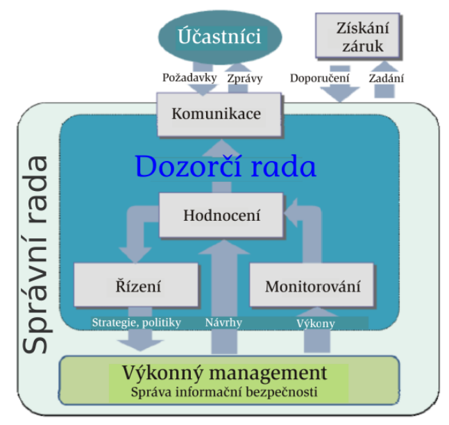

### Procesy řízení informační bezpečnosti organizace

#### Hodnocení

- Správní rada musí
  - Zajistit, aby podnikatelské iniciativy zohledňovaly problémy informační bezpečnosti
- Výkonný management musí
  - Zajistit, aby informační bezpečnost dostatečně podporovala a udržovala plnění
    podnikatelských cílů

#### Řízení

- Správní rada musí
  - Vymezit akceptovatelnou výši rizik pro organizaci
  - Schvalovat strategii a politiku informační bezpečnosti
  - Přidělit odpovídající investice a zdroje
- Výkonný management musí
  - rozvíjet a realizovat strategii a politiku informační bezpečnosti
  - slaďovat cíle informační bezpečnosti s podnikatelskými cíli
  - prosazovat pozitivní kulturu informační bezpečnosti

#### Monitorování

- Správní rada musí
  - Posuzovat účinnost řídicích aktivit informačních činností
  - Zajišťovat shodu s interními a externími požadavky
  - Brát do úvahy měnící se podnikatelské, právní a regulační prostředí a potenciální
    dopad jejich změn na informační rizika
- Výkonný management musí
  - Vybrat výkonnostní metriky relevantní z hlediska podnikání
  - Poskytovat správní radě zpětnou vazbu o výsledcích měření výkonu opatření
    informační bezpečnosti, včetně jejich dopadů na organizaci
  - Upozorňovat správní radu na nové skutečnosti týkajících se informačních rizik a
    informační bezpečnosti

#### Komunikace

- Správní rada musí
  - Externím zainteresovaným stranám sdělovat, že organizace uplatňuje úroveň informační bezpečnosti přiměřenou povaze jejího podnikání
  - Sdělovat výkonnému managementu výsledky externích přezkumů, ve kterých byly identifikovány problémy v oblasti informační bezpečnosti, a požadovat po něm zajištění nápravných opatření
  - Rozpoznávat legislativní závazky, očekávání zainteresovaných stran a potřeby podnikání z oblasti informační bezpečnosti
- Výkonný management musí
  - Informovat správní radu o všech záležitostech, které vyžadují pozornost a případně i rozhodnutí
  - Instruovat příslušné zúčastněné strany detailních akcích, které se mají provést na podporu prosazení směrnic a rozhodnutí správní rady

#### Získání záruk

- Správní rada musí
  - Objednávat nezávislé a objektivní názory na to, jak plní své odpovědnosti za
    zajištění a udržení požadované úrovně informační bezpečnosti
- Výkonný management musí
  - podporovat provádění auditu, hodnocení nebo certifikace objednané správní
    radou

**Řízení informační bezpečnosti** podle `ISO/IEC 27002`

- `ISO/IEC 27002` je (neúplným) výčtem použitelných opatření pro řízení informační bezpečnosti (cca 150 nástrojů v 11 skupinách). Vesměs orientované na zpracování informací vlastním týmem nebo třetí stranou.

- Aby uplatnění standardu bylo ok, musí být *vypracována bezpečnostní politika* reflektující bezpečnostní cíle, *management musí politiku prosazovat* a má být *implementovaný měřící systém* pro hodnocení řízení informační bezpečnosti.

- Standard vyžaduje na vysoké úrovni abstrakce bezpečnostní politiku
  $-$ bezpečnostní cíle organizace
  $-$ systém pro analýzu a vyhodnocení rizik a volbu opatření
  $-$ požadavky na vyhovění specifickým politkám, zákonným standardům, smluvním požadavkům, …
  $-$ odpovědnost za správu bezpečnosti

  Tato politika je odsouhlasena managementem, předložena zaměstnancům a třetím stranám, je pravidelně přezkoumávána a obsahuje jasně definované odpovědnosti za informační bezpečnost.

### Management organizace (z pohledu informační bezpečnosti)

- Správní rada – výkonný management + dozorčí rada
- Nejvyšší výkonný management (Board of Directors)
- Střední výkonný management (Board of Directors – 1)
- Řídící výbor (informační bezpečnosti), příp. samostatných architekt informační bezpečnosti
- Ředitel odboru (manažer) informační bezpečnosti, CISO, Chief of Information Security Officer
- Lokální správci (informační bezpečnosti)
- Administrátoři systémů
- Auditoři

### Odpovědnosti řídícího výboru informační bezpečnosti

- <u>Stanovuje</u>:
  Cíle informační bezpečnosti.
  Oblast působení ISMS.
  Hodnoty akceptovatelného rizika pro aktiva.
  Metriky vyhovění bezpečnostním politikám a jejich periodické kontrolování.
- <u>Odsouhlasuje</u>:
  Role, odpovědnosti, metodologie a procesy použité pro dosažení informační bezpečnosti.
  Validnost funkce ISMS.
  Přidělení rolí a odpovědností stanovených bezpečnostní politikou.
  Hlavní iniciativy vylepšování informační bezpečnosti v organizaci.
- <u>Zajišťuje</u>:
  Aby si celá organizace byla vědoma toho, jak se řeší informační bezpečnost.
  Dostatečné zdroje pro vývoj, implementaci a provozování ISMS.
  Koordinaci implementací bezpečnostních opatření napříč organizací.
  Provedení adekvátních kroků cílených na vylepšení ISMS.
  Posuzování ISMS managementem.
- <u>Posuzuje</u>:
  Adekvátnost opatření a koordinování jejich implementací.
  Význam bezpečnostních incidentů.
  Bezpečnostní politiku, schvaluje ji.
- <u>Sleduje</u>:
  Změny klíčových informací aktiv a jejich vystavení hrozbám.
- <u>Kontroluje</u>:
  Existenci zdrojů pro dosažení cílů.
  Dostatečnou integraci ISMS do procesů organizace.
  Plnění programu bezpečnostního uvědomnění a chápání ISMS.

### Manažer informační bezpečnosti, CISO

- Vypracovává seznam stran zainteresovaných na ITSec, seznam požadavků na ITSec od/na zainteresované strany
- Koordinuje činnosti související s ochranou osobních dat
- Posuzuje rizika, kvalitu ISMS
- Navrhuje metody autentizace, šifrování

- Oblasti práce:

  <u>Vyhovění legislativním, regulačním a smluvním požadavkům</u>

  <u>Oblast řízení rizik</u>: Navrhuje výběr opatření, identifikuje změny rizik a zajišťuje reakci, koordinuje ohodnocování rizik, iniciální posouzení rizik, zajišťuje že vrcholový management odsouhlasuje vše potřebné (rizika, plán zvládání, přístup k řízení, …)

  <u>Oblast řízení lidských zdrojů</u>: Ověřuje uchažeče o zaměstnání z hlediska ITSec, vypracovává plán školení v oblasti ITSec, zvyšuje povědomí o ITSec, navrhuje disciplinární řízení.

  <u>Ve vztahu s vrcholovým managementem</u>: Komunikuje. Navrhuje opatření, náklady a zdroje, sděluje důležité info, rizika, poskytuje rady.

  Navrhuje rozpočet, vylepšení a opravy <u>ITSec</u>, sděluje výsledky, dohlíží na opravné akce (a zodpovídá za ně), informuje o postupu. Eviduje info o aktivech. Bezpečně likviduje stará zařízení.

  <u>U třetích stran</u>: Ohodnocuje rizika, kontroluje vhodnost kandidátů, definuje položky do smlouvy týkající se ITSec.

  Definuje akceptovatelné komunikační kanály.

  Koordinuje analýzy dopadů katastrofických indidentů a plán činnosti po nich, koordinuje cvičení a testování plánů. Po incidentu oponuje plán obnovy.

  <u>V technické bezpečnosti</u>: Odsouhlasuje metody ochrany dat mobilních zařízení, sítích, kom. kanálech. Navrhuje metody autentizace, politiku hesel, šifrování, … Definuje principy bezpečného vývoje, vlastnostni online služeb. Analyzuje záznamy o činnosti uživatelů (hledá podezřelou).

  <u>V oblasti správy dokumentů</u>: Navrhuje drafts dokumentů v ITSec (politiky, metody řízení rizik, plán zvládání, …). Odpovídá za oponování a aktualizaci těchto dokumentů.

  <u>Oblast správy bezpečnostních incidentů</u>: Přijmá zprávy o bezpečnostních incidentech, koordinuje reakce na ně, zprávy o nich, připravuje důkazy pro právní řízení po incidentech. Analyzuje incidenty (vč. prokázání příčin s cílem prevence), určí adekvátní opravné/preventivní akce. Spolupracuje na plánu zachování činnosti po incidentech, navrhuje korekce toho plánu, a školí o tom.

### Odpovědnosti za informační bezpečnost

- Oddělení IT
  - Bezpečnost servroven
  - Zajištění výkonu bezpečnostních opatření systémů, za které odpovídají
- Lokální administrátoři/správci systémů
  - monitorování systémů, příprava bezpečnostních postupů
- Správci systémů na úrovni systému
  - Identifikace hrozeb, hodnocení rizik, implementace vybraných systémových opatření
- Správci sítí na úrovni domény nebo samostatné sítě
  - Identifikace hrozeb v mezích sítě, hodnocení rizik, implementace vybraných síťových opatření
- Správci areálů
  - Identifikace hrozeb, hodnocení rizik, implementace vybraných fyzických opatření
- Uživatelé IT
  - dodržování přihlašovacích pravidel, zálohování dat
- Třetí strany
  - odpovědnosti stanoveny ve smlouvě

# Přednáška #3

- Politiky jako specifikátory toho co a jak dělat
- Systém procesů zajišťující kontinuální efektivitu zabezpečování
- Jak takový systém procesů projektovat
- Schvaluje metody ochran mobilních zařízení a komunikací

## Politika

**Politika** = systém pravidel řídící dosažení cílů určitými způsoby

**Politika organizace**: Prohlášení o celkovém záměru a směru podnikání, formálně vyjádřené vedením organizace.

- Organizace může mít řadu politik, jednu pro každou z oblastí činnosti, které jsou pro organizaci důležité.

Pro oblasti bezpečnosti organizace mají být politiky organizovány hierarchicky

**Hierarchie bezpečnostních politik**

1. **Bezpečnostní politika organizace** (nejvyšší politika)

   Souhrn bezpečnostních zásad a předpisů, množina pravidel definujících správu a ochranu aktiv organizace. Definuje způsob zabezpečení jako celku. Je typicky podpořena mnoho dalšími politikami (z oblasti ITSec - InfoSec, ISMS politika - i mimo, např. Business Continuity Plan).

   Standard `ISO/IEC 27001` (a asi `27002` pro InfoSec) žádá, aby organizace měla <u>Politiku ISMS</u> (vyžadovaný) a <u>Politiku informační bezpečnosti</u> (to samé jako politika InfoSec). Obě mohou být vytvořeny jako doplňující se nebo být v libovolné závislosti.

   [Nebo je ISMS politika podle `27000 Plán zvládání rizik`, já fakt nevím, slajdy si protiřečí na 3 místech.]

2. **Politika InfoSec**: Jak a proti čemu chránit.
  
   Souhrn bezpečnostních zásad a předpišů pro ochranu informačních aktiv. Definuje bezpečné používání IT v rámci organizace. **Stanovuje koncepci informační bezpečnosti** v horizontu 5-10 let.

   Říká, co jsou citlivá informační aktiva, jakou mají klasifikaci, odpovědnost za ně, bezpečnostní infrastrukturu organizace, definujie sílu útočníků, vůči kterým se organizace zabezpečuje. **Nezávislá** na konkrétních IT technologiích.

   Bývá podpořena řadou detailních politik na konkrétní aspekty ITSec (řízení přístupu, emaily, používání síťových služeb, …).

   Politika se běžně vyjadřuje v běžném jazyce, neformálně (ale je pak systém hodnocen jako systém s nízkou úrvoní záruky). Vyšší úroveň záruky za důvěryhodnost politiky poskytuje semi-formální vyjádření (a/nebo bohatší škála opatření), popřípadě vyjímečně i formální logicko-matematciké jazyky.

3. **Politika ISMS** (= bezpečnostní politika systému zpracování informací): Jak navrhovat, vyvíjet, provozovat a hodnotit procesy plnící politiku InfoSec.

   Určuje způsob zabezpečení informací v daném systému v horizontu 2-5 let. Definuje **konkrétní** cíle co se proti čemu chrání, konkrétní opatření, použité mechanismy pro implementaci opatření, havarijní plán a plány činnosti po útocích.

   Detailní normy, pravidla, praktiky, předpisy konkrétně definující způsob správy, ochrany, distribuce citlivé informace a jiných IT zdrojů v oblasti vymezené systémem pro zpracování informací organizace. **Musí respektovat** konkrétní IT technologie.

### Tvorba politik informační bezpečnosti

Definice politiky InfoSec a politiky ISMS je 1. krok při budování ISMS.

- Tvorba politiky je obvykle **iterativní** proces
- Politika musí být
  - Schválená vedením organizace
  - Pravidelně přezkoumávaná a aktualizovaná
- **Iniciální dokument** deklaruje politiku a odpovídá na klíčové otázky jako:
  - Pro koho bude politika informační bezpečnosti závazná?
  - Kde bude oblast působnosti politiky informační bezpečnosti?
  - Co politika informační bezpečnosti chrání ?
  - Proč se politika informační bezpečnosti zavádí ?
- **Politika informační bezpečnosti** má pokrývat/obsahovat:
  - Kritéria evaluace (vyhodnocení) rizik a strukturu procesu jejich ohodnocení
  - Strukturu procesu ohodnocení rizik
  - Nástin přístupu k řízení rizik
  - Prohlášení, že vedení bude podporovat ISMS a pravidelně politiku přezkoumávat
- Tipy
  - Zaměstnanci musí být školení pro dodržování bezpečnostní politiky
  - Bezpečnostní politika nebude organizaci chránit před všemi možnými hrozbami
  - Politika informační bezpečnosti by měla být klíčovým faktorem při všech rozhodnutích o činnosti organizace
    - není pravda, že ovlivňuje činnost pouze IT oddělení
- Většina organizací vytváří politiku informační bezpečnosti podle standardu ISO/IEC 27002
- Důvěryhodná bezpečnostní politika zpracování informací je základní kámen **systému řízení informační bezpečnosti ISMS**

Důležitou součástí správy politik je **auditní činnost** zabezpečována nezávislými rolemi (na executivě a těch co vše navrhují)

- Cíle auditu: Kontrola správné definice bezp. procedur. Detekce neošetřených či neadekvátně pokrytých míst. Popř. po narušení jak k tomu došlo a kdo je odpovědný.
- Postup auditu se definuje jako součást procedur správy a provozu systému. Auditor musí být schopný audit vykonat bez rad monitorovaných entit.

Většina organizací vytváři politiku informační bezpečnosti dle standardu `ISO/IEC 27002` (politika založená na řízení rizik).

## Systém řízení informační bezpečnosti (ISMS)

Reprezentace jak organizace přistupuje k rizikům daným orientací na informační ekonomiku

- Cílem ISMS je zajistit trvalou aktuálnost politiky informační bezpečnosti a trvalou úroveň zabezpečení informací
- systém řízení , který je
  - Dokumentovaný, systematicky implementovaný a řízený
  - Trvale přezkoumávaný, auditovaný a kontrolovaný, vylepšovaný
  - DŮVĚRYHODNÝ systém pro řízení informační bezpečnosti
- Z pohledu oblasti působnosti
  - Jde o formální strukturu zajišťující konzistentní prosazování politiky informační bezpečnosti v oblasti, za kterou je management odpovědný
- Cíl řízení pomocí procesů ISMS
  - Správně fungující procesy podporující informační bezpečnost (autentizace, řízení přístupu, zálohování, podpisování, …) v činnostech organizace

### ISO 27001/27002

- **Bází pro budování ISMS** jsou standardy ISO 27001/ISO 27002
  - 27001
    - Říká jak navrhnout ISMS a co má ISMS dělat
    - Splnění požadavků ISO 27001 lze potvrzovat certifikací
      - Důkazem důvěryhodnosti ISMS
      - v současnosti drží certifikát splnění ISO 27001 tisíce ISMS
      - Musí existovat národní akreditační úřad (NAU)
      - Certifikaci provádí třetí, nezávislá certifikační instituce
        - u NAU se akredituje certifikační autorita
      - **Certifikát ISO 9000 říká** - My jsme organizace kvalitně fungující z hlediska procesů činnosti (byznysu)
      - **Certifikát ISO 27001 říká** - My jsme organizace kvalitně pečující o bezpečnost informací pomocí procesů cílených na zajištění informační bezpečnosti
    - 27001:2013 - Specifikace ISMS ≡jak musí být ISMS udělaný
      - Mimo jiné specifikuje Cíle a principy vybraných bezpečnostních opatření
    - ISO/IEC 27001 obsahuje seznam nástrojů dle ISO/IEC 27002 jako menu
      - Organizace přijímající ISO/IEC 27001 si z menu potřebné nástroje vybírá
      - Výběr musí vycházet z výsledků analýzy rizik
      - Škála opatření může být adekvátně rozšířena vůči ISO/IEC 27002
  - 27002
    - která bezpečnostní opatření může/má zabezpečovaný systém obsahovat

### Výčet požadovaných a doporučovaných částí ISMS

- **Dokumentace** by měla obsahovat:
  - info o kontextu působení ISMS (oblast, politika bezpečnosti, cíle)
  - o rizicích (jak se ohodnocují, zvládají, jak na ně jde aplikovat opatření)
  - info o aktivech, info o podpory ze strany organizace.
  - K tomu by měla mít info o protokolech různých věcí, jako o školeních, monitorováních, auditech, korekcí…
  - A různé politiky (např. hesel, likvidace věcí, klasifikace informací, work from home, …)
- Dokumentace doporučená
  - Správa dokumentů
  - Nástroje pro správu protokolů
  - proces opravné akce,
  - politika vzdálené práce, klasifikace infcí, hesel, likvidace a destrukce, čistého stolu a monitoru, změn. řízení, zálohování, dopadů činnosti na IB
  - plán cvičení a testování, údržby, oponentur
  - strategie zachování činnosti
- Záznamy požadované
  - zápisy ze schůzí, zprávy specialistů, (oponentní) zprávy
  - seznamy (aktiv, hrozeb, ...)
  - výsledky auditů, testování
  - výsledky měření a monitorování vč. KPI
  - závěry z oponentur (jednání mngmentu)
  - výsledky opravných akcí
  - logy uživ. aktivit, BU, …

### Postup budování ISMS

1. vydání seznamu aktuálních relevantních bezpečnostních problémů
   - Pokud bude (certifikační) auditor pochybovat nebo bude nejistý, bude hledat radu a objasnění ve standardu
   - To co standard nespecifikuje, to ještě nemusí být chybné - Standard vymezuje minimální požadavky, nikoli maximální požadavky
2. Zredukujte v zadání vše, co vypadá potencionálně složité, náročné na čas či zdroje, obtížné, … na to, o čem je každý přesvědčen, že je realizovatelné v rámci určeného času a přidělených zdrojů
3. Vymezit oblast toho, kde ISMS bude působit.
   - Vymezení hranic toho, co se plánuje implementovat
   - Ideálně jet podle standardu `27001` a `27002`

### Role participující na realizaci ISMS

- CEO
  - Odpovědnou osobou za ISMS vůči vedení firmy typicky bývá výkonný ředitel , CEO , Chief Executive Officer
  - CEO může, ale nemusí být (a nebývá) šéfem projektu ISMS
  - CEO musí plně podporovat šéfa projektu , poněvadž projekt ISMS je podnikatelský projekt, nikoli pouhý IT projekt
  - CEO musí šéfovi projektu ISMS definovat strategická rizika pro organizaci a jejich projevy/preference z pohledu rizik pro informační bezpečnost
- CISO
  - správce informační bezpečnosti, role daná statutem organizace, má odpovědnost za zajišťování informační bezpečnosti
- Šéf projektu ISMS

  - osoba pověřená řízením vlastního projektu ISMS, role není standardem vázaná na roli CEO nebo na CIS

- Projekt ISMS je projektem změny řízení v organizaci
  - Vrcholový management se musí průkazně zavázat, že na realizaci projektu ISMS zajistí ekonomické a personální zdroje
- Návrh a implementace ISMS je problém řízení, nikoli technologický problém
  - Dobrý manažer i bez znalostí a hlubokého porozumění technologiím zabezpečování a bez proniknutí do podstaty těchto technologií je schopný úspěšně vést návrh a implementaci ISMS

### Projekt zavedení, implementace ISMS

- ISO/IEC 27003
  - Návod k implementaci ISMS
- Co je to projekt
  - soustava činností směřujících k předem stanovenému a jasně definovanému cíli

#### Fáze zakázky projekt implementace ISMS

- ZAHÁJENÍ PROJEKTU IMPLEMENTACE ISMS
  - Získání souhlasu vedení organizace s projektem implementace ISMS
  - Definování oblasti působnosti ISMS a politiky ISMS
  - Dílčí fáze
    - Uvědomění potřeby ISMS
    - Získání odborných zkušeností
    - Vymezení prostoru
    - Formulování politiky
- PŘÍPRAVA IMPLEMENTACE ISMS
  - Analýza požadavků organizace na informační bezpečnost
  - Ohodnocení rizik a vypracování plánu zvládnutí rizik
- NÁVRH ISMS
  - Návrh a implementace ISMS
    - Úspěch projektu znamená splnění cíle ve třech dimenzích
      - Věcně (CO, JAK, a V JAKÉ KVALITĚ se má udělat)
      - Časově (KDY má být co provedeno - etapy/fáze, kroky, úkony)
      - Nákladově (ZA KOLIK se to má udělat, nejprve ve spotřebované práci a pak v penězích)

### Model PDCA

- Standard ISO/IEC 27001 původně direktivně předpisoval použít pro projekt implementace ISMS procesní přístup podle metodologie PDCA
- Model Plan-Do-Check-Act , PDCA - cyklický proces:
  - Plan (zavedení ISMS, projekt a detailní návrh ISMS)
    - Definice oblasti ISMS, politiky inf. bez., přístupu k ohodnocování rizik
  - Do (implementace ISMS)
    - Formulace plánu zvládání rizik a jeho dokumentace
    - Implementace opatření v plánu zvládání rizik
  - Check (sledování, monitorování, měření efektivnosti ISMS)
    - Monitorování, ohodnocování, testování, audit činností řízených ISMS
  - Act(definice vylepšení ISMS) - Provedení oprav, identifikace, dokumentace a implementace vylepšení
    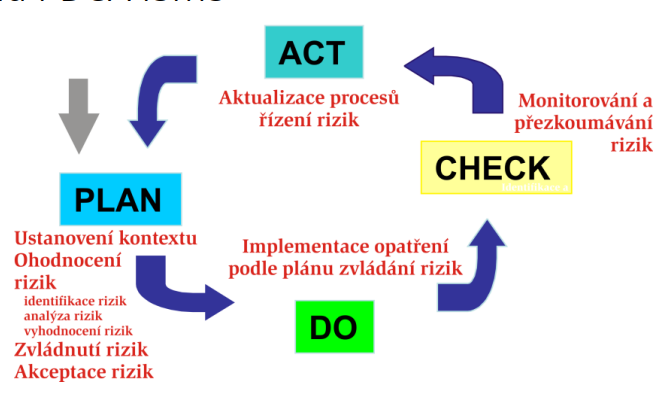

### Dokumentace ISMS

- ISO 27001 požaduje dostupnost dokumentace
- Tvorba dokumentace ISMS je časově nejnáročnější část projektu
- Dokumentace ISMS musí být
  - Úplná, vyčerpávající
  - V souladu s požadavky standardu ISO 27001
  - Dostupná a použitelná a adekvátně chráněná

### 4-vrstvá struktura dokumentové základny ISMS

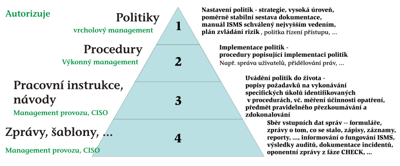

- Autorizační úrovně dokumentace

- 1. úroveň - vrcholový management, Board of Directors
- 2. úroveň - CSO (Chief Security Officer), správce bezpečnosti po projednání s řídicím výborem informační bezpečnosti
- 3. úroveň - CISO (Chief Information Security Officer), správce informační bezpečnosti + šéfové oddělení/odborů organizace
- 4. úroveň - CISO (Chief Information Security Officer), správce informační bezpečnosti + šéfové oddělení/odborů organizace

1. vrstva - **Politiky**
   - Nastavení politik - strategické poměrně řídce měněné dokumenty na vysoké úrovni abstrakce, stanovení principů
   - Dokumenty autorizované nejvyšším managementem
2. vrstva - Procedury
   - Popis procedur pro implementaci politik, nastavení podnikatelských požadavků, procedur a procesů
   - Dokumenty autorizované výkonným managementem
3. vrstva - Pracovní instrukce
   - Dokumenty typu smlouva s uživatelem, popis práce, apod.
4. vrstva - Zprávy
   - Zprávy o tom, co se stalo, jak ISMS běžel

### ISMS dále obsahuje dokumenty

- Z oblasti správy informační bezpečnosti
  - Soupis citlivých informačních aktiv v oblasti
  - Hodnocení zranitelností, hrozeb a rizik pro tato aktiva
  - Manuál ISMS obsahující Prohlášení o aplikovatelnosti
- Z oblasti nástrojů pro plnění správy informační bezpečnosti
  - sestava popisů procesů, politik, procedur a návodů k činnostem zajišťující informační bezpečnost v oblasti

### Typická dokumentová základna ISMS

- Dokumenty tvořící Manuál ISMS, Důkazy akcí provedených organizací, Popis systému řízení informační bezpečnosti, Plán zvládání rizik, Procedury řídící správu a inspekci ISMS, Pracovní instrukce, Formuláře, šablony, zprávy o auditech

### Testování

- Typy: ext. nebo int. audit
- Testy podle koncepce:
  - myšlenkové: logické testování na papíře
  - reálné: penetrační testy, ztráty energie, …
  - scénářově orient. testy

----- From here based on hojkas doc

# Přednáška 4

[Nebyl záznam. Vytvořeno pouze ze slidů.]

## Kyberbezpečnost

**2 modely:**

- **Identifikační model**: USA + jihoamerické státy.
  - \+ Efektivní, univerzální.
  - \- Velká míra zásahu do informačního soukromí.
  - \- Problém výpadků, nedostatek mezinárodní podpory.
- **Model ochrany prostředí**: EU, ČR
  - \+ Performativní pravidla, chytrá regulace.
  - \+ Menší zásah do informačního soukromí.
  - \- Méně efektivní, institucionální oddělení.

**Právní úprava kyberbezpečnosti:**

- `Zákon č. 181/2014 Sb.`, **o kybernetické bezpečnosti** (ZKB/ZoKB)
- `Zákon č. 240/2000 Sb.`, **o krizovém řízení** a o změně některých zákonů (krizový zákon)
- `Zákon č. 365/2000 Sb.`, **o IS veřejné správy** (ISVS)
- `Směrnice (EU) 2016/1148` o opatřeních zajištění vysoké společé úrovně bezpečnosti sítí a informačních systémů v Unii (**směrnice NIS**)
- `Nařízení (EU) 2019/881` o agentuře ENISA, o certifikaci kybernetické bezpečnosti informačních a komunikačních technologií (“**akt o kybernetické bezpečnosti**”)
Sektorová regulace (např. energetika, bankovní a finanční služby), obecná regulace

**Graf účastníků a akcí v ZKB (zákonu o kybernetické bezpečnosti):**

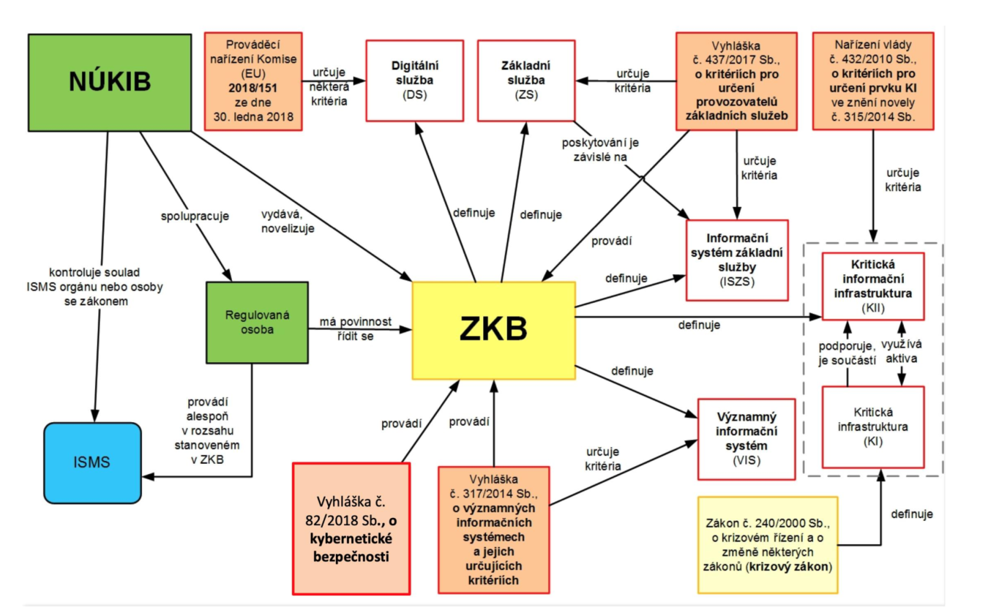

[NÚKIB = Národní úřad pro kybernetickou a informační bezpečnost]

 ### Druhy systémů které mají speciální povinnosti dle zákona o kyberbezpečnosti

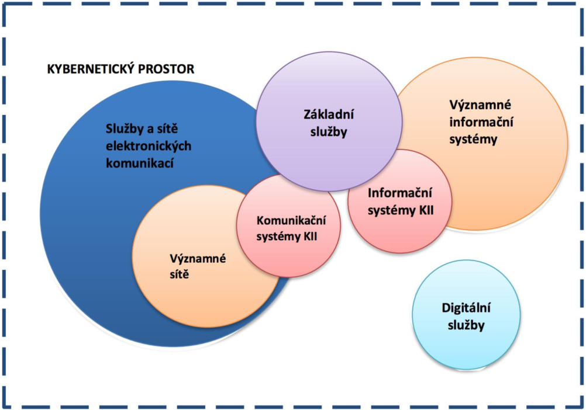

- **Služby a sítě elektronických komunikací**
  - Určování neprobíhá, osoby jsou definovány zákonem o elektronických komunikacích
  - Sféra Národního CERTu. Povinnost nahlásit konktakní údaje.
- **Významné sítě** = “síť elektronických komunikací zajišťujících přímé zahraniční propojení do veřejných komunikačních sítí nebo zajišťující přímé připojení ke kritické informační infrastruktuře”
  - Určování neprobíhá, povinný subjekt určen přímo definicí v ZKB.
  - Sféra Národního CERTu. Povinnost hlásit kontaktní údaje, detekovat kybernetické bezpečnostní události a hlásit incidenty.
- **Kritická informační struktura** (KII) = prvek nebo systém prvků kritické infrastruktury (KI), komunikační a informační systémy v oblasti kybernetické bezpečnosti.
  - Komplex informačních a komunikačních systémů, jejichž narušení by mohlo mít vážný dopad na bezpečnost státu, zabezpečení základních životních potřeb obyvatel, zdraví osob nebo ekonomiku státu. Systémy důležité pro chod státu a ekonomiky.
  - Určena podle stanovených kritérií v oblasti kybernetické bezpečnosti a krizového zákona.
    Týká se veřejnoprávních i soukromých subjektů.
  - Sféra Vládního CERTu, určuje/navrhuje NÚKIB.
  - Nejpřísnější regulace - povinnost plnit celý ZKB. Hlásit kontaktní údaje, detekovat a hlásit incidenty, povinnost zavést bezpečnostní opatření podle vyhlášky č. 82/2018 Sb. Nutno provádět ochranná a reaktivní opatření vydané NÚKIBem.

- **Významný informační systém** = systém spravovaný orgánem veřejné moci, který není kritickou informační infrastukturou ani informačním systémem základní služby, a u kterého narušení informační bezpečnosti může omezit/ohrozit působnost daného orgánu veřejné moci.
  - Pouze státní sektor.
  - Určeno: Buď automaticky pokud je systém zahrnut do přílohy vyhlášky č. 317/2014 Sb, nebo pokud orgán/osoba usoudí, že systém naplňuje kritéria této vyhlášky, a nahlásí se NÚKIBu.
- **Základní služby** = služby, jejichž poskytování je závislé na informačních systémech/sítích elektronických komunikací, a jejichž narušení by mohlo mít významný dopad na zabezpečení společenských/ekonomických činností v určitém odvětví (energetika, doprava, bankovnictví, finanční trhy, zdravotnictví, vodohospodářství, digitální infrastruktura nebo chemický průmysl).
  - Určuje NÚKIB na základě kritérií z vyhlášky š. 437/2017 Sb, poté osloví relevantní subjekty a zahájí správní řízení o určení provozovatele dané služby.
- **Digitální služby** = služby informační společnosti spočívající v provozování online-tržiště, internetového vyhledávače nebo cloud computingu.
  - Určeno: Sám orgán/osoba posoudí naplnění kritérií a případně se nahlásí Národnímu CERT.
  - Regulace se netýká malých a mikro podniků (<50 lidí, <10 milion € obrat).

**Instituty ZoKB**:

- Mají **obecné povinnosti**: Sbírat kontaktní údaje, sdělovat bezpečnostní opatření (organizační, technická)
- Mají **operativní povinnosti**: Řešit hlášení incidentů (kybernetický bezpečnostní incident = KBI), varování před možnými hrozbami, protiopatření (reaktivní, ochranná)
  - reaktivní protiopatření: reaguje na KBI, rozhodnutí nebo opatření obecné povahy
  - ochranná protiopatření: reakce na výsledek analýzy KBI, opatření obecné povahy
- Řeší **stav kybernetického nebezpečí** = stav, kdy je ve velkém rozsahu ohrožena bezpečnost informací nebo služeb elektronických komunikací nebo bezpečnost a integrita sítí elektronických komunikací (a tím by mohlo dojít k porušení nebo ohrožení zájmu České republiky ve smyslu zákona o ochraně utajovaných informací)
  - Rozhoduje ředitel NÚKIB, povinnost zveřejnění, max 7/30 dnů, možnost navazujícího nouzového stavu.
- Stanovují **požadavky na dodavatele**
- Vydávají **certifikace**

## Ochrana osobních údajů

**GDPR**: Nařízení Evropského parlamentu a rady (EU) `2016/679` o ochraně fyzických osob v souvislosti se zpracováním osobních údajů

Zákon `č. 110/2019 Sb.` Zákon o zpracování osobních údajů.

> Osobními údaji (se rozumí) veškeré informace o indentifikované nebo identifikovatelné fyzické osobě; identifikovatelnou fyzickou osobou je fyzická osoba, kterou lze přímo či nepřímo identifikovat, zejména odkazem na určitý identifikátor, například jméno, identifikační číslo, lokační údaje, síťový identifikátor nebo na jeden či více zvláštních prvků fyzické, fyziologické, genetické, psychické, ekonomické,  kulturní nebo společenské identity této fyzické osoby.

**Zpracování osobních údajů**: Jákakoliv operace nebo soubor operací s osobními údaji.

**Zásady** zpracování osobních údajů platí pro kohokoliv, kdo je zpracovává.

- Osobní údaje musí být ve vztahu k subjektu zpracovávány korektně a zákonným a transparentním způsobem.
- Zásada limitace účelem.
- Zásada minimalizace údajů (pouze nezbytný rozsah).
- Zásada přesnosti.
- Zásada omezení uložení (právo být zapomenut).
- Zásada integrity a důvěrnosti.
- Zásada odpovědnosti.

**Zákonnost zpracování v GDPR**: [situace kdy je zpracování osobních údajů OK]

- Existuje souhlas se zpracováním.
- Zpracování nezbytné pro plnění smlouvy.
- Zpracování nezbytné pro dodržení právní povinnosti správce.
- Ochrana životně důležitých zájmů subjektu údajů (souhlas bez zbytečného odkladu)
- Zpracování nezbytné pro plnění úkolu ve veřejném zájmu, nebo při výkonu veřejné moci, kterým je pověřen správce [Např. policie?]
- Nezbytnost zpracování pro ochranu práv a právem chráněných zájmů správce, příjemce, nebo jiné dotčené osoby.

**Práva subjektů údajů** [v GDPR]

- Právo být informován o zpracování osobních údajů
- Právo na přístup k údajům
- Právo na opravu, výmaz (“právo být zapomenut”)
- Právo na omezení zpracování
- Právo na přenositelnost údajů
- Právo vznést námitku
- Právo na ochranu před automatizovaným individuálním rozhodování, včetně profilování

**AI Act** - návrh nařízení Evropského parlamentu a rady, kterým se stanoví harmonizovaná pravidla pro umělou inteligenci

# Přednáška 5

## SDLC vs Secure SDLC

**SDLC** = **S**oftware **D**evelopment **L**ife**C**ycle (např. waterfall-based SDLC, agilní SDLC, …)

Typicky fáze: (akorát třeba u agilních v cyklu)

$Requirements \rightarrow Design \rightarrow Implementation \rightarrow Verification \rightarrow Release \rightarrow Respose$

Cílem **Secure SDLC** je zavést do všech fází klasického SDLC bezpečnostní prvky (kterými se zajistí, že se s bezpečností počítá od začátku, zákazník bude mít bezpečný sw, data atd.)

## Microsoft SDL

Jenom jeden příklad SDLC, uvádíme se proto, že Microsoft byl tak trochu pionýr v oblasti, řešil to jako jeden z prvních (a svoje metodiky zveřejnil ostatním firmám).

Secure developement integrovali 1998-2007. (Změnit metodiky celé firmy není otázka na chvíli, trvá typicky měsíce spíše roky změnit mentalitu firmy a všeho ohledně toho. Navíc Microsoft jak byl první, museli si spoustu nástrojů, metodik, praktik… vyvíjet sami.)

<u>**Praktiky v SDL podle fází vývoje**:</u>

**Requirements**

- <u>Definice bezpečnostních požadavků</u> na základě:

  - Standardů firmy.

  - Legálních požadavků (např. GDPR, NIST, ISO, OWASP…), industry standardů.

  - **OWASP ASVS** = **A**pplication **S**ecurity **V**erification **S**tandard
    OWASP je organizace zabývající se bezpečností webových aplikací, sdružuje lidi z celé světa (má oddíly, jeden je i v Brně). OWASP pod sebou má desítky až stovky security-related projektů, jeden z jejich flagship projektů je právě ASVS.

    Dokument ASVS obsahuje 69 stran požadavků v 14 různých oblastech (např. autentikace, session management, řízení přístupu, kryptografie, errors, logy, požadavky na hesla, …). Dokument může sloužit jako checklist věcí na testování produktu, že vyhovuje bezpečnosti.

- <u>Definice a použití kryptografických standardů</u>

  - Cryptography Review Board (skupina lidí ve firmě, kteří aktivně sledují stav a použitelnost různých technologií kryptografie) vydávají kryptografické doporučení (např. SSL/TLS verze, typy šifer, algoritmů, délky klíčů, RNG, …).
  - Microsoft tato doporučení zveřejňuje (takže menší firmy bez dedikovaných lidí na cryptography review se mohou inspirovat tímto).

**Design**

Zároveň s vymýšlením toho, jak aplikace bude vypadat, přemýšlíme nad tím, jestli tam někde není chyba/bezpečnostní díra. Čím dřív se na to přijde, tím méně stojí to opravit.

<u>Threat Modeling</u> (Modelování hrozeb): Brainstorming všeho, co se může pokazit/může být špatně. Kromě free flow brainstormingu je dobré použít jako podporu nějaký tool nebo existující seznamy, aby se na něco nezapomnělo (aby se nesoustředilo na jeden detail a nepřehlédlo celou jinou oblast).

- Při této fázi je dobré se zaměřit na to, aby se pouze generoval seznam hrozeb, a diskuzi “je toto vůbec třeba řešit? a neřešíme to už metodou XY?” nechat až na později. (V této fázi vytvořit obsáhlejší seznam a seškrtat to až později.)

- Výsledkem bude velký seznam hrozeb. Co implementovat jako první je možné rozhodovat např. pomocí <u>DREAD</u> skóre. (Nicméně nejlépe by bylo zaintegrovat všechno co jde, protože ve fázi designu to obvkyle nebývá takový problém.)

  - **D**amage, **R**eproducibility, **E**xploitability, **A**ffected users, **D**iscoverability

    $RiskValue$ = (Damage+ AffectedUsers) $\times$ (Reproducibility + Exploitability + Discoverability)

- Možné nástroje:

  - *Data Flow Diagram*. Tým dostane přehled o celém systému, a lépe se určí, kde se co řeší/kde se co má zabezpečovat/kontrolovat. Součástí je dobré určit “trust boundaries” - podcelky, kde si komponenty navzájem věří (potom hranice trust boundaries určují body, na které je třeba se při zabezpečování zaměřit nejvíce).

  - *Microsoft STRIDE*. **S**poofing, **T**ampering, **R**epudiation, **I**nformation Disclosure, **D**enial of Service, **E**levation of privileges.

    Tento seznam (a oblasti, kterých se týká) je fajn při brainstormingu projít nad každou interakcí mezi komponentami v našem Data Flow Diagramu a ptát se: “Může nastat Spoofing mezi uživatelem a management konzolí? Případně jak tomu zamezit?”.

    Při omezeném času (pokud není žádoucí procházet takto detailně každou interakci), je fajn udělat to aspoň pro všechny interakce co překračují trust boundaries.

  - *Microsoft Threat Modeling Tool*. Nástroj, ve kterém lze vytvořit diagram interakce komponent i zadat konkrétní typ (např. databáze na této technologii v cloudu). Nad vloženým diagramem tool automaticky vygeneruje (obsáhlý) seznam možných hrozeb. (Může vést k tomu, že se tým přestane zamýšlet nad hrozbami nad rámec tohoto seznamu, nebo je přestane kvůli velikosti toho seznamu bavit to modelovat a procházet.)

  - *OWASP Threat Dragon*. Nástroj umožňující vytvořit diagram interakce komponent a vepisovat k nim možné hrozby. Neprovádí automatickou analýzu hrozeb, pouze umožňuje lépe zaznamenat vlastní hrozby než klasické Data Flow Diagramy.

  - *LINDDUN*. **L**inkability, **I**dentifiability, **N**on-repudiation, **D**etectability, **D**isclosure of information, **U**nawareness, **N**on-compliance. Zase jde hlavně o seznam bodů, které se mohou projít, zamyslet se nad každým z nich, a tím checknout, že se na nějakou důležitou oblast nezapomnělo.

  - *Mozilla Rapid Risk Assessment*. Používá se spíš na to zjistit, jestli je nějaká služba z pohledu bezpečnosti zajímavá nebo ne - jestli je třeba ji projít podrobněji. 30-60 minut, zaměří se na data a CIA (Confidentiality, Integrity, Availability). Vyhodnocuje dopad na reputaci, produktivitu a finanční stránku. Pokud něco vyjde s velkým dopadem, rozebere se to jiným nástrojem více.

**Implementation**

- <u>Manage the Security Risk of Using Third-Party Components</u>
  - Než se použije knihovna třetí strany, zamyslet se a vyhodnotit ji (známé zranitelnosti, podpora vývojáři, frekvence updatů).
  - Pravidelné skenování codebase, pravidelný update komponent (u kterých byly objeveny nové zranitelnosti).
  - Je mnoho nástrojů pro takovou analýzu, např. OWASP Dependency Check (Java, .NET).
- <u>Use Approved Tools</u>
  - Definovat a udržovat seznam povolených toolů (ověřených, že neobsahují samy o sobě zranitelnosti), používat nejnovější updaty (s fixy nově objevených bezpečnostních zranitelností).
- <u>Perform Static Analysis Security Testing</u>
  - Ideálně už nad ještě nemergnutým kódem co je právě vyvíjen (čím dříve je vývojář upozorněn, tím větší šance, že se to vážně opraví). Např. plugin do IDE, job nad merge requestem, …
  - Nástroje např. SonarQube.
  - Při výběru toolu na analýzu je třeba myslet na to, jaké mají nástroje false positive & false negatives rates. Moc false positives naučí lidi ignorovat všechny warningy a přestat to používat.

**Verification**

- <u>Perform Dynamic Analysis Security Testing</u>
  - Dynamická se dělá v runtime. Např. analýza otevřených portů, použitých komunikačních protokolů, atd.
  - Nástroje generické (např. Burp Suite, OWASP ZAP) nebo specifické (např. SQLmap pro zjištění možné SQL injection).
- <u>Perform Penetration Testing</u>
  - Penetrační testy provádí experti na inf. bezpečnost, simulují útok hackerů a používají k tomu veškeré možné prostředky, které by mohli mít skuteční hackeři (statické analýzy pokud je k dispozici kód, dynamické analýzy, atd.).
  - Existují guidbooky, např. OWASP Security Testing Guide.

**Response**

- Ideálně se potenciální problémy odhalí proaktivně už dříve, ale stejně je potřeba mít zavedené postupy pro případ, že ne a musí se reagovat.

- <u>Establish a Standard Incident Response Process</u>

**Other**

- <u>Provide Training</u>

  - Snaha naučit vývojáře automaticky přemýšlet o tom, jak vyvíjet bezpečně

- <u>Define Metrics and Compliance Reporting</u>

  - Sbírat statistiky, analyzovat je, vyvozovat z nich případně změny do postupů.

  - Možné metriky: Počet externě/interně reportovaných zranitelnost. Fix rate. False positives. Coverage.

  - **BSIMM 12** (**B**uilding **S**ecurity **I**n **M**aturity **M**odel): Software security framework.

    Řeší metriky v 4 doménách, 12 praktikách, 119 aktivitách. Každý rok osloví firmě a ptají se, co za praktiky ohledně bezpečnosti dělají. Firma dostane zpětnou vazbu nejen kolik z nich dělá/nedělá, a jak si na tom stojí oproti ostatním 128 anonymizovaným společnostem. (To se dá použít jako guide co je fajn zavést jako další.)

  - OWASP SAMM 2: Podobné jako projekt BSIMM 12, ale ještě neposkytují srovnání s ostatními firmami.

# Přednáška 6, část 1

## Kritéria hodnocení bezpečnosti

**Vývoj kritérii**

- Začátek v USA koncem 60. let – potřeba ověřených systémů pro vladní organizace, ale individuální hodnocení byla nákladná – snaha minimalizovat náklady na hodnocení zavedením obecných kritérií.

  Tzv. “Orange Book” (1985, Trusted Computer System Evaluation Criteria), dávalo třídy D (žádná bezpečnost) až A1 (nejvyšší).

- V Evropě se vyvinulo ITSEC (oddělení funkčnosti a záruk) v Kanadě CTCPEC (funkčnost dělena na důvěrnost, integritu, zodpovědnost, dostupnost), v US Federal Criteria.

  Více standardů $\rightarrow$ mezinárodně prodávaný sw potřeboval více kontrolami projít, opět snaha mít nějaký common ground.

- **Společná kritéria** (Common Criteria) – slouží jako celosvětový standard, `ISO/IEC 15408`.

  (To neznamená, že předchozí instituce/standardy vymizely, na některý software mohou být kladena i jiná kritéria než tato, a USA si trochu jede vlastní věci, ale je to rozšířený common grounds, na jehož základě se mnoho hodnocení provádí.)

**Pojmy**

- **Akreditace**: Oficiální souhlas (pověření) s prováděním určité činnosti.
- **Certifikace**: Vydání daného osvědčení na základě provedeného hodnocení.
- **Hodnocení** (evaluace): Ověření shody deklarovaných vlastnostní (dle kritérií). Hodnocení (autoritou) vždy pouze kontroluje, že deklarované vlastnosti sedí. Neověřuje systém celkově ani nic takového.
- **Validace**: Ověření platnosti/souladu, v US terminologii “hodnocení”.

## Common Criteria (CC)

Pojmy:

- **TOE** – Target of Evaluation (**Předmět hodnocení**): Produkt nebo systém (popř. jeho část), který je předmětem hodnocení
- **ST** – Security Target (**Specifikace bezpečnosti**): Cílová kombinace komponent spojených s konkrétním produktem nebo systémem [Cíl úrovně bezpečnosti, který se prověřuje?]
- **PP** – Protection Profile (**Profil bezpečnosti**): Implementačně nezávislá skupina bezpečnostních požadavků určité skupiny TOE.

Certifikáty CC se dříve zaváděly na dobu neurčitou, brzy ale bylo jasné, že platnost dané úrovně bezpečnosti s časem klesá, a nyní jsou vydávány na 5 let.

Certifikace se ve velkém množství provádí například na oblast produktů typu čipové karty, kde banky, které je budou používat, nutí výrobce, aby měly podle CC konkrétní úroveň záruky.

CC tvoří požadavky na *funkčnost* (functionality) a *záruky* (assurance).

- **Funkčnost**: Popis, co za funkce v oblasti bezpečnosti produkt umí (na papíře).
  “Co vlastně za bezpečnost ten produkt dělá, jestli chrání integritu, autenticitu, atd. a na jaké úrovni to dělá.”
  
- **Záruky**: Jakou důvěru můžeme mít v to, jak dobře zařízení splňuje bezpečnostní funkce.
  “Jak dobře byl produkt vyvíjen, aby umožňoval tu úroveň bezpečnosti, kterou má umožňovat.”
  
  (Neplést s **robustností**: To je charakteristika síly konkrétní bezpečnostní funkce a záruka, že je dobře naimplementovaná.)
  
  > [Subjektivní vložka toho, jak jsem to pochopila já, protože ty definice zní strašně. Ale nemusím mít pravdu.]
  >
  > Lidsky řečeno: Funkčnost je na papíře co systém umí pro bezpečnost, např. že řeší autorizaci pro přístup k tomuto, integritu dat, atd. A záruka je, jak moc můžeme věřit, že to ten systém vážně dělá (a že to dělá spolehlivě), neboli že produkt dostál svým bezpečnostním cílům.
  >
  > Např. Systém má požadavek na funkčnost, že bude zajišťovat důvěrnost dat přenesených při uživatelově přihlášení. Úroveň záruky je taková, že je to implementováno tak dobře, aby to odradilo pokusy běžného útočníka.

**Příprava na evaluaci v CC**

- Definování produktu/systému, co bude evaluován
- Specifikace funkcionality
- Specifikace úrovně záruky, který produkt/systém tvrdí, že splňuje
- Zjistit si, co je potřeba mít ready pro hodnocení u certifikační autority
- Připravit produkt a dokumentaci na evaluaci

Proces ohodnocení úrovní záruky může mít tyto body:
(záleží, na jakou úroveň se míří, vyšší úroveň $\rightarrow$ více kroků)

- analýza a kontrola procesů a procedur použitých při vývoji produktu
- kontrola, že tyto procesy/procedury byly vážně aplikované
- analýza, jak moc sedí návrh produktu a skutečný stav
- analýza, jak moc sedí návrh produktu a požadavky na něj
- důkazy verifikace
- analýza guidance dokumentů
- analýza testů na funkčnost a jejich výsledků
- nezávislé testy na funkčnost
- analýza zranitelností
- penetrační testování

CC úroveň záruky $\rightarrow$ záruka se zakládá na hodnocení (aktivním zkoumání produktu a jeho podkladů), které je prováděno experty (kteří s rostoucí úrovní záruky zkoumají do většího rozsahu, hloubky, …)

**7 úrovní záruky (EAL)**

- Hierarchický systém, EAL1 (nejnižší) až EAL7+ (nejvyšší), čím vyšší stupeň, tím víc věcí to musí splňovat a tím naročnější a obsáhlejší je proces hodnocení. Produktů, co mají EAL7 je na světě jen v řádu desítek. Pro výrobce nemá cenu dělat si vyšší EAL než kolik po nich chce klient.

  **EAL1** – functionally tested.
  **EAL2** – structurally tested.
  **EAL3** – methodically tested and checked.
  **EAL4** - methodically designed, tested and reviewed.
  **EAL5** – semiformally designed and tested.
  **EAL6** – semiformally verified design and tested.
  **EAL7** – formally verified design and tested.

- Prakticky:

  - EAL1-3: Nevýznamná úroveň bezpečnosti, je to takové, že to ty systémy dosáhnou i spíš omylem nebo s relativně málo úsilím, nemá cenu na tyto úrovně cílit. Takové “nějaká bezpečnost tam je”, často se tam dodává až jako afterthought nebo aby byl aspoň nějaký certifikát.
  - EAL4-5: Už významná úroveň, na ni se certifikuje nejvíc produktů, např. čipové/identiifkační karty jsou požadované, aby měly tuto úroveň. V těchto produktech už se typicky na bezpečnost myslelo od začátku.
  - EAL6-7: Systémy s velkým důrazem na bezpečnost.

**Záruky** znamenají…

- pro zákazníka: jakou úroveň zabezpečení mám garantovanou v daném výrobku?
- pro vývojáře: co všechno bude můj tým muset provést a poskytnout pro hodnocení?
- pro hodnotitele: dostal jsem všechny potřebné podklady a zdroje, proběhly všechny testy na danou úroveň v pořádku, abych mohl potvrdit certifikát?

**Význam kritérií**

- Usnadňují nasazení a používání bezpečných systémů (jednodušší srovnávání a výběr dle skutečných potřeb)
- Usnadňují specifikaci požadavků
- Ujasňují požadavky na návrh a vývoj

# Přednáška 6, část 2

## Praktické poznatky z posouzení stavu informační a kybernetické bezpečnosti v organizaci

**Proč řešit posouzení?**
3 možnosti: Buď to je přímo dané zákonem, klienti by bez toho přestali spolupracovat, nebo to sama firma vnitřně vnímá jako dobrý business krok.

1) **Požadavky jsou vynucené primárně**, např. zákonem o kybernetické bezpečnosti, zákonem o krizovém řízení, GDPR, zákon o IS ve veřejné správě, o ochraně utajovaných informací, občanský zákoník, trestní zákoník, atd.
2) **Požadavky jsou vynucené sekundárně**, zpravidla tlakem ze strany klientů, kteří mají sami zavedený ISMS (ISMS = Information Security Management System) (např. ISO 27001 stanovuje požadavky na soulad – trvají na tom, aby spolupracující software měl stejný důraz na bezpečnost)
3) **Zajištění business kontinuity a odpovědnost dobrého hospodáře**: Dávat důraz na bezpečnost pro firmu znamená ochranu aktiv, zajištění lepšího provozu, atd.

**Rámec pro posouzení**: Záleží podle účelu, proč se posouzení dělá.

- Povinné osoby (z pohledu ZoKB - Zákonu o kybernetické bezpečnosti) mají rámec posouzení jasný, podle tohoto zákona
- Nepovinné osoby (z pohledu ZoKB) buď potřebují audit (podle ISO 27001), kde rámec určuje tato norma, nebo nepotřebují audit podle této normy, a pak se posuzuje např. podle norem NÚKIBu (Národní úřad pro kybernetickou a informační bezpečnost)

**Průběh posouzení**

Iniciační fáze $\rightarrow$ Vyžádání dokumentace $\rightarrow$ Sběr informací $\rightarrow$ Studium/načtení a posouzení předaných informací $\rightarrow$ Pohovory se zainterestovanými stranami $\rightarrow$ Zpracování podkladů $\rightarrow$ Vyhodnocení podkladů $\rightarrow$ Vypracování posouzení s doporučeními k nápravě $\rightarrow$ Předání závěrečné zprávy, prezentace zákazníkovi

- **Iniciační fáze**
  - Posuzovaný subjekt si objedná posouzení stavu informační a kybernetické bezpečnosti u své organizace, s hodnotitelem sepíše smlouvu a NDA (důraz na důvěrnost, protože informace, ke kterým se hodnotitel dostane, jsou citlivé).
  - Následuje kick off meeting, kde jsou přítomni zástupci vedení a  zainteresovaných stran. Stanoví se cíle, priority, časový rámec posouzení, míra spolupráce posuzovaného subjektu (jaké zdroje se vyhradí, kam všude se hodnotitel pustí, …). Hodnotitel seznámí posuzovaný subjekt s průběhem posouzení a vysvětlí tyto fáze. Zároveň se vyjasní komunikační matice a způsob předávání informací mezi hodnotitelem a subjektem (opět důraz na důvěrnost).
- **Vyžádání dokumentace**
  - Posuzovaný subjekt je vyzván k předložení veškeré dokumentace a záznamů, které má hodnotitel zkoumat a hodnotit.
- **Sběr informací**
  - Sběr informací a podkladových materiálů potřebných ke zjištění stávajícího stavu a k ujasnění rozsahu ISMS.
  - Věci, co jsou relevantní k bezpečnosti informací, jako je:
    Práva a povinnosti rolí v organizaci, směrnice, politiky, metodiky, informace o řízení bezpečnosti informací, záznamy, seznam dodavatelů ICT a jejich smlouvy, topologie infrastruktury, provozní informace, popis IS, vše kolem zpracování osobních údajů, fyzická bezpečnost, dodržování předpisů, úroveň povědomí o nich, …
- **Studium/načtení a posouzení předaných informací**
  - Časově nejnáročnější fáze.
  - Hodnotitel vše přečte, přičemž si vytváří komplexní obreaz o fungování posuzované organizace. Pokud mu nějaké informace chybí, požádá o jejich doložení (pokud existují).
- **Pohovory se zainterestovanými stranami**
  - Hodnotitel od zaměstnanců posuzovaného subjektu vyžaduje informace, které v předložených materiálech postrádá, doptává se na věci, které je potřeba ujasnit nebo které jsou sporné.
  - Je potřeba počítat s tím, že zaměstnanci nemusí důležité informace sdělit (protože je to např. nenapadlo, předpokládají, že to je obecná znalost, nechtějí to sdělit, nebo nebyly otázky položeny správně).
- **Zpracování podkladů**
  - Hodnotitel zíksané informace zkompletuje, utřídí si je tak, aby mohl posoudit dobře relevanci ve vztahu ke zvolenému rámci posuzování.
- **Vyhodnocení podkladů** a **vypracování posouzení s doporučeními k nápravě**
  - Zjištěný faktický stav je porovnán s poždavky stanoveného rámce.
  - Vyhodnocení zjištěného stavu bod po bodu, jak slovním komentářem, tak i zdůvodněním a uvedením grafického semaforu (barva podle toho jestli je to ok, nebo ne, a jak moc závažné), včetně případných doporučení k nápravě nedostatků.
- **Předání závěrečné zprávy, prezentace zákazníkovi**
  - Závěrečná zpráva předána v elektronické, případně i písemné podobě s dostatečným předstihem (cca 14 dní) následovaná prezentací výsledů ve formě prezentace, v rámci které hodnotitel ukáže výsledky (stravitelnou formou) představitelům hodnocené organizace a následně proběhne diskuze nad zjištěními a možnými opravnými prostředky.

**Proč bývají tyto věci problematické** a jaké se v implementaci ISMS skrývají **překážky**

- Čím větší rozsah ISMS, tím více práce a peněz.
- Často se setkáme se špatnými předsudky ohledně IT oddělení a jeho sféry působení.
  - IT je provozní, nikoliv bezpečnostní oddělení, ani nejde o univerzální support. Zájmy IT mohou jít proti bezpečnostním zájmům (např. když je vyžadována častá složitá aktualizace). IT nemůže být zodpovědné za bezpečnost, protože by tím kontrolovalo samo sebe.
  - Na IT oddělení často padne nejvíc peněz (kromě personálu pod ně spadá celá technika firmy umoŽňující fungování ve všech ostatních odvětvích), ve vedení může být nechuť utrácet na “IT věcech” jako bezpečnost ještě víc peněz.
- Potenciální legislativní překážky, např. výklad zákonů a nebo spor o tom, který zákon je nadřazený.
- Potenciální organizační překážky: Nemusí existovat osoba zodpovědná za oblast ISMS, nebo v bezpečnostních rolích nemusí být odborníci na dostatečné úrovni, zaměstnanci neradi přijímají zodpovědné bezpečnostní role, …
- Odpor lidí k tomu být kontrolován, dokumentován. Management nemusí chápat důležitost informační bezpečnosti, řádoví zaměstnanci nemají rádi změny a nechtějí více odpovědnosti.

**Vydáním posudku to nekončí**

- Posuzovaný subjekt by dál měl pokračovat. Pravidelné skeny zranitelností, pentesty, opatření, analýzy rizik, učit se z chyb, které se časem ukážou, …
- Informační bezpečnost je kontinuální proces, který nikdy nekončí, a posouzení je jeho součástí.

# Přednáška 7

[Nebyl záznam. Vytvořeno pouze ze slidů. Které byly v angličtině.]

## Security Operations in real life

V **malé firmě**

- Typicky bez dedikovaného týmu na bezpečnost. Přinejlepším je řešení bezpečnosti one-man show (který to řeší spíš z vlastní iniciativy), často ani to ne. Bezpečnost se řeší v rámci IT oddělení, popřípadě IT adminem. Není vnímána jako až tak důležitá část, spíš jde jen o zálohy a autentizace.
- Když je tam aspoň jeden člověk, co řeší bezpečnost, je to lepší než nic, ale je to potom pochopitelně limitované na zkušenosti/znalosti pouze jedné osoby.
- Typicky přístup vedení takový, že se bezpečnost banalizuje (“proč by na nás někdo útočil”), dává se jí minimální budget a minimální lidské zdroje.
- V takovýchto podmínkách se začne informační bezpečnost brát vážně až po skutečném útoku, nebo po nevydařelém auditu.

Ve **středně velké firmě**

- Malý tým, který je “na všechno” ohledně bezpečnosti a řeší i infrastrukturu, operační aspekty, atd. Není specializovaný, pořád má mezery v kolektivních znalostech.
- Bezpečnost vnímána jako nezbytné zlo, tým bývá často limitován zdroji a pořádné dostane až pokud dojde k nějakému útoku.

Ve **velké firmě**

- Velký dedikovaný tým/týmy, ne všichni se soustředí pouze na bezpečnost, ale třeba i důvěrnost dat, atd.
  Už mají prostor soustředit se na různé oblasti bezpečnosti, např.:
  - **Security Architecture** definuje bezpečnostní politiky/standardy/procesy, provádí analýzu rizik (před vývojem SW především), zabraňuje špatnému návrhu aplikací nebo volbě technologií, co se nehodí do existujícího tech stacku.
  - **Security Engineering** řeší, aby nástroje a metody, pomocí kterých se vyvíjí a udržují systémy, byly bezpečné.
  - **Security Operations Centre** řeší operační aspekty informační bezpečnosti. Koordinují reakci na případné hrozby/incidenty, monitorují je a reportují o nich, analyzují rizika a zranitelnost (za běhu produktu, narozdíl od Sec. Architecture), analyzují bezpečnostní události, řeší notifikace na případné hrozby, …
  - Další, např. Pentesting tým, CISO, Security Consulting Team, …

Životní cyklus provedení změn v řízení bezpečnosti:
Navrhnutí změny $\rightarrow$ Analýza dopadu $\rightarrow$ Schválení/Zamítnutí $\rightarrow$ Zavedení změn $\rightarrow$ Zhodnocení/Reportování $\rightarrow$ … (nový cyklus)

**Koncept DevSecOps**

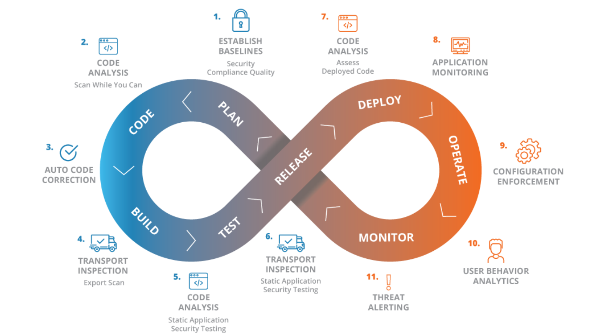

**Security Framworks**, příklady

- <u>CIS control v8</u>: Zaměřuje se na aktivity (ne na to, kdo spravuje zařízení), obsahuje 153 safeguards a 18 oblastí, kterými pokrývá kritické procesy/aktivity v organizaci (např. data protenction, penetration testing, account management, malware defenses, data recovery, …)
- <u>The Cybersecurity Framwork (NIST)</u> má tři primární části: *Core* (hierarchický seznam žádoucích výsledků cybersecurity, který funguje jako návod a kontrola), *Profiles* (sladění požadavků, cílů a zdrojů organizace s ideálními výsledky z Core) a *Implementation Tiers* (poskytuje možnosti měření, jak dobře je cybersecurity risk management implementovaný do organizace, úrovně 1 Partial, 2 Risk Informed, 3 Repeatable, 4 Adaptive)
  - Záznamy v části Core se skládají z popisu výsledku, kterého chceme dosáhnout (např. důvěrnost dat), a popisu, co se bude dělat, aby se nežádoucímu výsledku předešlo, jak bude probíhat případná detekce, reakce a zotavení se.
  - Framework je založený na rizicích. Vychází z mezinárodních standardů. Adaptovatelný na různé technologie, oblasti, uživatele. Living document.
- <u>MITRE ATT&CK</u>: The **A**dversial **T**actics, **T**echniques **&** **C**ommon **K**nowledge, cílem je popsat a klasifikovat cyberattacks (based on real-world). Používá se pro zavedení obranných a útočných akcí, monitorování, reportování, atd.
