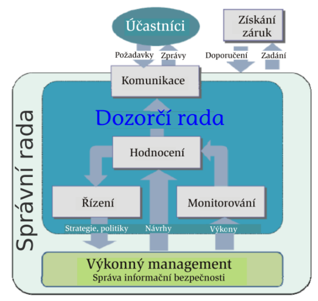

# PV017 Řízení informační bezpečnosti

**Use at your own risk**

# Přednáška #1

- Co se rozumí bezpečností a informační bezpečností zvláště
- Koncept a anatomie informační bezpečnosti

## „Safety“ X „Security“

- Popsáno standardy rodiny ISO/IEC 27xxx a 15408

### Safety, bezpečí

- Stav bytí, ve kterém platí, že za definovaných podmínek někdo či
  něco nezpůsobí škodu.
- Bezpečí se mnohdy chápe jako chránění proti nahodilým událostem.

### Security, bezpečnost

- Ochránění proti úmyslným škodám na aktivech.
- Bezpečnost = zajištění, jak něco NEDĚLAT.
- Abychom bezpečnost zajistili efektivně, musíme znát co se nesmí dělat.
- Nelze se bránit proti účinkům škodících akcí realizovaných na bázi dosud
  neexistujících/neznámých technologií.

## Informační bezpečnost

- Ochrana proti úmyslným škodám, nežádoucím akcím na informačních aktivech.
- ISO/IEC 27002
  - Dokument, obsahující výčet technologií, standardů, politik a manažerských praktik vhodných pro zajištění informační bezpečnosti
  - Dle standardu je informace je bezpečná, když je:
    - Přístupná pouze oprávněným subjektům
    - Modifikovatelná pouze oprávněnými subjekty
    - Dostupná oprávněným subjektům (do stanovené doby)
- Informace je bezpečná, když je zajištěná její:
  - **Důvěrnost** (confidentiality, C),
    - omezení přístupu k informacím a jejich zpřístupnění pouze oprávněným uživatelům („správným lidem“) a zabránění přístupu k informacím nebo jejich prozrazení neoprávněným uživatelům
  - **Integrita** (integrity, I),
    - Integrita zdroje - změny zdroje smí provádět pouze autorizované subjekty a autorizované mechanismy
    - Integrita dat - data nesmí být nevhodně, náhodně a/nebo záměrně nějakou škodlivou činností změněna
    - Integrita původu - data skutečně pochází od osoby/subjektu, který je validně poskytuje, nikoli od podvodníka
  - **Dostupnost** (availability, A).
    - Informační zdroje musí být dostupné autorizovaným subjektům
  - Další vlastnosti
    - Autenticita - Subjekt provádějící operace s daty se prokázal - prošel autentizací
    - Zodpovědnost - Každý subjekt, který pracuje s informacemi, má za ně specifickou odpovědnost
    - Nepopiratelnost - Nepopiratelně lze určit subjekt nebo mechanismus, který akci provedl
    - Spolehlivost - Bezporuchovost

### Pojmy informační bezpečnosti

- **Aktivum** (Assets)
  - Data, systémy obsahující data, lidské zdroje k provozu
  - Účastník (informačního) prostředí vlastní/používá něco, co pro něj má nepominutelnou hodnotu, toto je jeho aktivem
  - Hmotná, nehmotná
  - Informační aktivum
    - Informace nebo služba, kterou zpracovává nebo poskytuje informační nebo komunikační systém
    - Technické vybavení, komunikační prostředky
  - Aktivum nelze nahradit bez vynaložení nákladů, času, úsilí
  - Aktiva musí být individuálně identifikovatelná
- **Zranitelnost** (Vulnerability)
  - Slabina využitelná ke způsobení škod
- **Hrozba** (Threat)
  - Potenciální možnost využití zranitelného místa k útoku útočníkem
  - Hrozby je nutné identifikovat, pokud je cílem jejich eliminace
- **Útok** (Attack)
  - Útok provádí útočník využitím zranitelnosti informačního aktiva (realizovaná hrozba)
  - Přírodní katastrofy/Externí útoky/Interní útoky/Lidské chyby
- **Škoda**
  - důsledek útoku na (hodnotu) aktiva
- **Bezpečnostní incident** (Security incident)
- **Riziko** (Risk)
  - Velikost rizika je daná pravděpodobností provedení útoku a výší škody vzniklé útokem
  - Známe hrozby jimž jsou vystavena aktiva a odpovídající rizika – analýza rizik
- **Opatření** (Control)
  - Nástroj, služba pro snížení/eliminaci rizika
  - Typicky kombinace technologie, chování a procedury
  - Podmínka efektivnosti opatření: cena opatření <= výše škody
- **Bezpečnost**
  - zamezení škodám eliminací zranitelných míst nebo útočníků
  - **Perfektní bezpečnost** - absolutní eliminace všech rizik
  - **Systém bude úspěšný** (bezpečný), když bude zajišťovat ochranu proti všem možným útokům, a to vč. útoků, které se v době jeho tvorby dosud nevyskytly
  - Útočník bude úspěšný, když pro útok využije jedinou nedokonalost v bezpečnostních ochranách
  - Skutečně dosahovaná úroveň informační bezpečnosti se odvozuje od chápání informační bezpečnosti legislativou uživateli a provozovateli bezpečnostních, operačních, komunikačních a dalších typů systémů
  - Splnění nutné podmínky dosažení bezpečnosti informací je nekonečný proces

### Mechanismy pro implementaci opatření zajišťujících důvěrnost

- Využívá se **šifrování** pomocí klíčů
  - Klíč je rozsáhlý řetězec bitů (náhodné čísla, prvočísla)
- **Symetrické šifrování**
  - Blokové/Proudové
  - Stejný klíč pro Alici i Boba
  - 
- **Asymetrické šifrování**
  - Privátní klíč (Podpis, dešifrování)
  - Veřejný klíč (Ověření podpisu, šifrování)
  - 

### Mechanismy pro implementaci opatření zajišťujících integritu

- **Hashování**
  - Ke zprávě je připojen otisk zprávy
  - Otisk zprávy je vytvořen hashovací funkcí
    - Požadavek na hashovací funkce:
      - rychlost výpočtu, jednosměrnost, bezkoliznost
      - při změně (1 bitu) se změní nejméně 50 % otisku
  - Ochrana proti pasivnímu útoku
- Message authentication code (MAC)
  - Ochrana proti aktivnímu útoku proti integritě a/nebo autentizaci
- Asymetrické šifrování
  - **Digitální podpis** (zajišťuje i nepopiratelnost)

### Mechanismy pro implementaci opatření zajišťujících autentizaci

- Autentizace entit
  - Něco co znám - heslo, klíč kryptografie, PIN
  - Něco co mám - karta, občanka, řidičák
  - Něco co jsem - otisk prstu, zornička, hlas, podpis
  - Dvoufaktorová autentizace
- Autentizace dat
  - šifrování
  - Jednosměrně pomocí symetrické kryptografie
    - Alice zašle požadavek o komunikaci, Bob zašle náhodné číslo Alici, Alice náhodné číslo zašifruje a zašle ho Bobovi. Bob si dešifruje zprávu a pokud je tam dané číslo, Bob ví, že se jedná o držitele klíče (Alice).
    - Aby se prokázal i Bob, tato komunikace se provede zrcadlově opačně
    - 
  - Jednosměrně pomocí asymetrické kryptografie
    - Alice zašle požadavek o komunikaci, Bob zašle náhodné číslo a identifikátor, které jsou zašifrovány veřejným klíčem Alice. Alice si tuto zprávu dešifruje pomocí svého soukromého klíče. Alice odstraní identifikátor a číslo pošle zpět.
    - 
  - Jednosměrně pomocí podpisu
    - Alice zašle požadavek o komunikaci, Bob zašle náhodné číslo. Alice provede podpis identifikátoru a náhodného čísla. Podpis zašle s identifikátorem zpět. Ověření probíhá pomocí věřejného klíče Alice.
    - 

### Správa klíčů

- Pro symetrickou kryptografii
  - Key Distribution Center
  - Drží klíče a generuje klíče pro komunikaci dvou subjektů
- Private Key Infrastructure, Certifikační autorita
  - Pro Asymetrickou kryptografii
    - Private Key Infrastructure
    - Certifikační Autorita
      - Vydává Certifikát -> Dokument držící veřejný klíč a informace o certifikátu, vlastníkovi a certifikačí autoritě
      - Je vytvořena hierarchie certifikačních autorit

### Politika informační bezpečnosti (IT Security Policy)

- Politika
  - pravidla řídicí dosažení cílů určenými způsoby
- Definuje
  - bezpečné používání IT v rámci organizace
  - třídu (sílu) útočníků, vůči kterým se informace organizace zabezpečují
- Stanovuje
  - co jsou citlivá informační aktiva, jejich klasifikaci a odpovědnosti za jejich stav
  - bezpečnostní infrastrukturu organizace z pohledu informační bezpečnosti

### Bezpečnostní procedury

- Dokumenty popisující akce, které se mají provést při útoku, a role osob vystupujících v bezpečnostních procedurách

### Bezpečnostní politika

- Soubor pravidel specifikující uplatňování opatření potřebných pro
  dosažení akceptovatelné úrovně rizik
- BP říká
  - co proti čemu/komu se chrání
  - stanovuje bezpečnostní cíle
  - jak se tato ochrana prosazuje
  - určuje způsob dosažení bezpečnostních cílů pomocí implementových opatření
- Pro ověřitelně validní prosazování informační bezpečnosti IS je bezpodmínečně nutné definovat bezpečnostní politiku IS odpovídající hrozbám a rizikům, kterým je IS vystavený
- Detailnost bezpečnostní politiky závisí na účelu a na chráněné oblasti, ve
  které je politika uplatňovaná
- Nižší BP
  - Plán zvládání rizik IS
  - Horizont 1 až 2 let
  - Dokument specifikující opatření chránící konkrétní IS
- Vyšší BP
  - Dokument vymezující chráněnou oblast a základní bezpečnostní cíle
  - Horizont 5 až 10 let
- Bezpečnostní politika je **důvěryhodná** (Trustworthy) jestliže se jejím uplatňováním prokazatelně dosahuje požadované úrovně ochrany aktiv
  - Trusted - Má nezasloženou důvěru / Trustworthy - Má zaslouženou důvěru (Spolehlivě splní požadavky)

## Anatomie informační bezpečnosti

### Klasifikace aktiv (zákonem o kybernetické bezpečnosti)

- Dle **důvěrnosti** aktiv
  - Nízká
    - Aktiva veřejně přístupná
    - Není vyžadována žádná ochrana
  - Střední
    - Nejsou veřejně přístupná
    - Není vyžadována žádná ochrana
    - např. Know-how
  - Vysoká
    - Nejsou veřejně přístupná, jejich ochrana je vyžadována právními předpisy
    - Přenosy informací jsou chráněny kryptografickými prostředky
  - Kritická
    - nejsou veřejně přístupná a vyžadují nadstandardní míru ochrany
    - Pro ochranu důvěrnosti je požadována evidence osob, které k aktivům přistoupily, a metody ochrany zabraňující kompromitaci ze strany administrátorů
- Dle **integrity** aktiv
  - Nízká
    - Aktivum nevyžaduje ochranu z hlediska integrity
  - Střední
    - Aktivum může vyžadovat ochranu z hlediska integrity
    - Ochrana integrity: standardní nástroje např. omezení přístupových práv pro zápis
  - Vysoká
    - Aktivum vyžaduje ochranu z hlediska integrity
    - Ochrana integrity: prostředky sledující historii provedených změn a zaznamenat identitu osoby provádějící změnu
  - Kritická
    - Aktivum vyžaduje ochranu z hlediska integrity
    - Ochrana integrity: prostředky jednoznačné identifikace osoby provádějící změnu např. pomocí technologie digitálního podpisu
- Dle **dostupnosti** aktiv
  - Nízká
    - Narušení dostupnosti aktiva není důležité a v případě výpadku je běžně tolerováno delší časové období pro nápravu (cca do 1 týdne)
    - Ochrana dostupnosti: pravidelné zálohování
  - Střední
    - Narušení dostupnosti aktiva by nemělo překročit dobu pracovního dne
    - Ochrana dostupnosti: běžné metody zálohování a obnovy
  - Vysoká
    - Narušení dostupnosti aktiva by nemělo překročit dobu několika málo hodin
    - Ochrana dostupnosti: záložní systémy a obnova poskytování služeb může být podmíněna zásahy obsluhy či výměnou technických aktiv
  - Kritická
    - Narušení dostupnosti aktiva není přípustné
    - Ochrana dostupnosti: záložní systémy a obnova poskytování služeb je krátkodobá a automatizovaná

### Zranitelnosti

- Mohou se nacházet v hardware, v software, v datech, v návrhu architektury, fyzickém uspořádání, personální politice, logických a technických opatření..

### Hrozby

#### Typy

- **Odhalení**
  - Slídění, špehování
  - Analýza komunikačního provozu
- **Podvod**
  - Modifikace dat, falšování identity, popírání autorství
  - Maškaráda - Útočník vystupuje jako legitimní uživate
  - Diseminace zlomyslného software (Planting) - Trojský kůň, vir
  - Modifikace systému, příprava pro příští útoky
- **Narušení**
  - Modifikace (dat, programu, chování technického prostředku, …)
    - Neautorizovaná osoba získá přístup do systému a modifikuje v něm uložená data, neoprávněně používá zdroje,
- **Uchvácení**
  - Zpožďování provedení služby, odmítnutí poskytnutí služby, Denial of Service (DoS)

#### Klasifikace hrozeb pro organizaci

- **Vnitřní** hrozby
  - Zdroj hrozby (útočník) se nachází uvnitř (zranitelné) organizace
  - Nezkušený zaměstnanec
- **Vnější** hrozby
  - Zdroj hrozby (útočník) se nachází mimo vnitřní síť organizace
  - Hackeři na Internetu, konkurence, cílení či náhodní nepřátelé

#### Hrozba sémantických útoků

- Nejslabší článěk bezpečnosti je člověk
  - Pouze amatér útočí na počítače a software
  - Profesionál útočí na lidi
- Ochrana proti sémantickým útokům musí být cílená na sociální řešení, ne na matematicko-logická (a technická) řešení
- Nastupuje fenomén kyberprostoru, je nutné fenomén informační bezpečnosti rozšířit na fenomén kyberbezpečnosti
  - Informační bezpečnost řeší narozdíl od kyberbezpečnosti i data na papíře.
  - Kyberbezpečnost řeší i věci nad rámec informační bezpečnosti, neřeší pouze data samotná, ale i lidi

#### Klasifikace útočníka

- slabý (stačí jen slabá opatření)
  - amatér, náhodný útočník
- středně silní (středně silná opatření)
  - hacker, vandal, hračička: často má znalosti, ale ne zázemí
- silní (nutná silná opatření)
  - profesionál-kriminálník: často se zázemím, motivovaný
- Dle firmy IBM:
  - cript kiddies, chytří nezasvěcení útočníci, dobře vybavení lidé z venku, zasvěcení insideři, dobře finančně podporované organizace

#### Model útočníka

- Atributy protivníka, které je třeba zvážit
  - Cíle
    - často naznačují cílové aktiva vyžadující zvláštní ochranu
  - Metody
    - techniky útoku nebo typy útoků
  - Schopnosti
    - - výpočetní zdroje, znalosti, dovednosti
  - Úroveň financování
    - ovlivňuje odhodlání útočníka, metody a schopnosti
  - Outsider vs. insider

### Opatření

- nástroj pro snižování rizik
- Provedená akce relevantní jisté hrozbě

#### Klasifikace

- Podle technologie implementace
  - administrativní
    - standardy pro návrh, kódování, testování a údržbu SW, směrnice pro tvorbu hesel, licenc. podmínky
  - logická (software)
    - funkce řízení přístupu, dig. podpis, antivir, šifrování
  - technická (hardware)
    - tokeny, ID karty, šifrovače, archiv. pamě
  - fyzická
    - trezory, zamčené. dveř
- Konceptuální klasifikace
  - preventivní: hlavně velká rizika, opatř. jsou drahá
  - heuristické: pro střední rizika
  - detekční a opravné: povoluje riziko a pak ho řeší
  - podpůrná
- Podle oblasti jejich nasazení
  - Technická opatření
    - arch. systémů, mix HW, SW a firmware
    - Preventivní technická opatření
      - Autentizace, autorizace, řízení přístupu, podpisování, ochrana komunikací,
    - Detekční technická opatření
      - Audit, detekce útoků, návraty do bezpečného stavu, detekce virů
    - Podpůrná technická opatření
      - Identifikace, správa krypto-klíčů
  - Řídící opatření
    - politiky, návody, standardy
    - Preventivní řídicí opatření
      - Přidělení adresné odpovědnosti za bezpečnost kritických podnikatelských procesů
      - Průběžné bezpečnostních školení
    - Detekční řídicí opatření
      - Periodické zkoumání efektivnosti bezpečnostních opatření
      - Vedení průběžného řízení rizik pro ohodnocování a zvládání rizik
    - Opravná řídicí opatření
      - Plán zachování kontinuity činnosti po havárii
      - Plán činnosti po detekci incidentu
  - Provozní opatření
    - Preventivní provozní opatření
      - Virové ochrany
      - Protipožární ochrana
      - Řízený fyzický přístup k datovým médiím
    - Detekční provozní opatření
      - Zajištění fyzické bezpečnosti a bezpečnosti prostředí

### Bezpečnostní mechanismy

- Opatření musíme účinnou formou implementovat
  vhodnými (bezpečnostními) mechanismy
  - Mechanismy administrativního, technického, logického, … charakteru
  - Opatření řešící problém nepopiratelnosti - digitální podpis
    - mechanismus = asymetrická kryptografie
  - Opatření řešící řízení přístupu
    - mechanismus = fyzické klíče, identifikační karty, biometriky
  - Opatření řešící problém důvěrnosti
    - mechanismus = šifrování, trezory, smluvní závazek (NDA)

#### Klasifikace

- Mechanismy základní síly, slabé bezpečnostní mechanismy
  - Ochrana proti náhodným, neúmyslným útokům, amatérům
- Bezpečnostní mechanismy střední síly
  - Ochrana proti „běžným“ útokům
- Silné bezpečnostní mechanismy
  - Ochrana proti profesionálům, točníkům s vysokou úrovní, znalostí, s velkými příležitostmi, s velkými prostředky

## Generické rysy zabezpečování informací

- Minimalizovat prostor využitelný pro útok
- Jako implicitní řešení používat bezpečná řešení
- Princip nejmenších práv
- Důkladný a komplexní princip ochran
- Každý externí systém vůči bezpečné aplikaci musí být implicitně považovaný za nedůvěryhodný
- Chybný je koncept „Security through Obscurity“
  - Spoléhá na utajení vnitřních mechanismů před útočníkem – např. ukrytí klíče pod rohožkou
- Separace rolí
- V jednoduchosti je síla
- Správně opravovat chyby

# Přednáška #2

- Jak významná je role standardů, bez nich ani ránu
- Legislativní rámec
- Co se rozumí řízením rizik
- Kdo má v instituci na starosti dosažení informační bezpečnosti

## Standardy (normy) informační bezpečnosti

- Cíl přednášky
  - Co to jsou standardy, normy, doporučení?
  - Jak vznikají standardy a doporučení?
  - Kdo je kdo ve světě standardů a doporučení ?
  - Které standardy informační bezpečnosti jsou reprezentativní ?
- Standard
  - Úmluva o technické specifikaci nebo jiném stanoveném kritériu
  - Umožňují dosáhnout základní "kvalitativní" úrovně podobné nebo dokonce kompatibilních systémů a podpořit jejich interoperabilitu
  - Standardy lze použít jako měřítko pro porovnávání
  - Standard je jen dokument
    - interpretace se mohou lišit, zvláště při překladu do různých jazyků
  - Pokud produkt vyhoví jen podstatné části standardu, pak v podstatě vyhovuje standardu, ale není vyhovující standardu
- Standard x Norma x Doporučení
  - V Česku se tradičně používá pojem „norma“, celosvětově standard
  - Doporučení - termín používaný některými organizacemi

### De facto standard

- Standard vypracovaný v rámci jisté komunity
- před jeho vydáním odsouhlasí, že standard odpovídá jí stanoveným cílům
- De facto standard reprezentuje spíše liberální pohled na svět
- Vyzrálé de facto standardy, které se ukázaly jako efektivní, se často přepracovávají/přebírají na de iure standardy
- Např. standardy RFC (Internet standardy), ISACA (Výpočetní systémy), OWASP (Web aplikace), ISF (Informační bezpečnost)
- Firemní, proprietární standardy
  - Např. PKCS (Public-Key Cryptography Standards) publikovaný RSA Labs

### De iure standard

- Standard „podle práva“
- Schválený autoritou (státní)
- De iure standard reprezentuje silně konzervativní pohled na svět
- Vydávají se pomaleji jak Dfs

### Závaznost standardů

- Žádný standard sám o sobě nemá charakter právního předpisu
- Právní předpis může stanovit povinné vyhovění standardu
  - V tom případě se obvykle dává přednost de iure standardům

### Certifikát

- Produkt, služba, proces, … může být prohlášena za vyhovující standardu
  - Požadavek vyhovění může být předepsaný zákonem, smlouvou
- Produkt, služba, proces, … může být certifikovaný
  - existuje certifikát potvrzující, že je vyhovující standardu
  - Certifikace - neutrální důvěryhodná třetí strana prověří validitu prohlášení o vyhovění standard a vydá o tom relevantní certifikát

### ISO Standardy

- ISO (International Organization for Standardization)
- Důležitá rodina standardů ISO/IEC 27000
  - V současnosti celosvětové uznávaný základní standard zajišťování informační bezpečnosti

#### Životní cyklus ISO standardu

- Odpovědnost za tvorbu norem v dílčích oblastech mají technické výbory, Technical Committees, TC
- Návrh nové pracovní položky -> úrovně návrh standardu (Committee Draft – 3 měsíce, Draft International Standard – 6 měsíců, Final DIS – 2 měsíce)
- Obvykle pětiletá perioda hodnocení mezinárodního standardu
  - Když se odhalí vada standardu , jsou přijímána opatření, aby standardy byly revidovány i dříve

#### ISO/IEC 27001

- Definuje požadavky na funkcionalitu a vlastnosti systému správy (řízení)
  informační bezpečnosti
- Standard je detailním popisem požadavků, které musí/má ISMS splnit, pokud ISMS chce standardu vyhovět
- Je nezávislý na technologii, určený pro organizace všech typů, velikostí a podstat, působících v jakémkoli sektoru, kdekoli ve světě
- 27001 nařizuje použít 27002 jak zdroj návodů pro volbu a implementaci opatření, nezakazuje použití i dalších zdrojů

#### ISO/IEC 27002

- V dodatku standard 27001 uvádí seznam cílů opatření definovaných v ISO/IEC 27002
  - ISO/IEC 27002 obsahuje návody, jak je implementovat
- Doporučení jak navrhovat, implementovat, udržovat a vylepšovat opatření prosazující informační bezpečnost, používá slova may , should(může, měl by)

## Legislativa informační bezpečnosti

TODO: Po půlsemestrálce

## Řízení rizik

- Popsáno v ISO/IEC 27005

### Rizika

- Využití zranitelnosti
- Mohou plynout z
  - změna byznys modelu
  - nevyhovíme zákonu
  - nízká kvalita návrhu, provozu aplikací
  - z přírody
- Riziko se vyjadřuje
  - V pravděpodobnostních pojmech
    - s jakou pravděpodobností se hrozba uplatní
  - V pojmech charakterizujících dopad hrozby
    - velikost škody způsobené útokem
  - Generické kombinované vyjádření úrovně rizika
    - úroveň rizika = F(pravděpodobnost útoku) × F´(dopad útoku)
- Rizika se zvládají volbou a uplatňováním vhodných opatření
- Abychom riziko eliminovali nebo snížili, musíme:
  - ohodnotit
  - identifikovat
  - analyzovat
  - vyhodnotit (určit jeho úroveň)

### Procesy řízení rizik

- Ustanovení kontextu
  - Vymezení účelu provedení řízení rizik
  - Zajištění zdrojů pro řízení rizik
  - Stanovení kritérií pro vyhodnocení dopadů útoků, úrovní rizik, akceptovatelnosti rizik
- Ohodnocení rizik
  - získání informací pro účinné určení/volbu opatření potřebných ke změně rizik na přijatelnou úroveň pomocí procesů
  - Výstupem ohodnocení rizik je
    - seznam ohodnocených rizik, řazený podle kritérií hodnocení rizik
    - Prohlášení o aplikovatelnosti vhodných opatření řešících snižování/eliminaci ohodnocených rizik
  - **Identifikace rizik**
  - **Analýza rizik** - určení velikosti rizik
  - **Vyhodnocení rizik**- určení úrovní rizik porovnáním vůči stanoveným kritériím
- Zvládnutí rizik 
  - proces modifikující rizika, výběr a implementace opatření snižujících rizika
  - Určí rizika
    - která se eliminují
    - která nelze eliminovat a sníží se na akceptovatelnou úroveň
    - která se přenesou smluvně nebo pojištěním na jinou organizaci
  - Určí tolerovaná rizika, pro která se po zvážení odmítla opatření, která by je udržovala na akceptovatelné úrovni, akceptovatelná rizika
- Akceptace rizik 
  - rozhodování o přijatelnosti rizika dle stanovených kritérií
- Informování o rizicích
  - sdělení informace o rizicích všem, kdo může rizika ovlivnit či být riziky ovlivněn
- Monitorování a přezkoumávání rizik a procesu řízení rizik

## Řízení informační bezpečnosti v organizaci - Management, role a odpovědnosti

- V organizaci musí fungovat systém procesů, standardů a praktik, kterým se řídí a ovládají aktivity zajišťující v organizaci informační bezpečnost
- Řízení informační bezpečnosti musí 
  - Sladit cíle a strategie informační bezpečnosti s podnikatelskými cíli a strategiemi
  - Dodržovat legislativu, právní předpisy a smlouvy
  - Být posuzováno, analyzováno a implementováno principy 
    - danými výsledky řízením rizik
    - podporovanými vnitřním řídícím a kontrolním systémem organizace

### Vrcholový (top) management organizace 

- odpovědné za chod organizace jako celku
- vytváří  koncepce podnikání a strategie pro rozvoj organizace
- definuje cíle, které jsou na nižších úrovních managementu postupně dekomponovány až na úroveň operativních cílů
- Tradiční struktura organizace - dualistický model řízení
  - správní rada řídí organizaci a dělí své pravomoce a odpovědnosti mezi dozorčí radu a výkonné vedení
  - **Správní rada** (Governing Body)
    - Určuje strategie vymezující politiky řídící činnosti organizace a zajišťuje jejich prosazování/dodržování
    - Skupina osob odpovědných vlastníkům organizace za soulad činností organizace s jejími cíli
    - obvykle dozorčí rada a výkonné vedení 
  - **Dozorčí rada** (Supervizory Board)
    - typicky se schází několikrát do roka (obvykle 4-8 x), aby mohlo odsouhlasit zásadní změny ve společnosti.
  - **Výkonné vedení** (Executive Management)
    - Osoba nebo skupina lidí, na které dozorčí rada přenáší odpovědnost za implementaci strategií a politik pro dosažení cílů organizace
      - Veškerý chod organizace je pak delegovaný na výkonného (generálního) ředitele (CEO) 
  - Board of Directors, řada ředitelů, nejvyšší (výkonný) management
    - Chief Executive Officer, Chief Financial Officer, Chief Operating Officer
  - Board of Directors – 1, střední (výkonný) management
    - Chief Information Officer, Chief Information Security Officer

### Zásady řízení informační bezpečnosti organizace

- Informační bezpečnost se zavádí v rámci celé organizace
- Odpovědnost za informační bezpečnost a za její sledovatelnost má být promítnuta do všech činnosti organizace
- Zavedení informační bezpečnosti vychází z výstupů procesů řízení rizik
- Investiční strategie informační bezpečnosti je dána podnikatelskými cíli organizace 
- Musí být zajištěna shoda s interními a externími požadavky
- Hodnocení výkonnosti informační bezpečnosti musí sledovat cíle podnikatelských činností 
- Musí se podporovat prostředí s pozitivním přístupem k informační bezpečnosti 
- Model (procesů) řízení informační bezpečnosti v organizaci
  - 

### Procesy řízení informační bezpečnosti organizace

#### Hodnocení

- Správní rada musí 
  - Zajistit, aby podnikatelské iniciativy zohledňovaly problémy informační bezpečnosti
- Výkonný management musí
  - Zajistit, aby informační bezpečnost dostatečně podporovala a udržovala plnění
podnikatelských cílů

#### Řízení

- Správní rada musí 
  - Vymezit akceptovatelnou výši rizik pro organizaci
  - Schvalovat strategii a politiku informační bezpečnosti
  - Přidělit odpovídající investice a zdroje 
- Výkonný management musí
  - rozvíjet a realizovat strategii a politiku informační bezpečnosti
  - slaďovat cíle informační bezpečnosti s podnikatelskými cíli
  - prosazovat pozitivní kulturu informační bezpečnosti

#### Monitorování

- Správní rada musí
  - Posuzovat účinnost řídicích aktivit informačních činností
  - Zajišťovat shodu s interními a externími požadavky
  - Brát do úvahy měnící se podnikatelské, právní a regulační prostředí a potenciální
dopad jejich změn na informační rizika 
- Výkonný management musí
  - Vybrat výkonnostní metriky relevantní z hlediska podnikání
  - Poskytovat správní radě zpětnou vazbu o výsledcích měření výkonu opatření
informační bezpečnosti, včetně jejich dopadů na organizaci
  - Upozorňovat správní radu na nové skutečnosti týkajících se informačních rizik a
informační bezpečnosti

#### Komunikace

- Správní rada musí
  - Externím zainteresovaným stranám sdělovat, že organizace uplatňuje úroveň informační bezpečnosti přiměřenou povaze jejího podnikání
  - Sdělovat výkonnému managementu výsledky externích přezkumů, ve kterých byly identifikovány problémy v oblasti informační bezpečnosti, a požadovat po něm zajištění nápravných opatření
  - Rozpoznávat legislativní závazky, očekávání zainteresovaných stran a potřeby podnikání z oblasti informační bezpečnosti
- Výkonný management musí
  - Informovat správní radu o všech záležitostech, které vyžadují pozornost a případně i rozhodnutí
  - Instruovat příslušné zúčastněné strany detailních akcích, které se mají provést na podporu prosazení směrnic a rozhodnutí správní rady

#### Získání záruk

- Správní rada musí
  - Objednávat nezávislé a objektivní názory na to, jak plní své odpovědnosti za
zajištění a udržení požadované úrovně informační bezpečnosti
- Výkonný management musí
  - podporovat provádění auditu, hodnocení nebo certifikace objednané správní
radou

### Management organizace (z pohledu informační bezpečnosti)

- Správní rada – výkonný management + dozorčí rada
- Nejvyšší výkonný management (Board of Directors)
- Střední výkonný management (Board of Directors – 1)
- Řídící výbor (informační bezpečnosti), příp. samostatných architekt informační bezpečnosti
- Ředitel odboru (manažer) informační bezpečnosti, CISO, Chief of Information Security Officer
- Lokální správci (informační bezpečnosti)
- Administrátoři systémů
- Auditoři

### Odpovědnosti řídícího výboru informační bezpečnosti

- ......
- Stanovení cílů informací bezpečnosti v organizaci
- Odsouhlasení specifických rolí a odpovědností napříč celou organizací 
- Odsouhlasení charakteristik metodologií a procesů použitých pro implementaci politiky informační bezpečnosti
- Kontrola, zda jsou v organizaci dostupné zdroje pro dosažení cílů
- Posuzování a schvalování BP
- .....

### Manažer informační bezpečnosti, CISO

- Vypracovává seznam stran zainteresovaných na ITSec, seznam požadavků na ITSec od/na zainteresované strany
- Koordinuje činnosti související s ochranou osobních dat
- Posuzuje rizika, kvalitu ISMS
- Navrhuje metody autentizace, šifrování

### Odpovědnosti za informační bezpečnost

- Oddělení IT
  - Bezpečnost servroven
  - Zajištění výkonu bezpečnostních opatření systémů, za které odpovídají
- Lokální administrátoři/správci systémů
  - monitorování systémů, příprava bezpečnostních postupů
- Správci systémů na úrovni systému
  - Identifikace hrozeb, hodnocení rizik, implementace vybraných systémových opatření
- Správci sítí na úrovni domény nebo samostatné sítě
  - Identifikace hrozeb v mezích sítě, hodnocení rizik, implementace vybraných síťových opatření 
- Správci areálů
  - Identifikace hrozeb, hodnocení rizik, implementace vybraných fyzických opatření
- Uživatelé IT
  -  dodržování přihlašovacích pravidel, zálohování dat
- Třetí strany
  - odpovědnosti stanoveny ve smlouvě

# Přednáška #3

- Politiky jako specifikátory toho co a jak dělat
- Systém procesů zajišťující kontinuální efektivitu zabezpečování
- Jak takový systém procesů projektovat
- Schvaluje metody ochran mobilních zařízení a komunikací

# Přednáška #4

- Jak zajistit provozní bezpečnost – pohled z praxe

# Přednáška #5

- • Jak zajistit aplikační bezpečnost - pohled z praxe

# Přednáška #6

- Jak hodnotit bezpečnost
- Praktické poznatky z posuzování kyberbezpečnosti – pohled z praxe
