# PA103 Object-oriented Methods for Design of Information Systems

**Use at your own risk**

---

# Lecture #1: Introduction to Object-Oriented Design

## Challenges of SW development:

- **Maintainability**
  - Ability to maintain/adapt the code due to bug fixes, new feature requirements
- **Quality**
  - Effeciency, security, reliability or another qualitative attributes that we can guarantee with our software
- **Complexity**
  - Current systems are too big to maintain them as whole
  - Solution to this is that we decompose the system into smaller parts and maintain each part separately
- **Changing requirements**
  - User Requirements are changing all the time
  - Possible solutions
    - System decomposition - Better localizing changes thanks to isolated parts with clear responsibilities
    - Process management - Management for every part of change (requirements management, development managent, test management) will improve maintainabilty
    - Quality assurance - We are focusing on quality of changes with regular quality testing to improve overall software quality 

### System decomposition

We use modeling to control complexity of system by organizing and decomposing system into smaller parts that then have relationships between each other.

We use divide and manage (divide at impera) principle when modeling.
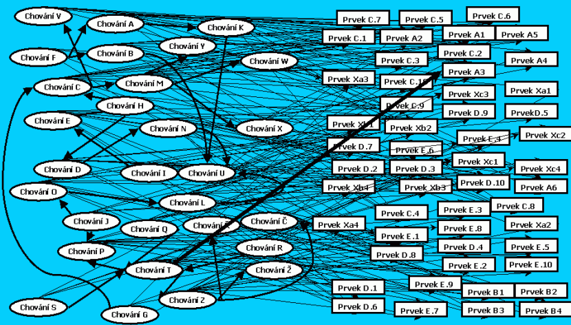

#### Structured modeling

Models that help us to decompose and organize system can be focused separately on **data** or **functions**

- Context diagram, data flow diagram, events, functional requirements, ...
- Entity-relationship diagram,data vocabulary, ...

Functional hierarchies and data clustering help to organize functional and
data models.

Continuous elaboration of models (e.g. constistency checking) can be **within** (this model is correct)  or **between** (these model corresponds to that model) models

Relationships between functional and data models can still be too complex

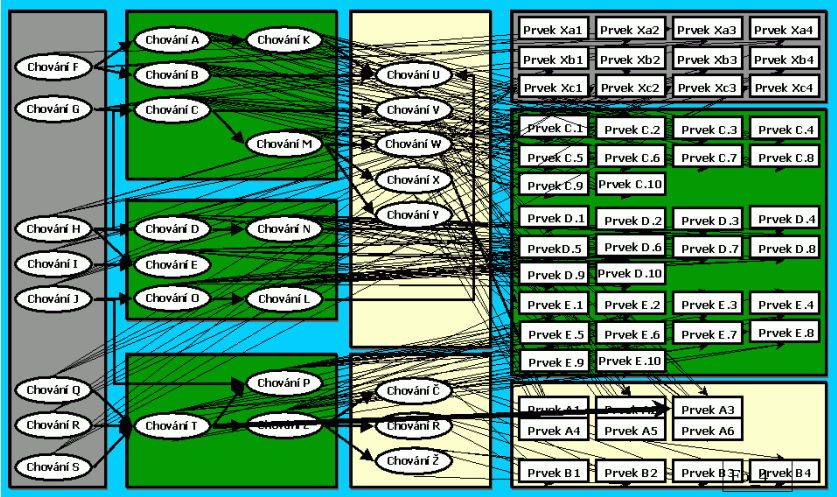

#### Object Oriented modeling

Models are focused on objects that encapsulate data and fuctions. Complexity is then hidden inside the object. There are higher requirements on interpart communication protocals.

In OO modeling we have much more diagrams than in structured modeling. These models can be used only in special cases and sometimes they are focused on single phase in software development cycle.

Two key models that are core of object oriented development are **Class Diagram** and **Use Case Diagram**.

Consistency checking are again between and inside the model.

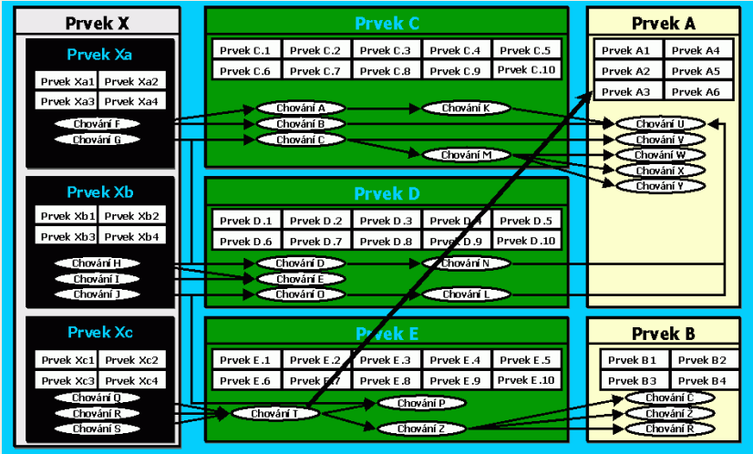

### Quality assurance

Quality consists of many qualitative attributes from different points of view
- User Experience (View of Customer) - Usability, Reliability, Performace, Security 
- Code Quality (View of Developer) - Modularity, Complexity, Testability
- Long Term View (View of manager) - Adaptability, Portability, Reusability

These quality attributes can conflict themselves and there is no way to optimaze all at once.

- 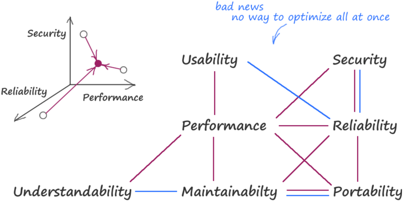
  - Purple relationship - Improving one decreases second
  - Blue relationship - Improving one improves second

Quality can be improved by

- Standardization of processes
- Regular testing and code reviews
- Using software patterns 
  - Different paterns can be used to improve different (Functional or nonfuctional) quality attributes

### Process management

Defining and managing development processes - How to do things, how to communicate... (Tactics, methodologies, guidelines) 

## OO Fundamentals

Expectations from OO Paradigm are Decomposition into small maintainable parts (Works only if we follow encapsulation rules) and reusability (does not work tell for object and classes)

**Object**

- smallest unit combining (encapsulating) data and functions
- stores data in field behind the “layer” of functions (operations)
- instantiating classes
-  Methods define behaviour. Data in object defines object state. Object state can affect behaviour

Classes represent static view (design-time entities), while objects represent dynamic view (run-time entities)

Functions define **responsibility** - Object or class have defined data and methods to manipulate with

### OO decomposition principles

#### Abstraction 

Abstraction in modeling is a problem of choosing what object and classes represent in the system. That affects distribution of responsibilities.

Abstraction of a single class is influenced by

- Attributes (possible states)
- Methods (behavior)
- Surrounding context – “neighboring” classes

#### Inheritance

Objects are childs of other objects. Child then inherits behaviour of inherited class.

Objects can never change affiliated class (i.e. the type) during their life time -> Never use inheritance if object’s role can vary in time

Inheritance can be always replaced by association

#### Association

Object consists of parts. Different parts distinguish object between themselves.

Association is more flexible than inheritance because links are created (and can be changed)
at run-time 

Real OO decomposition usually mixes both inheritance and association together

#### SOLID Principle
- Single-responsibility principle
  - Every class, function or module should have responsibilty over single part of systems functionality
- Open-closed principle
  - Class, function or module should be open for extension but closed for modification
  - Changes will be hangled as new methods or classes and will involve minimal changes to existing code
- Liskov substitution principle
  - Introduces polymorphism
  - Whenever an instance of a class is expected, one can always substitute an instance of any of its sub-classes
    - If S is a subtype of T, then objects of type T in a program may be replaced with objects of type S without altering any of the desirable properties of that program
  - Liskov principle can be violated by replacing object with a type that has different desired behaviour (e.g. Duck that quacks is replaced with Mechanical duck that quacks only when it has batteries)
  - To preserve substitution, we have to follow several constraints put on
    - method signatures,
    - behavioral conditions of sub-types.
  - **Method signatures**
    - **Arguments** of derived classes must be equally or more generic - less derived than arguments of base class
      - 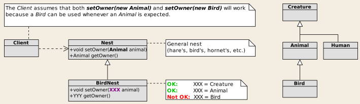
    - **Return type** should be equally or less generic - more derived - than those required by the base class
      - 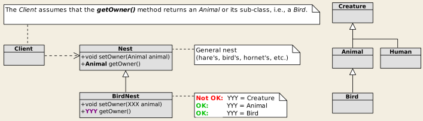
    - No new **exceptions** should be thrown by methods of the sub-type, only existing one or their subtypes
  - **Behavioral conditions of sub-types**
    - **History constraint**: New or modified method or properties should not modify the state of an object in a manner that would not be permitted by the base class.
      - Violation
        - 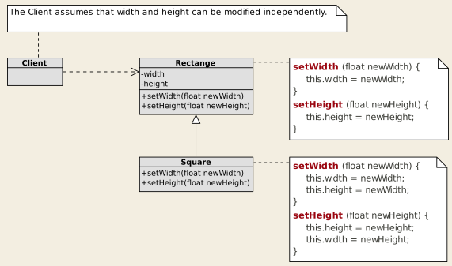
        - Mechanical Duck for example
    - **Preconditions** cannot be strengthened in a sub-type
    - **Postconditions** cannot be weakened in a sub-type
    - **Invariants** of the supertype must be preserved in a sub-type
  
- Interface segregation principle
  - Large interfaces are split into smaller ones so client can work only with methods that are of interest to them
- Dependency inversion principle 
  - Instead of having direct dependencies it may be better to loosely couple software modules
    - High-level modules should not import anything from low-level modules. Both should depend on abstractions
    - Abstractions should not depend on details. Details (concrete implementations) should depend on abstractions.

## Classes vs. data entities (ERD vs. class diagram)
 (Only showcase of possible implementation solutions to given diagram)

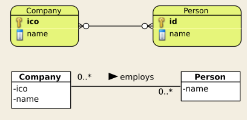

- Identity in ERD = primary key; Identity in OO = address in the memory!
- This model is directly implementable. As opposed to ER model, M:N relationships pose no problem.

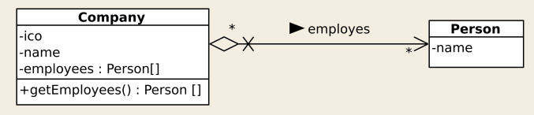

 Approach 1, model 1: We prefer one direction
- Company stores persons (employees) in array
- Person has no link to its companies
- Problem
  - There are many companies registered in the system. Where
they are stored? 
  - How we get link to concrete address if we have no query mechanism
- Solution 
  - Implement JobsMngr that stores all the companies and mediates access to companies and their employees 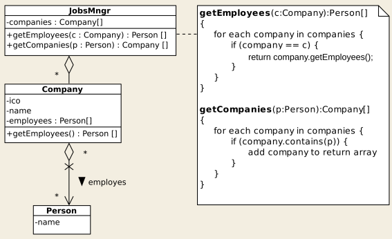

Approach 2, model 1: Bidirectional association

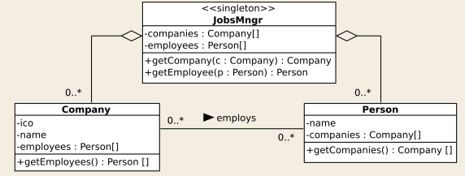
- Pros: Clear responsibilities. Responsibilities are uniformly distributed to all
classes
- Cons: Very complicated memory management and consistency checking,
especially without automatic “garbage collection”

Approach 2, model 2: Preserved bidirectional association, responsibility
located in a big “God” object.
- Pros: Management of instances and then the consistency checking are
localized in the JobsMngr => maintainability.
- Pros: Efficiency
- Problem: Where to put salaries
- Solution
  - 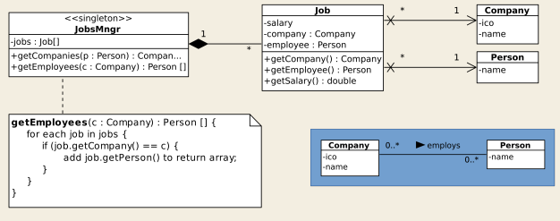
  - Helper class

As shown, there are many solutions. Designer has to choose best solution for given context. Patterns can help designers to make right decisions.