# PA103 Object-oriented Methods for Design of Information Systems

**Use at your own risk**

---

# Lecture #1: Introduction to Object-Oriented Design

## Challenges of SW development

- **Maintainability**
  - Ability to maintain/adapt the code due to bug fixes, new feature requirements
- **Quality**
  - Effeciency, security, reliability or another qualitative attributes that we can guarantee with our software
- **Complexity**
  - Current systems are too big to maintain them as whole
  - Solution to this is that we decompose the system into smaller parts and maintain each part separately
- **Changing requirements**
  - User Requirements are changing all the time
  - Possible solutions
    - System decomposition - Better localizing changes thanks to isolated parts with clear responsibilities
    - Process management - Management for every part of change (requirements management, development managent, test management) will improve maintainabilty
    - Quality assurance - We are focusing on quality of changes with regular quality testing to improve overall software quality

### System decomposition

We use modeling to control complexity of system by organizing and decomposing system into smaller parts that then have relationships between each other.

We use divide and manage (divide at impera) principle when modeling.
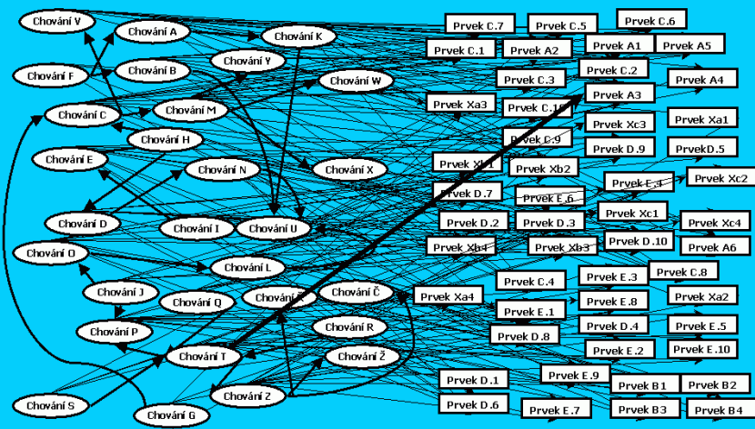

#### Structured modeling

Models that help us to decompose and organize system can be focused separately on **data** or **functions**

- Context diagram, data flow diagram, events, functional requirements, ...
- Entity-relationship diagram,data vocabulary, ...

Functional hierarchies and data clustering help to organize functional and
data models.

Continuous elaboration of models (e.g. constistency checking) can be **within** (this model is correct)  or **between** (these model corresponds to that model) models

Relationships between functional and data models can still be too complex

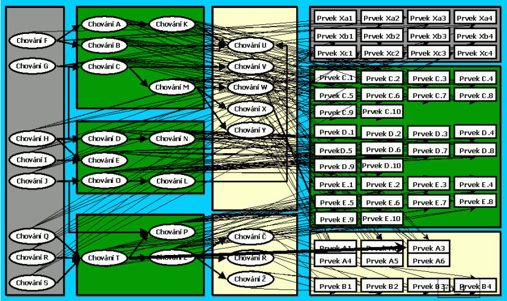

#### Object Oriented modeling

Models are focused on objects that encapsulate data and fuctions. Complexity is then hidden inside the object. There are higher requirements on interpart communication protocals.

In OO modeling we have much more diagrams than in structured modeling. These models can be used only in special cases and sometimes they are focused on single phase in software development cycle.

Two key models that are core of object oriented development are **Class Diagram** and **Use Case Diagram**.

Consistency checking are again between and inside the model.

### Quality assurance

Quality consists of many qualitative attributes from different points of view

- User Experience (View of Customer) - Usability, Reliability, Performace, Security
- Code Quality (View of Developer) - Modularity, Complexity, Testability
- Long Term View (View of manager) - Adaptability, Portability, Reusability

These quality attributes can conflict themselves and there is no way to optimaze all at once.

- 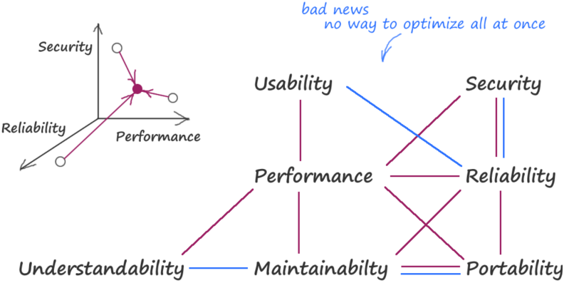
  - Purple relationship - Improving one decreases second
  - Blue relationship - Improving one improves second

Quality can be improved by

- Standardization of processes
- Regular testing and code reviews
- Using software patterns
  - Different paterns can be used to improve different (Functional or nonfuctional) quality attributes

### Process management

Defining and managing development processes - How to do things, how to communicate... (Tactics, methodologies, guidelines)

## OO Fundamentals

Expectations from OO Paradigm are Decomposition into small maintainable parts (Works only if we follow encapsulation rules) and reusability (does not work tell for object and classes)

**Object**

- smallest unit combining (encapsulating) data and functions
- stores data in field behind the “layer” of functions (operations)
- instantiating classes
- Methods define behaviour. Data in object defines object state. Object state can affect behaviour

Classes represent static view (design-time entities), while objects represent dynamic view (run-time entities)

Functions define **responsibility** - Object or class have defined data and methods to manipulate with

### OO decomposition principles

#### Abstraction

Abstraction in modeling is a problem of choosing what object and classes represent in the system. That affects distribution of responsibilities.

Abstraction of a single class is influenced by

- Attributes (possible states)
- Methods (behavior)
- Surrounding context – “neighboring” classes

#### Inheritance

Objects are childs of other objects. Child then inherits behaviour of inherited class.

Objects can never change affiliated class (i.e. the type) during their life time -> Never use inheritance if object’s role can vary in time

Inheritance can be always replaced by association

#### Association

Object consists of parts. Different parts distinguish object between themselves.

Association is more flexible than inheritance because links are created (and can be changed)
at run-time

Real OO decomposition usually mixes both inheritance and association together

#### SOLID Principle

- Single-responsibility principle
  - Every class, function or module should have responsibilty over single part of systems functionality
- Open-closed principle
  - Class, function or module should be open for extension but closed for modification
  - Changes will be hangled as new methods or classes and will involve minimal changes to existing code
- Liskov substitution principle
  - Introduces polymorphism
  - Whenever an instance of a class is expected, one can always substitute an instance of any of its sub-classes
    - If S is a subtype of T, then objects of type T in a program may be replaced with objects of type S without altering any of the desirable properties of that program
  - Liskov principle can be violated by replacing object with a type that has different desired behaviour (e.g. Duck that quacks is replaced with Mechanical duck that quacks only when it has batteries)
  - To preserve substitution, we have to follow several constraints put on
    - method signatures,
    - behavioral conditions of sub-types.
  - **Method signatures**
    - **Arguments** of derived classes must be equally or more generic - less derived than arguments of base class
      - 
    - **Return type** should be equally or less generic - more derived - than those required by the base class
      - 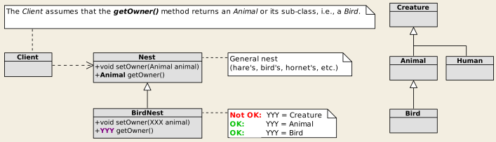
    - No new **exceptions** should be thrown by methods of the sub-type, only existing one or their subtypes
  - **Behavioral conditions of sub-types**
    - **History constraint**: New or modified method or properties should not modify the state of an object in a manner that would not be permitted by the base class.
      - Violation
        - 
        - Mechanical Duck for example
    - **Preconditions** cannot be strengthened in a sub-type
    - **Postconditions** cannot be weakened in a sub-type
    - **Invariants** of the supertype must be preserved in a sub-type
  
- Interface segregation principle
  - Large interfaces are split into smaller ones so client can work only with methods that are of interest to them
- Dependency inversion principle
  - Instead of having direct dependencies it may be better to loosely couple software modules
    - High-level modules should not import anything from low-level modules. Both should depend on abstractions
    - Abstractions should not depend on details. Details (concrete implementations) should depend on abstractions.

## Classes vs. data entities (ERD vs. class diagram)

 (Only showcase of possible implementation solutions to given diagram)

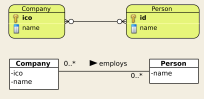

- Identity in ERD = primary key; Identity in OO = address in the memory!
- This model is directly implementable. As opposed to ER model, M:N relationships pose no problem.

 Approach 1, model 1: We prefer one direction

- Company stores persons (employees) in array
- Person has no link to its companies
- Problem
  - There are many companies registered in the system. Where
they are stored?
  - How we get link to concrete address if we have no query mechanism
- Solution
  - Implement JobsMngr that stores all the companies and mediates access to companies and their employees 

Approach 2, model 1: Bidirectional association

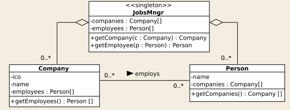

- Pros: Clear responsibilities. Responsibilities are uniformly distributed to all
classes
- Cons: Very complicated memory management and consistency checking,
especially without automatic “garbage collection”

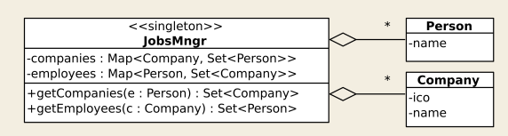

Approach 2, model 2: Preserved bidirectional association, responsibility
located in a big “God” object.

- Pros: Management of instances and then the consistency checking are
localized in the JobsMngr => maintainability.
- Pros: Efficiency
- Problem: Where to put salaries
- Solution
  - 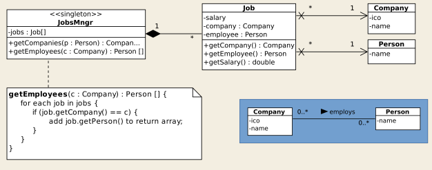
  - Helper class

As shown, there are many solutions. Designer has to choose best solution for given context. Patterns can help designers to make right decisions.

# Lecture #2: Analysis Patterns

## Motivation and history

### Generic Properties of Patterns

Common goal - improve the quality of SW design, either specific (security, reliability, etc.) or maintainability.

When using patterns, designers have to make decisions, usage of pattern is not mechanical -> It is creative process

- Appropriate pattern has to be selectad to reach given goals
- Sometimes we have to combine multiple patterns
- Consequences of pattern usage has to be considered

### History

Christopher Alexander (an architect) defined the pattern term for designing homes, buildings, and towns.

- Pattern: solution of the problem in given context
- “Each pattern describes a problem which occurs over and over again in our environment and
then describes the core of the solution to that problem, in such a way that you can use this
solution a million times over, without ever doing it in the same way twice.”

In 1995 book by Gamma, Helm, Johnson, Vlissideas was issued "Design patterns: Elements of Reusable object oriented software". Book focuses on patterns for generic object oriented programming,

In 1997 Martin Fowler: Analysis patterns book was published.
Fowler’s patterns are

- Intended to be used in the requirements analysis phase of the SW life cycle
- Based on the „data modeling“ (ERD or class diagram)
- Related to the decomposition of the problem domain model

SW Development Life Cycle

1) Requirement Analysis
   - Key UML models are **Use Case Diagram** and **Conceptual class diagram** (problem domain model)
2) Design
3) Development
4) Testing
5) Maintenance

### Conceptual Class Diagram

- Provides basic terms and data that have to be stored in the system
  - Describes the problem domain by terms (**classes**), their basic properties (**attributes**) and contexts (**associations with cardinality**)
- Although the class diagram is a static model, in the analysis phase it’s used primarily for  the clarification of behavior (functional requirements)
- Clarifies terminology

Problem Domain Model Example

- As said, we focus on classes, associations with cardinality and this model is then used for further step by step decomposition
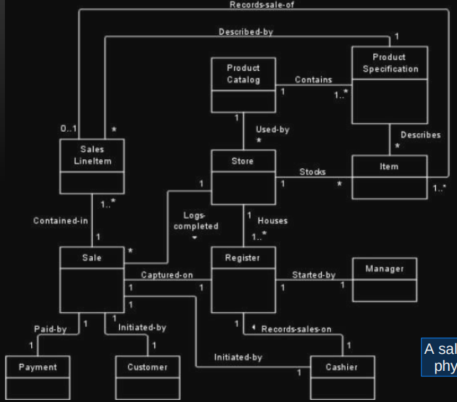

## Analysis Patterns

### Analysis patterns of M. Fowler

Defined 9 basic pattern collections covering various business domains

- **Accountability**
  - organizational structure and responsibilities
  - defines and asociates data with actors
- **Observations and Measurements**
  - measured values
- **Observations for Corporate Finance**
  - analysis of complex financial relationships and results in companies
  - Modules of managers
- **Referring to Objects**
  - objects identification
- **Planning**
  - schedules and protocols for repetitive plans
- Another pattern collections:
  - **Inventory and Accounting** (cashflow and invetorying)
  - Trading
  - Derivative Contracts
  - Trading Packages

Every collection consists of evolutionary sequence of patterns, from very basic to complex solutions

65 analysis patterns and 21 support patterns in total

### Accountability

The concept of accountability applies when a **person or organization is responsible to another person/organization**.

It captures **responsibilities** of **actors** (user roles) that often appear in the class diagram (problem domain model)

List of patterns:

- **Party**
- **Organization Hierarchies**
- **Multiple Organization Hierarchies**
- **Organization Structure**
- **Accountability**
- **Accountability Knowledge Level**
- Party Type Generalization
- Hierarchic Accountability
- Operating Scopes
- Post

#### Party

It is part of other more advanced patterns.

This model creates super type (nadtyp) for two independent analytical classes (Person, Organization) that have some shared context. Supertype then handles this context they share as one.

Use this pattern when:

- There is common behavior between two roles
- There is no need to distinguish between two roles

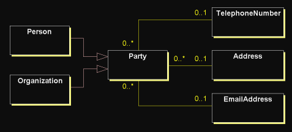

#### Organization Hierarchies

Companies have usually hierarchical organization structure (Operation Unit has Regions, Region has Divisions, Division has Sales Offices)

Pattern uses recursive relationships
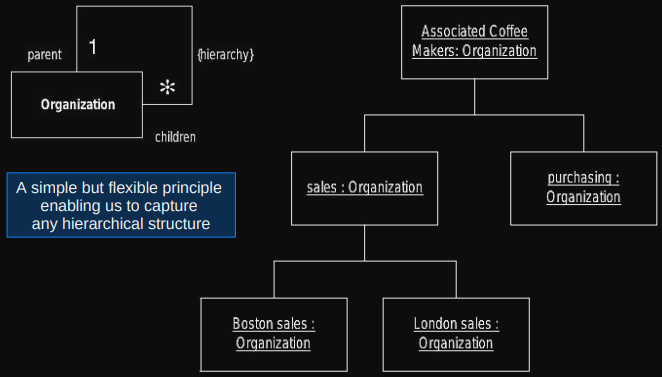
This allows very easy changes on organization structure. Without pattern, changes in model are required. With pattern, only new subclasses and rules are required
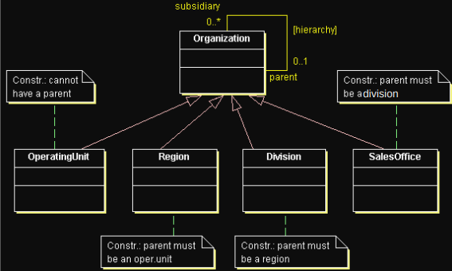

The danger with the recursive relationship is that it allows a division to be part of a sales office - we need to specify which type is above and below which => sub-classes and constraints are introduced (as shown in the image)

#### Multiple Organization Hierarchies

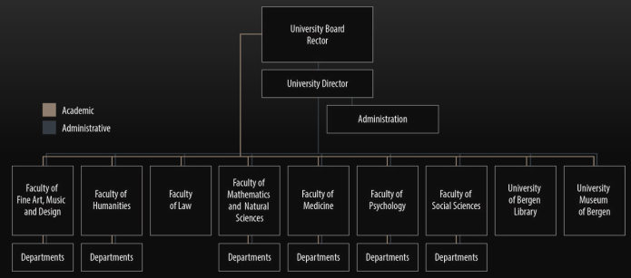

Many types we have parallel organization structures (Academic structure vs Administrative structure of University, Production structure vs Service structure)

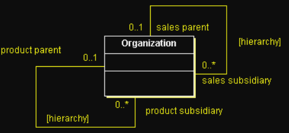

Using pattern of Organization Hierarchies for multiple structures gets hard to use with many associations. Organization Structure pattern is introduced

#### Organization Structure

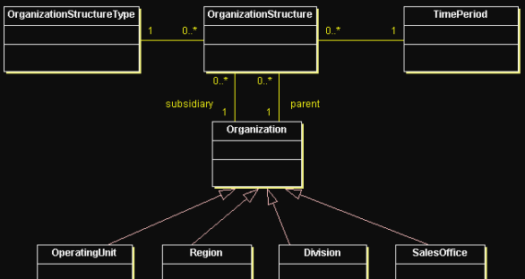

Pattern of Org. Hier. is extended with class insted of self reflection (recursion). Two relationships then describe parent and subsidiary organization structures (Described on university structure image as lines). After introducing extending analytical class, we can associate another data with it (e.g. OrganizationStructuryType for classifying the line, TimePeriod).

Summary for university organization hierarchies image:

- OrganizationStructure represents lines
- OrganizationStructureType represents color (type) of individual lines
- Organization represents rectangles

Example:

- Two organizational structures of the company: sale vs. PR
- From the sale point of view, there are two shops, in Brno and Prague. Brno sales office is subordinated to Moravia division, Prague sale office is subordinated to Bohemia division.
- From the PR point of view, both sale offices are subordinated to the common central office
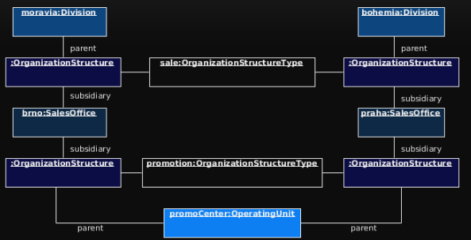

Suitable for **multiple** organizational hierarchies or hierarchies **changing in time** (and we want to capture these changes)

- Overkill for single organizational hierarchy
- Adding a new hierarchy = adding a new instance of OrganizationStructureType
  
TimePeriod allows us to record changes in the organization structure over
time.

Adding a new hierarchy is adding a new instance of
OrganizationStructureType

Constraints to organization structure are expressed by referring to
properties of the organization structure

- Disadvantage: Adding a new structure type can require changing the rules
- Solution: Adding a Rule class

#### Accountability

1:12:00

#### Accountability Knowledge Level

### Observations and Measurements

List of patterns:

- **Quantity** – values and their units
- **Conversion Ratio** – conversion ratios between units
- **Compound Units** – compound units e.g. km/h
- **Measurement** – measurement and recording of obtained values
- **Observation** – general observations and their recording
- **Protocol** – protocols of regular measurements
- **Subtyping Observation Concepts**

### Observations for Corporate Finance

Patterns:

- **Enterprise Segment** – dividing enterprise due to dimensions, e.g. geographical
location, product range, market, industry sector, etc.
- Measurement Protocol – how measurements can be calculated from other
measurements using formulas that are instances of model types
- Range – range between two quantities + operations with ranges
- Phenomenon with Range

### Referring to Objects

### Planning

### Inventory and Accounting

Patterns:

- **Account**
- Transaction
- Summary Account
- Memo Account
- Posting Rules
- … and many more

### Referring to Objects

Patterns:

- **Name** – objects identification by names
- **Identification Scheme** – brings context to objects identification
- **Object Merge** –
- **Object Equivalence**–
