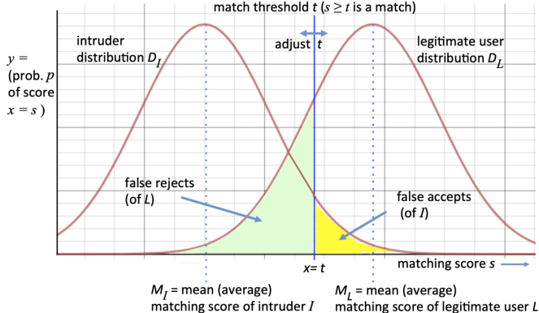
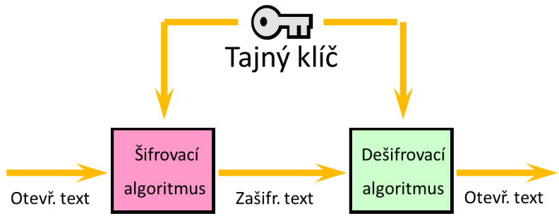
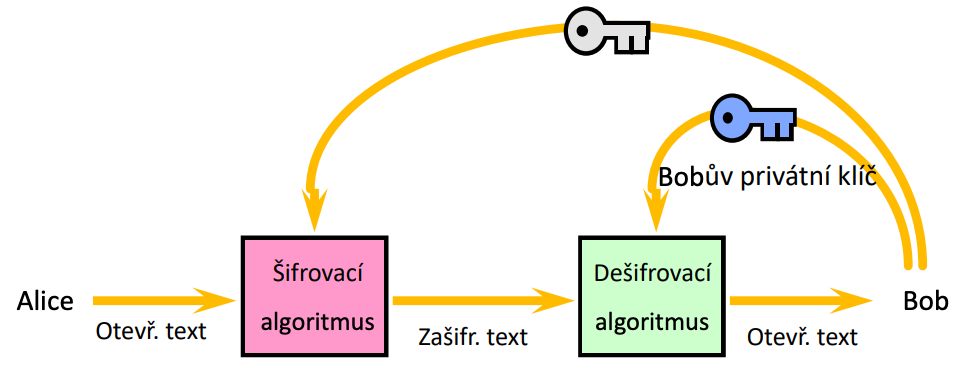
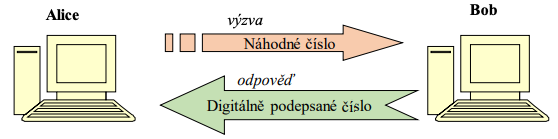

# PV157 Autentizace a řízení přístupu

**Use at your own risk**

_Based na [dokumentu](https://github.com/hojkas/MUNI_notes_and_stuff) by [hojkas](https://github.com/hojkas)_

---

## Přednáška #1: Úvod, pojmy

3 základní pojmy:

- **Autentizace** - proces ověření (a tím i usavení) identity s určitou míru záruky
  Subjekt předkládá tvrzení o své identitě (1:1) - něco co známe (PIN, heslo), co máme (klíč, čip), co jsme (biometrika), popř. kde jsme

  Metody autentizace:

  - něco, co známe (PIN, heslo)
  - něco, co máme (token- klíč, čipová karta)
  - něco, co jsme (biometriky)
    - Biometrické metody jako jediné opravdu autentizují člověka, nikoliv držitele tokenu, hesla...
    - Autentizace probíhá porovnáním dvou biometrických vzorků. Pro úspěšnou autentizaci musí byt nad určitou hodnotu
    - Prahová hodnota - hranice, která určuje počet autentizací, které jsou systémem nesprávně zamítnuty
    - 
  - někde, kde jsme

- **Identifikace** - rozpoznání určité entity v dané množině entit
  = vyhledání, systém prochází všechny relevantní záznamy v databázi, aby našel patřičnou shodu a identitu subjektu sám rozpoznal (1:N)

- **Autorizace** - udělení určitých práv a určení povolených aktivit (na základě toho, co zjistila autentizace a identifikace)

**KRYPTOGRAFIE (rychlé zhrnutí)**

Podle druhu a paremetrů klíčů dělíme na:

- _symetrické_,
- _asymetrické_ (veřejný + soukromý klíč)
- _bezklíčové_ (hash funkce, RND)

**Hashování** (bezklíčová kryptografie):

- Produkt hash funkce má dávat malý a “jedinečný” reprezentant jakýhkoliv velký dat
- výsledek musí být výrazně odlišný i pro jemně odlišné vstupy, tzv. _lavinové kritérium_ (při libovolné změně vstupu musí dojít ke změně každého bitu výstupu s pravděpodobností nejméně **50%** (Při nižších hodnotách lze z velkého počtu hashů odpozorovat hashovací funkci)).
- Důraz kladen na
  - **rychlost výpočtu**,
  - **jednosměrnost operace** - při využití jakékoliv výpočetní síly nesmí jít poznat, jaká data hash vytvořila,
  - **bezkoliznost slabá** - útočník není schopen najít vstup, který by vytvářel konkrétní hash (útočník hledá x2, pro který je hash stejný, jak pro zadané x1)
  - **bezkoliznost silná** - útočník není schopen najít dva vstupy, které by dávaly stejný hash (útočník hledá x1 a x2, které se rovnají)
- Např. MD5, SHA0, ty se kdysi masivně používaly, dnes už kvůli jejich problémum mizí a používá se například SHA-2 a SHA-3.

**Kryptografický klíč**: Rozsáhlý řetězec bytů, často omezené požadavkem (např. prvočísla, náhodná čísla…)

**Symetrická kryptografie**: Stejný klíč pro obě komunikující strany.

- Výhody: Rychlost, klíče jsou kratší než u asymetrické.
- Nevýhody: Problém šíření klíčů, pro každou další komunikující stranu třeba dalších klíčů, pokud útočník získá klíč od kterékoliv strany, přečte i zpětně celou konverzaci.

**Asymetrická kryptografie**: Každá strana má veřejný klíč, který každý může znát, a privátní klíč.

- **Šifrování**: Strana A vezme veřejný klíč B a zašifruje s ním zprávu, pouze s použitím privátního klíče B se dá zpráva rozšifrovat a přečíst.
- **Podepisování**: B svým privátním klíčem zašifruje podpis, nikdo jiný ho bez znalosti privátního klíče není schopen napodobit, ale každý může tento podpis rozšifrovat veřejným klíčem B a tím ověřit, že ho skutečně podepsalo B.
- Výhody: Není třeba šířit žádný tajný klíč pro komunikaci, není třeba rozšiřovat pro více komunikujících.
- Nevýhody: Pomalé, dlouhé klíče.

**Hybridní kryptografie**: Kombinace pro eliminaci nevýhod.

- **Šifrování**: Celá zpráva zašifrována krátkým symetrickým klíčem, ten je k tomu přibalen a zašifrovaný asymetricky. Nebo si strany asymetrickou kryptografií vymění symetrické klíče a pak komunikují symetrickou.
- **Podpis**: Vytvoří se ze zprávy hash dat, až ten je podepsán soukromým klíčem.

**Digitální podpis**:

- zajišťuje _autentizaci_ (integritu a prokázání původu) dat (**ne**zajišťuje důvěrnost! na tu je tu šifrování).
- Při registraci se vytvoří privátní klíč a veřejný klíč uložený v **certifikátu**.
- Podepisování se provádí na hashi z dokumentu, ověření podpisu probíhá rozšifrováním toho hashe díky veřejnému klíči z certifikátu a vytvoření vlastního hashe z daného dokumentu a jejich porovnání.
- Nejznámější algoritmy – RSA, DSA
  - s obnovou zprávy (podpis „obsahuje“ podepisovaná data)
  - bez obnovy zprávy (podpis „neobsahuje“ data)

**Certifikát**: Obsahuje veřejný klíč subjektu, vydává Certifikační autorita (ta zajišťuje platnost veřejného klíče, podepisuje ten certifikát sama, takto se vytváří chain of trust).

**Využití digitálního podpisu**:

- Autentizace dat.
- Autentizace počítačů/tokenů (protokol výzva odpověď, ten co se autentizuje podepíše danou výzvu, tím ukazuje že je tím, za koho se vydává; nebo výzva již obsahuje zašifrovanou zprávu jeho veřejným klíčem a on ji rozšifruje svým soukromým, čímž dokáže svou identitu).
- Autentizace osob (schopnost spustit aplikaci tajných dat na počítači/tokenu).

**Kryptografické primitivum**: Kryptografická funkce, která slouží jedné straně (podepisování, hashování, šifrování, dešifrování)

**Kryptografický protokol**: Kryptografická funkce, která slouží dvě a více stran

**Kerckhoffsův princip**:

- Algoritmus – postup – je všem znám a všemi kontrolován jako správný
- Klíč – tajná informace – musí být chráněna před nepovolanými osobami

**Terminologie**:

- Nekryptujeme ani neenkryptujeme – šifrujeme (zašifrujeme)
- Nešifrujeme soukromým klíčem – podepisujeme
- Nerozšifrováváme – dešifrujeme
- Neautentikujeme, neautentifikujeme a neidentizujeme – autentizujeme a identifikujeme

## Přednáška #2: Autentizace uživatelů tajnými informacemi

3 úrovně tajných informací

- 1. Krátké/slabé – pro lidi – hesla, PINy
- 2. Dostatečně dlouhé - kryptografické klíče, se kterými lze provést průkaznou operaci a přitom je nesdělit.
- 3. Protokoly s nulovým šířením znalostí (Nelze odvodit tajnou informaci z velkého množství získaných dvojic výzva-odpověď)

Aby autentizace uživatelů tajnou informací byla bezpečná, je nutné, aby:

- 1. Informace byla opravdu tajná (ne datum narození, jméno psa).
- 2. Měla by být vybrána z velkého prostoru možných hodnot.
- 3. Pravděpodobnost všech hodnot by měla být +- stejná.
- 4. Pokud dojde ke kompromitaci, musí být možné ji přenastavit.

Druhy tajných informací:

- klasické - PIN, heslo, passphrase (problém lidská pamět vs bezpečnost)
- alternativní - identifikace obrazové informace, spojení bodů ve správném pořadí na mobilu

Pro komunikaci a odeslání (autentizaci) hesla se používá jen jeho hash. Hesla by neměla být uložena v otevřené podobě, ale v nečitelné - šifrovaná či přímo jen hash hesla.

**Protokoly výzva-odpověď**

- Alice se může přesvědčit o identitě Boba, bez získání jejího tajemství
- Odposlechem výzvy i odpovědi útočník moc nezíská

**Druhy hesel**:

1. skupinová - uživatelská role, málo bezpečné (vstupní kódy)
2. unikátní pro danou osobu (např heslo = user id)
3. neunikátní (nejčastěji používano, je jedno jestli dva lidi mají stejné heslo a ani to nejde kontrolovat)
4. jednorázová (obvykle závislé na tajné informaci, např. vygenerované jednorázové heslo pro platbu bankou, google auth, …)

**Heslo založené na frázi**: Heslo tvoří například část věty nebo logický sled slov, pomáhá zapamatovat dlouhá složitá hesla.

Heslo může být uložené v otevřené podobě, šifrované nebo hashované.

**Šifrovaná hesla**:

- Heslo je uloženo zašifrované na zařízení, musí být k dispozici pro systém možnost zase odšifrovat pro použití, musíme věřit administrátorovi systému.

**Hashování hesel:**

- Heslo je uložené/posílané pouze jako hash, aby útočník nebyl schopný zjistit skutečné heslo.
- Hashování je ideálně pomalejší funkce, aby nemohl být proveden brute force, ALE aby to nebylo pro uživatele znepříjemnění
- Často se využívá tzv. **solení** - hash se nevytváří pouze z hesla, ale ještě z náhodně vygenerované “soli”, kterou si systém uloží spolu s userid a hashem samotným → dvě stejná hesla nebudou mít stejný hash a útočník by musel zjistit kombinaci hesla i soli aby se dostal dovnitř.
  - Popř. ještě může být **pepř** - “tajná sůl”, která se k tomu obdobně přidává, ale místo databáze je uložena bokem na nějakém secure médiu.

Na Unixu **/etc/shadow** obsahuje: login, hash hesla, dny od Jan 1 1970 kdy bylo heslo naposledy změněno, dny do momentu kdy bude moct heslo být změněno, dny po kterých musí být heslo změněno, dny než je uživatel varován o blízké expiraci, dny po kterých heslo expiruje, dny po které je účet disabled.

Používá se hashovací funkce založená na SHA2.

**/etc/passwd** obsahuje: User name, Encrypted password (nebo info o tom, že je hash uložený v /etc/shadow), User ID number (UID), User's group ID number (GID), Full name of the user (GECOS), User home directory, Login shell.

Hesla mohou být uložena v aplikacích, pro pohodlí uživatele na úkor bezpečnosti, záleží v jaké podobě je aplikace ukládá a jak moc nám vadí kdyby to leaklo.

**Útoky**

- _Cílený_ (chce zjistit heslo konkrétního uživatele) vs _Plošný_ (chce zjistit heslo kohokoliv z nějaké skupiny uživatelů)

- _Online_ (posílání tipů na verifikační zařízení -> omezení počtu pokusů za jednotku času) vs _Offline_ (útočník se dostal přímo k souboru s hesly)

- _Krádež hesla_ (útočník heslo odpozoruje při zadávání či přenosu, ať už díky mallware, soc. inženýrství, kamerami apod.)

- **Možnosti hádání hesel**:

  - Slovníkový útok (nejčastěji používaná hesla),
  - permutace písmen a jejich obvyklých náhrad (A → 4),
  - věci související s uživatelem či systémem (datum narození apod.),
  - hrubou silou

  $$brute\_force\_success\_rate = \frac{cas\_platnosti \times pocet\_odhadu\_za casovou\_jednotku}{velikost\_abecedy^{delka\_hesla}}$$

- **Útok skrz obnovu hesla**: Když útočník zneužije systém obnovy hesla, aby si tam nastavil vlastní.

- Útočník může někdy získat přístup k požadovaným datům nebo službám i bez znalosti hesla (malware, chyba v designu nebo řízení přístupu).

- _“Slabá” místa kde dochází k útoku_: Klient, databáze či její záloha/kopie, server/host, paměť, záznamy, přenos po síti, tvrdě zakódovaná hesla, manuály s iniciálními hesly a pod.

- _Proč dochází k útoku_: Slabá hesla, málo bezpečné uložení hesel, snadná obnova hesla…

**Výsledky experimentu s hesly**:

- Hesla založená na frázích jsou obtížněji uhodnutelná než naivně zvolená
  hesla
- Náhodná hesla nejsou lepší než ta založená na frázích
- Školení uživatelů nemá za následek výrazný posun v bezpečnosti hesel
- Aktuální výzkum ukazuje expirace hesla jako málo účinné.

**Blacklist**: Algoritmus analyzuje nově zvolené heslo, zda je nevhodné (slovníky, prozrazené hesla, slabá hesla)

**Vhodná hesla**:

- Používat fráze
- Minimálně 8-10 znaků
- Používat nealfabetické znaky
- Prosazovat danou politiku volby hesel nějakým mechanismem, jinak alespoň 10 % hesel bude slabých

**Jednorázová hesla**:

- Například papírek s N hesly, kód na potvrzení v SMS,
- <u>Lamportův řetězec hashů</u>
  - nová hodnota potvrdí správnost předchozí
  - (my máme aktuální x-tý hash něčeho, systém má třeba nějaký x-n předchozí hash, když systém zhashuje n-krát svůj starý hash, získá x-tý hash a porovná ho s předloženým hashem).
- One-time Password Algorithm (Google Authentificator)
  - OTP založené na synchronizaci hodin na zařízeních

**Autentizace obrazovou informací**: Vybírá se jeden obrázek z mnoha, např. smluvený obrázek, konkrétní řada třeba 4 obrázků (jako pin), nebo smluvený obrázek zobrazený v deformované verzi. Obrazová informace se pamatuje lépe než sled znaků.

**PIN** - Personal Identification Number. Levnější klávesnice, obtížněji zapamatovatelné než hesla, proti snadnému brute force se brání znemožněním přístupu po 3 špatných pokusech, obvykle používáno v kombinaci s fyzickým předmětem (např. karta).

Doručení PINu a karty by zákazníkovi mělo probíhat různými cestami nebo aspoň ne zaráz. PIN napsaný v poště jde často prosvítit baterkami, přičemž laserový tisk je překvapivě snadnější na přečtení než průklepový.

**Výhody tajných informací**:

- Všichni uživatelé s nimi už umí pracovat,
- jednoduše se kontrolují (nevyžadují dodatečný HW, umí to každý OS),
- jednoduše se uživatelům předávají,
- snadno se změní/nahradí,
- jejich nedostatky jsou známé a dlouho studované.

**Nevýhody tajných informací**:

- Pro bezpečnost od uživatelů implicitně očekáváme věci, které dost často porušují (zapisují si hesla, používají stejné heslo napříč systémy, vymýšlejí snadno uhádnutelná hesla).
- Je problém se vyznat v nekonzistentních politikách hesel (každý systém chce jinou délku, strukturu, má jinou dobu platnosti hesel).
- Při zjištění se snadno okopíruje a šíří.
- Lze jej zjistit aniž by si toho uživatel všiml.

## Přednáška #3: Autentizace uživatelů tokeny

**Token** - předmět, něco, co uživatel má. Jako u tajných informací chceme, aby autentizace byla co nejsnazší pro autorizovanou osobu a co nejkomplikovanější pro podvodníka.

Nejčastěji používané tokeny:

- karty (s magnetickým proužkem, nebo čipové - kontaktní/bezkontaktní)
- autentizační kalkulátory (s tajnou informací, s hodinami, různé typy výstupu)

**Padělání tokenů**:

- Dilema tokenů: chceme, aby jednotka za kus byla pro mnohakusovou výrobu co nejmenší, ale padělat jeden kus tokenu byla co největší.
  - Kvůli tomuto se může stát, že technologie co byla bezpečná a nákladně padělatelná se díky této výhodě stane běžnou a cena padělku kvůli tomu klesne
- Na cenu padělání má navíc vliv:
  - Zda útočník získá “stejně” hodnotné padělané tokeny když jich vyrobí mnoho (a klesne mu tím náklad), či nikoliv.
  - Na jak dlouho a kolik potřebuje správných tokenů, aby mohl padělat.
  - Jaký trest ho čeká za padělání.
- Další prevence padělání:
  - Vybavení není veřejně dostupné nebo to veřejně dostupné je upravené (např. kopírky naschvál nekopírují určité barvy),
  - utajení určitých např. konstrukčních parametrů je utajené,
  - u tokenu se navíc kontroluje licence/živost, atd.

**Karta s magnetickým proužkem**:

- Obvykle 3stopý proužek na cca 250B.
- Poměrně jednoduše se kopírují.
- Snaha chránit záznam posunutím bloků moc nefuguje (víc problémů jak užitku), snaha dát tam hologram taky nic moc (musí být specializované zařízení na čtení).
- Možnost ověřit pravost původního proužku vytvořením fyzikální charakteristiky toho proužku, to je těžké napodobit, ale zase ta charakteristika se mírně mění v čase a dá se tam přímo nahrát podvrženou charakteristiku.

**Čipová karta**: Technicky vzato by se měla rozlišovat _čipová karta_ (paměťová či paměťová se speciální logikou, ale bez možnost výpočtů) a _procesorová karta_, ale tento kurz shrnuje oba typy pod pojem “čipová karta”.

**Kontaktní** vs **bezkontaktní** (riziko provádění operace bez vědomí uživatele, má omezený zdroj energie). Pak existuje ještě **hybridní** (má kontaktní čip i bezkontaktní, co vzájemně nejsou propojené) a **duální/kombinovaný** (jeden čip, má kontaktní a bezkontaktní rozhraní).

**Čipová karta** (ta s procesorem, dále se bavíme výhradně o ní) má:

- RAM (jednotky kB dostupné), ROM (desítky až stovky kB) a EEPROM (stovky kB)
- Lineární záznamy (pevné nebo variabilní délky), cyklické záznamy, transparentní (nestrukturovaná) data.

- Soubory jsou na kartě přístupné jen přes logickou strukturu souborů, podobně jako data na pevném disku (kořenový adresář, adresáře, soubory).
  - kořenový adresář → hlavní soubor - master file (MF), adresáře → dedikovaný soubor - dedicated file (DF), soubory → elementární soubor - elementary file (EF).
  - Každý soubor má hlavičku určující přístupová práva k němu, ty se získávají zadáním určitého PINu.
  - Soubor s PINem např. pro tu kartu tak může změnit jen ten, kdo má nadřazený PIN.
  - Bývá omezen počet pokusů, poté je soubor blokován dokud není odemčen odblokovacím PINem (např. PUK u SIM).
    - Lze nastavit i jinak, kryž jsou karty programovatelné.

**Čipová karta jako aktivní prvek**: Karty mají nezanedbatelnou výpočetní sílu, mohou implementovat kryptografické algoritmy i protokoly. Je tak možné provádět určité operace rovnou na nich a citlivá data neopustí kartu. Symetrické šifrování není problém, asymetrické šifrování je náročnější a vyžaduje specialní výpočetní jednotku.

**Bezpečnost čipových karet** pojmy:

- _Fyzická bezpečnost_ - překážka kolem počítačového systému za účelem ztížení neatorizovaného fyzického přístupu k tomuto počítačovému systému
- _Odolnost vůči narušení (tamper resistance)_ - vlastnost části systému, která je chráněna proti neautorizované modifikaci způsobem zajišťujícím podstatně vyšší úroveň ochrany než ostatní části systému
- _Zjistitelnost narušení (tamper evidence)_ - systém, u kteréhokoliv jakákoliv neautorizovaná modifikace zanechává zjistitelné stopy
  - aka jsme schopni zjistit, že útok proběhl (např. se snažil dostat do bankomatu a praskl u toho kryt)
- _Detekce narušení (tamper detection)_ - automatické zjištění pokusu o narušení fyzické bezpečnosti
  - aka aktivní automatizovaný proces, který zjistí to narušení v běhu a například vypne proud do systému
- _Odpověď na narušení (tamper response)_ - automatická akce provedená chráněnou částí při zjištění pokusu o narušení
  - nejlepší chránění, má definovaný ochranný krok po tom co se útočník dostane do systému (např. vymaže okamžitě citlivá data;
  - může to být například detekce světla u HW, který není určen k otvírání, když útočník schránku otevře, vymaže se obsah)

**Útočníky** dělíme na kategorie: _třída 1_ (chytří útočníci bez znalosti systému), _třída 2_ (zasvěcení insideři), _třída 3_ (dobře financované organizace se specialisty a schopností provádět detailní analýzy).

**Útoky na čipové karty**

- **Fyzické** - Vyžaduje nákladné vybavení. _Invazivní_ (nevratné, viditelné, přímé zásahy do čipu apod.) nebo _Semi-invazivní_ (nedochází k přímému zničení čipu, např. využívá zahřívání, záření, laser, elmag. pole…)

- **Logické** - Vyžaduje detailní znalosti o struktuře karty (často zjištěné fyzickým útokem)

  - **Monitorování** - sledují kartu během činnosti a z toho něco vyvozují

    - **Časová analýza** - čas vykonání výpočtu záleží na známem vstupu a datech na kartě, pokud útočník zná algoritmus a dává vlastní vstup, může odvodit data na kartě. Obrana spočívá v minimalizaci závislosti délky výpočtu na vstupu (často blokuje optimalizace), klamavé operace…

    - **Výkonové analýzy** - sledování spotřeby proudu, např. zda jde o sčítání či násobení, zapisování 0 nebo 1.

      Při ověřování PINu přístroj potřebuje na operace různé druhy napětí. Je potřeba zajistit, aby útočník z tohoto napětí nemohl zjistit, v jakém stádiu se operace nachází (good/bad), a i kdyby odpojil proud před vyhodnocením, čítač pokusů se musí snížit tak jako tak.

      Sekvence operací pro ověření PINu odolné proti přerušení napájení je: Ověření, že zbývá >0 pokusů → snížení čítače → ověření správnosti PINu → zvýšení čítače zpět pokud správný

  - **Indukce chyb během výpočtu** - vnáší chybu během činnosti (např. bit flip když jdou data po směrnici a sledování, co ta změna způsobí), cílem vyvolat změnu hodnoty v paměti/registru, obejít určitou instrukci či modifikovat průběh autentizace. Např. díky teplotě, elektrickému poli…

  - **Útoky přes API** - API jsou často složitá, s mezerami, rozsáhlým složitým rozhraním, nedokumentovanými věcmi, kódem který se zapomněl odstranit, atd.

**Autentizační kalkulátory** - tvoří důvěryhodný interface pro práci s čipovou kartou. Obvykle používají protokol výzva-odpověď, kde odpověď je funkcí tajné informace a výzvy. Přenos info vstup/výstup buď manuálně (klávesnice/display) nebo automaticky (optika, barcode, infrared). Může vyžadovat prostě standardní PIN (a někdy i nouzový, který útočníka pořád pustí dovnitř, ale třeba k tomu upozorní policii).

**Tokeny založené na hodinách** - často v kombinaci s autentizačními kalkulátory. V daném okamžiku dávají správnou hodnotu jedinečnou pro daný přístroj, co platí pro určitý čas a server ji taky umí spočítat a čeká ji. Problém ztráty synchronizace hodin, často server bere i výstup z T-1 a T+1 a pokud obdrží takto zpožděný/dopředný záznam, bere to jako že hodiny se v tom desynchronizovaly a od příště počítá s touto hodnotou.

**Bezkontaktní karta** - posílá prostě jen svoje ID, lze snadno odpozorovat a zfalšovat.

**Výhody tokenů**: Rychle se zjistí ztráta, nejdou jednoduše okopírovat, samy o sobě mohou být schopny zpracovat nebo přenést další informace.

**Nevýhody tokenů**: Ke kontrole často třeba special čtečka/zařízení/školená osoba. Bez tokenu není uživatel autorizován (naproti tomu heslo/biometriku nejde “zapomenout doma”). Může se rozbít, přestat fungovat nebo fungovat částečně a jde to těžko detekovat. Token musí být dost složitý aby ho nešlo snadno okopírovat.

## Téma #4: Biometrické autentizační metody

**Biometriky** = “automatizované metody identifikace nebo ověření identity na základě měřitelných fyziologických nebo behaviorálních vlastností člověka”

**Verifikace** biometrikami - 1:1, identita je známá, jde o ověření této identity

**Identifikace** biometrikami - 1:N, identita není známa, je nutné projít celou databázi registrovaných osob, náročnější proces

**Biometrické technologie** mohou být založené na:

- _Fyziologických_ charakteristikách (otisk prstu, geometrie ruky) - _statické_
- _Behaviorálních_ charakteristikách (podpis, hlas) - je vyžadována akce uživatele - _dynamické_

**Charakteristiky**

- genotypické - geneticky založené - např. DNA
- fenotypické - ovlivněné prostředím, vývojem - např. otisk prstu

**Proces použití biometrik**:

1. **registrace** - prvotní nasnímání biometrických dat a zpracování, důležitá kvalita (nechceme dokonalost, ale aby to odpovídalo kvalitou cca vzorkům odebíraným při provozu), registrační vzorek se vytvoří získáním důležitých charakteristik a uloží se (na kartu, server, snímač, …)
2. **verifikace/identifikac/autentizace** - nasnímání biometrických dat, extrahování důležitých charakteristik a srovnání s reg. vzorkem, musí být plně automatické bez speciální obsluhy, výsledkem je míra shody, na základě které je vydáno rozhodnutí ano/ne

**Variabilita** - biometrická data nejsou nikdy 100% shodná (kvůli kvalitě zpracování nebo mírné změně v času; pokud jsou 100% shodná, pravděpodobně jde o útok nebo mizernou kvalitu vstupu), je třeba povolit určitou míru odlišnosti = variabilitu

**Chyby biometrických systémů**:

- Hlavní typy chyb: **FAR** (False Acceptance Rate) a **FRR** (False Rejection Rate). Když snížíme prahovou hodnotu přijetí vzorku (povolíme vyšší variabilitu), roste FAR a klesá FRR. **ERR** (Equal Error Rate) je když FAR = FRR, často to je ideální hodnota nastavení práhu (ale záleží na použití, někde kde je potřeba ultra tight security třeba nevadí, když to bude víc odmítat správné vzorky, security za cenu nepohodlí oprávněných uživatelů)

- Další typy: **FTE** (Failure to Enroll) je procento případů, kdy se biometrickou charakteristiku při registraci ani podaří vytvořit (např. příliš požkozená bříška prstů). **FTA** (Failure to Acquire; nebo taky FTC = Failure to Capture) je procento případů, kdy se charakteristiku nepodaří získat při autentizaci (např. dočasné poranění prstu). Tyto případy vždy v určité míře nastanou, musíme mít možnot alternativního přístupu.

- Někdy se chyby sdružují na **chyby I. druhu (False Positive Identification Rate)** = FAR, a **chyby II. druhu (False Negative Identification Rate)** = FRR + FTA + jiné.

**Chybovost** biometrických systémů závisí na řadě faktorů: Typ snímače (a jestli jsou všechny stejné), prostředí (světlo, …), nastavení (počet pokusů, ukládaná kvalita vzorku, …), uživatelé (trénovaní vs nováčci, manuální pracovníci vs ostatní, motivace uživatelů, …).

**Vybrané biometriky**

- **Otisk prstů**. Jedna z nejstarších. Snímače otisku mohou být optické, kapacitní, elektrooptické, ultrazvukové, tepelné, tlakové. **Markanty** otisků - významné body otisku, které se extrahují a ukládají. Jde o věci jako delty, smyčky, kruhy, končící čáry, … Mají více úrovní, typicky se mapuje lvl 1 (dominující obrazec celého otisku) a 2 (delta, ukončení, částečná čára…). Uloží se do vektorové mapy a v takové podobě se srovnávají. Soudní systémy zemí určují, kolik markantů musí mít otisk schodný aby byl nepopiratelný (typicky 8-15).
  _Rychlost_: 1ms - 1s, _Přesnost_: FAR pod 0.01%, FRR asi 5%
- **Geometrie ruky** snímá tvar ruky pomocí 2D nebo 3D snímače, vždy z vrchu (vytváří 2D obrys ruky nebo 3D náhled ruky). Není jedinečný.
  _Rychlost_: ~1s. _Přesnost_: FAR i FRR 3-5%, nevhodné na identifikaci, max na verifikaci.
- **Dynamika podpisu**. Důležitý není výsledný podpis, ale i dynamika psaní. Potřebuje určitý čas podepisování, aby to mělo z čeho mít vzorek. Je potřeba speciální snímač a tablet. Zaznamenává pořadí a směr psaní písmen, rychlost, přítlak…
  _Rychlost_: Verifikace během 1s. _Přesnost_: Nedostatečná pro většinu aplikací, FAR i FRR až několik procent, přesto relativně populární (historický význam podpisu jako autentizace).
- **Verifikace hlasu (mluvčího)** je založená na charakteristikách daných hlasovým ústrojím člověka. Může být ovlivněno nachlazením, emočním stavem atd. Probíhá typicky běžným mikrofonem, popř. tím v mobilním zařízení, žádný speciální setup. Může být použito na ověření na pozadí - **kontinuální autentizace** - uživatel se přihlásil a už hlasem ovládá systém, ale pokročilé funkce jsou mu zamezeny dokud to z jeho dosavadních příkazů neverifikuje hlasem.
  _Rychlost_: docela rychlé, _Přesnost_: za ideálních podmínek FAR i FRR pod 2%, velmi ovlivněno šumem.
- **Dynamika psaní na klávesnici** měří čas stlačení klávesy a čas mezi stisky kláves, nevyžaduje speciálni HW, porovnávání probíhá pomocí pattern matching nebo neuronovek. Možnost **kontinuální autentizace uživatele** během práce se systémem, některé funkce zamčeny dokud není autentizován podle příkazů, co doteď napsal. Pokud uživatel přejde na jinou klávesnici, může se dynamika lišit.
- **Oční duhovka** srovnává jedinečný vzor oční duhovky, černobílá kamera blízko u oka, popsána je 256B tzv. **iriscode**, pro porovnání stačí hammingova váha - super rychlé.
  _Rychlost_: miliony srovnání za sekundu, _Přesnost_: FAR téměř nulové, FRR kolem 3%
- **Oční sítnice** srovnává vzor cév na oční sítnici, snímání zdrojem infračerveného světla, nepříjemné.
  _Přesnost_: velmi přesné (nízké FAR, relativně vysoké FRR ale).
- **Rozpoznání obličeje**. Má problém s osvětlením, účesem brýlemi, obličej se mění v čase. Ale aspoň se přesnost za posledních pár roků zlepšila.
  _Rychlost_: výpočetně náročné, verifikace v řádu vteřin. _Přesnost_: FRR i FAR několik procent.
- **Další**: DNA (délka analýzy stovky minut), lůžka nehtů, tvar ucha, vůně/pot (how), pohyby tváře, dynamika chůze, …

BTW tu se bavíme o biometrikách jako autentizace do systémů. Biometriky mají ještě speciální místo ve forenzních vědách, kde jsou na ně kladeny úplně jiné požadavky a co není vhodné pro IT může být velmi žádané tam a naopak. Forenzní použití zajímá: vysoká přesnost, použití i třeba částečného ne moc kvalitního vzorku (např. z místa činu), ve forenzním využití biometrik nevadí, že zpracování trvá dlouho, že není automatické, že je potřeba specialista, ani nevadí že se ukládají velká data a zpracování jednoho vzorku je nákladné.

**Výhody biometrik**: Biometriku nelze zltratit, zapomenout ani někomu jen tak předat. Výsledky jsou rychle a relativně přesně. Nižší cena údržby než u tokenů (a často i než u hesel).

**Nevýhody biometrik / praktické problémy**:

- Důvěryhodnost vzorku (živost) - pochází od živé osoby a skutečně od té, co se snaží autentizovat? (Neumíme spolehlivě řešit, často se to aspoň částečně kontroluje tak, že tam je osoba typu vrátný a aspoň checkuje, že tam někdo strká fakt vlastní oko atd.)
  - Přidání testování životnosti vzorku má obvykle dopady na větší a dražší senzor/zařízení, výrobu, na vyšší počet FRR. Ani tak nic neposkytuje 100% ochranu, vše lze obelstít, “jen” to zvýší cenu útoku.
- Musíme počítat s tím, že část populace nenaměříme (FTE, FTA, …). V závislosti na technologii může být navíc FAR i FRR příliš vysoké (ale ne vždy, třeba duhovka i otisk prstu mají slušně nízké FAR).
- Problém správy charakteristik - každý má jen jednu, pokud leakne databáze jednoho systému kam se uživatel přihlašoval biometrikou, nesmí to ohrozit druhý! Navíc tu jsou legální omezení. Biometrická data jsou citlivé informace.
- Běžná komerční zařízení jsou často jen na “usnadnění přístupu” a samy o sobě mají zabezpečení mizerné.
- Kopírování biometrik podle typu nemusí být extra obtížné (např. otisk prstu z gumídků).

**Biometriky a kryptografie**: Biometriky nejsou tajné! Takže pro autentizaci dat (na podpis biometrikou) jsou nepoužitelné. Hodí se výhradně na autentizaci uživatelů. Mohou být max použity jako ochrana _přístupu_ k tajnému klíči např.

## Téma #5: Autentizace uživatelů - lokační a kontextové přístupy

[Toto téma bylo divný, rychle ho projel, nepřijde mi, že by se tu mluvilo o zkouškových věcech moc]

Multifaktorová autentizace za posledních pár dekád nabírá na popularitě.

Počítač (a další elektronická zařízení) dnes už vnímají okolí - můžeme využí senzory prostředí. Umí vnímat uživatele - měření aktivit orgánů atd.

Můžeme dělat _kontinuální_ autentizaci - nejde pouze u autentizaci na začátku operací, ale i v průběhu, dotyčný je neustále autentizován (např. kamerou, myš s čtečkou otisku na tlačítkách)

Další možnost autentizace - **kde** jsme.

- absolutní - GPS
- relativní-fyzické - blízkost jinému zařízení
- relativní síťové - síťové prvky a identifikátory
- volná vazba logická - různé povahy (např. google autentikátor na jiných zařízeních)

## Téma #6: Autentizační protokoly

**Protokol**: Několikastranný algoritmus definovaný posloupností kroků, které specifikují akce prováděné dvěma a více stranami, pro dosažení určitého cíle.

**Kryptografické protokoly**

- _Autentizační protokol_ - zajistí jedné straně určitou míru jistoty o identitě jiné strany
- _Protokol pro ustavení klíče_ - ustaví sdílené tajemství (typicky klíč)
- _Autentizovaný protokol pro ustavení klíče_ - ustaví sdílené tajemství se stranou, jejíž idetita byla ověřena

Autentizujeme během protokolu jednu stran, obě strany, popř. kontinuální autentizace. Může se buď někdo autentizovat hned, nebo až na výzvu.

**Útoky** na komunikaci protokoly:

- Rozlišujeme **pasivní** útočníky (analyzují odchycená šifrovaná data) a **aktivní** (modifikují data nebo vytváří nové zprávy, aktivně se účastní konverzace).

- **Útok impersonací**. Při autentizaci heslem může útočník odposlechnout heslo a použít na impersonaci.
- **Útok přehráním**. Při autentizaci hashovaným heslem může útočník přenos hashe zaznamenat a potom znovu poslat při vydávání se za původního uživatele.
- **Útok prolínáním** (interleaving) kombinuje zpráv z více průběhů obvykle stejného protokolu. (Komunikací s oběma stranami protokolem výzva odpověď získá dostatek informací, aby se úspěšně vydala za druhou stranu.)
- **Slovníkový útok** využívá často používaná hesla.
- **Využití známého klíče**. U protoklů pro ustanovení klíče, kde se klíč ustanoví na základě staršího útočníkovi známého klíče.
- Další útoky [nebo jen jiné názvy, idk]: **Odraz** (využití odeslané zprávy k okamžitému poslání odesilateli), **Man-in-the-middle**, **Volený text** (vhodná volba výzev v protokolech výzva-odpověď pro získání dlouhodbého klíče; cíleně posílá ty výzvy na které potřebuje znát odpověď).

**Protokoly výzva-odpověď** (= challenge-response)

- Navržené tak, aby odposlechem výzvy i odpovědi útočník nic nezískal (nebo přinejmenším nezískal nic dokud neodposlechne mega moc komunikace). Jednoduchý příklad na demonstraci: A pošle B výzvu = náhodné číslo, B vrátí tuto výzvu podepsanou svým podpisem, čímž dokázal svou identitu bez sdílení svého tajemství. I kdyby útočník jeho odpověď zachytil, při pokusu se napojit by dostal jinou výzvu.

- Mohou být založeny na:

  - _Symetrických technikách_ - symetrické šifrování, jednosměrná funkce s klíčem (MAC), generátory passcode
  - _Asymetrických technikách_ - dešifrování, digitální podpis

  [SKIP tuto byly ty jednotlivé metody popsány, slidy 15-22 prezentace L06_Protokoly, vynecháno protože se to v otázkách nevyskytovalo]

**Časově proměnné parametry** využívané v kryptografických protokolech:

- **Náhodná čísla** - nepredikovatelná čísla, zajišťuje jedinečnost a “čerstvost”. Vážně náhodná čísla je netriviální získat, v praxi používáme pseudonáhodná čísla.
- **Sekvence** - monotonně rostoucí posloupnost čísel, které jednoznačně identifikují zprávy v rámci komunikace a umožňují tak detekovat útok přehrátím z jiné komunikace.
- **Časová razítka** (timestamps) - obě strany musí mít synchronizované a zabezpečené hodiny, zajišťují jedinečnost a časovou přesnost.

**Protokoly pro správu klíčů**

- Účelem je: přenos klíče, ustanovení klíče, aktualizace klíče (který strany dlouhodobě sdílí), autentizace jedné nebo obou stran. Takovýto protokol má buď jenom dvě strany, co si klíče ustanoví, nebo ještě důvěryhodnou třetí stranu sloužící jako prostředník.

- **Symetrické techniky přenosu klíče**

  - Aktualizace klíče založená na symetrické šifře (A a B sdílí tajný klíč)
  - Přenos klíče odvozením
  - Aktualizace klíče se vzájemnou autentizací - **AKEP2** (Authenticated Key Exchange Protocol 2), používá sdílený původní tajný klíč K a MAC algoritmus

- **Protokol bez klíčů** - přenos klíče bez předchozího sdíleného tajemství

  - **Shamirův** protokol bez klíčů, využívá komutativní šifru E, každá strana si ustanoví svůj vlastní klíč. A nad X udělá šifru E podle svého klíče. B nad výsledkem udělá šifru E podle svého klíče (teď je tam dvojité šifrování). A využije komunitativnosti šifry, získá už X zašifrované jen podle klíče B a takto mu to pošle, B dokáže odšifrovat a vzít klíč.
    $$
    1.\ A \rightarrow B: E_{K_A}(X)\ \ \
    2.\ A \leftarrow B: E_{K_B}(E_{K_A}(X))\ \ \
    3.\ A \rightarrow B: E_{K_B}(X)
    $$

- **Kerberos** - využívá symetrické šifry, dvě strany si mění klíč skrz důveryhodný autentizační server. Cíl Kerberosu: autentizovat A vůči B, ustanovit klíč (ten volí server), popř. distribuce tajemství sdíleného A i B. Každá strana se serverem sdílí vlastní tajemství (a pro výměnu klíčů tak nemusí sdílet tajemství i mezi sebou)

  - Druhy důvěryhodných třetích stran v Kerberu:
    - **KDC** - Key Distribution Center - Server sdílí unikátní klíč s každým klientem, server distribuuje klíče které vygeneruje.
    - **KTC** - Key Translation Center - Server klíče sám negeneruje, dodá ho jedna ze stran a server jen distribuuje.

- **Asymetrické techniky přenosu klíče**

  - Zašifrování podepsaných klíčů (pouze v případě, kdy z podpisu lze získat podepsaná data)
  - Separátní šifrování a podpis (pouze když nejde z podpisu získat podepsaná data)
  - Podepsání zašifrovaných klíčů
  - X.509 obousměrná autentizace s přenosem klíče
  - **Diffie-Hellman**: Společné (prvo)číslo m a základ z. A si zvolí tajné číslo a, pošle B $x = z^a\ mod\ m$, B si zvolí tajné číslo b a pošle A $y = z^b\ mod\ m$, každá strana vezme co jim přišlo a určí klíč jako $key = x^b\ mod\ m$ (pro B).

**Zero-knowledge protokoly** (protokoly s nulovým rozšířením znalosti)

- Jdou dále než protokoly sdělující hesla a protokoly typu výzva a odpověď. Narozdíl od nich nedávají útočníkovi vůbec žádnou informaci o proběhlé autentizaci, takaže i kdyby nasbíral X takových výmděn, nemá šanci nic zjistit. Splňuje **úplnost** - poctivé strany vždy dosáhnou výsledku a **korektnost** - pravděpodobnst že nepoctivý útočník se může vydávat za poctivého je nulová.
- Protokol **Fiat-Shamir**: Součástí auntetizace je mimo jiné krok, kdy B pošle A 0 nebo 1 podle předchozí zprávy A. Tento postup se n-krát opakuje, s každým opakováním je šance, že se útočník autentizuje (že správně uhádl všechny 0 a 1) nižší a nižší.

Protokoly vyšší úrovně:

- **TLS/SSL** (TLS = Transport Layer Security)

  - Zajišťuje: **Autentizaci stran** (pomocí certifikátů a protokolů výzva-odpověď; může být buď oboustranná nebo jednostranná ze strany serveru, ale nikdy jen ze strany klienta!), **integritu dat** (autentizační kódu - message authentication code - MAC, neboli hash dat) a **důvěrnost dat** (po handshake je pomocí RSA nebo DiffieHelman ustaven symetrický klíč, kterým je šifrována všechna následující komunikace). Šifrovaná data obsahují **sekvenční číslo** (prevence proti útoku přehráním).

    [NOTE: to že je to RSA nebo DH je opsáno z ISA, v Autentizaci tam je s klíči nějaký mess který jsem nepochopila]

  - Mezi aplikační vrstvou a protokolem TCP. (Nemá přístup k aplikačním datům, neprovádí elektronické podepisování dat.)

  - Komponenty TLS/SSL:

    - **Record Layer Protocol** - Základní vrstva, umožňuje kombinaci s různámi protokoly vyšší úrovně (HTTP, FTP…) které mohou běžet beze změny.
      Posloupnost kroků: Rozdělení dat na bloky o max $2^{14}$B $\rightarrow$ komprimace dat $\rightarrow$ výpočet MAC $\rightarrow$ doplnění na délku bloku šifrovacího programu $\rightarrow$ šifrování.
    - **Handshake Protocol** - Umožňuje autentizaci serveru (povinná) a klienta (volitelná). Probíhá posláním certifikátů veřejných klíčů (a znalostí odpovídajících soukromých klíčů). Jsou zde také vyměněna náhodná čísla a další data nutná pro výpočet bloku klíčů.
    - **Change Cipther Specification Protocol** - Změna parametrů šifrování.
    - **Alert Protocol** - Info o chybách a varování.

- **IPSec** (IP Security)

  - Zajišťuje přenos po ipv4 i ipv6. Zajišťuje: **Autentizaci původu dat** (každý datagram je ověřován, zda byl odeslán uvedeným odesílatelem), **integrita dat** (zda nebyla při přenosu změněna), **důvěrnost dat** (šifrována), ochrana před útokem přehráním, automatická správa klíčů.
  - Správa klíčů: Oakley (založeno na Diffie Hellman), ISAKMP.
  - Využívá protokoly AH a ESP (jeden nebo je jde kombinovat)
    - **AH** (Authentication Header) - Hlavička slouží k zajištění původu dat, integrity a chrání vůči útoku přehráním, používá MAC kombinovaný se sekvenčním číslem. Umisťuje vlastní hlavičku AH za IP hlavičku, do které dává hash vytvořený z původní IP hlavičky, ostatních hlaviček a dat, a tajného klíče. Nezajišťuje důvěryhodnost.
    - **ESP** (Encapsulation Security Payload) - Zapouzdřuje a chrání data IP datagram (má Header, Trailer a Auth část, kterými “obalí” celoý datagram nebo celý krom hlavičky, podle režimu). Zajišťuje integritu, autenticitu, důvěrnost dat, brání útokům přehráním. POužívá symetrický šifrovací klíč sdílený oběma stranami.
  - Dva režimy IPSec:
    - **Transportní režim** (end-to-end)
    - **Tunelovací režim** (firewall-to-firewall)

## Téma #7: Autentizace počítačů

Počítače můžeme autentizovat na základě adresy počítače nebo na základě tajné informace.

**Autentizace podle (síťové) adresy**

- **MAC** adresa ethernetové síťové karty: můžeme svázat port přepínače nebo IP adresu pouze s určitou MAC.
  MAC adresy nejsou tajné a jde je změnit.
- **IP** adresa počítače: Přístup k síťovým službám (např. webové stránce) na základě IP adresy.
  IP adresu jde změnit nebo uvést jinou (IP spoofing).

**Soubor .rhosts**

- Slouží k uvedení strojů (a popř. loginů z nich), kterým důvěřujeme (…že správně uvedou uživatelské jméno). Aka počítače s povoleným přihlášením bez další autentizace. Nahrazuje autentizaci heslem.
- Možné útoky: počítač neuvede správně login uživatele, DNS, routing nebo IP spoofing.

**Autentizace na základě tajné informace**

- Tajnou informací může být heslo, tajný symetrický klíč, soukromý asymetrický klíč.
- Řešíme problém, jak tyto informace ukládat. _V nešifrované podobě_ má k nim počítač jednoduchý přístup, ale i všichni uživatelé s dostatečnými právy (a útočníci co si je obstarají). _Šifrovaně/chráněné heslem_ - při startu počítače/programu je nutné zadat heslo/šifrovací klíč a potom jsou tajné informace celou dobu v paměti, plus může být heslo slabé.

**Protokol SSH** (Secure Shell)

- K přihlášení klienta (uživatele) k serveru, zajišťuje autentizaci serveru i klienta.

- Server má privátní <u>RSA server key</u> (popřípadě DSA nebo tak), klient má veřejný <u>RSA host key</u>. Když ke klientovi dojde zpráva (v momentě kdy se uživatel přihlašuje “starým” klíčem), že byl klíč serveru změněn, je potřeba si checknout že to bylo vážně změněno administrátorem a nejde o útok.

- Klient se může autentizovat několika metodami:

  - Pokud je v .rhosts nebo etc/hosts.equiv (s RSA/DSA/ECDSA autentizací klienta/počítače)
  - RSA/DSA/ECDSA autentizace klienta
  - heslo uživatele
  - kerberos

- Protokol komunikuje takto: klient pošle verze ssh $\rightarrow$ server pošle verzi ssh $\rightarrow$ server pošle RSA host key (popř. RSA server key), nabízené šifrování atd. $\rightarrow$ klient si ověří, že RSA klíč sedí, pošle zašifrovaný RSA klíč relace a vybraný šifrovací algoritmus $\rightarrow$ server potvrzdí (už šifrovaná komunikace) $\rightarrow$ klient se autentizuje

- Často využíváme auntentizačního agenta - jen jednou zadáme heslo, on si uloží klíč do paměti a veškeré autentizační požadavky v ssh řeší za nás.

  [O tom, proti čemu SSH brání vůbec nic neříkal ani ve slidech to není, aspoň ne přímo. I když na to tam otázka je, idk.]

## Téma #8: Řízení přístupu

Řízení přístupu určuje, který subjekt (uživatel, proces…) má jaký přístup k určitému objektu (soubor, db, printer…). **Vlastník dat** (owner) je subjekt zodpovědný za konkrétní datový objekt, **správce** (custodian) je subjekt pověřený odpovědností za bezpečnost konkrétního datového objektu, **uživatel** (user) je subjekt, který má právo přístupu ke konkrétnímu datovému objektu.

**Centralizovaná správa řízení přístupu** (jeden správce, mnoho vlastníků i uživatelů, + přísné řízení, + konzistentnost, - vysoká režie) vs **decentralizovaná** (objekt spravuje jeho vlastník = správce, mnoho vlastníků = správců i uživatelů, + snadno vysoká odpovědnost, - nekonzistentní, - bez celkového přehledu, - špatně se prosazuje bezpečnostní politika).

Konkrétní metody řízení přístupu:

- **Heslo** jako řízení přístupu: Každý objekt má přiděleno heslo/hesla svým vlastníkem, právo přístupu má subjekt co zná heslo. Nevýhody: nelze zjistit kdo má přístup, heslo musí být dostupné v systému pro ověření.

- **Matice přístupových práv**: 2 rozměry (sloupec subjekty, řádek objekty), každé pole určuje právo subjektu na daný objekt. Popř. může být 3d kde další rozměr je program. V praxi problém obrovské matice, problém ukládat i vyhledávat.

- **Seznam přístupových práv (ACL - Access Control List)**: Jako matici přístupových práv, ale uložená pro každý objekt zvlášť a ukládá jen neprázdné prvky. Element přístupových práv (ACE) přiděluje práva na daný objekt subjektu, skupině subjektů… Výhoda že určitá práva lze omezit na jednotlivce ve skupině, nevýhodou je obtížná správa, neefektivní kontrola práv a složitost zjištění kam všude má subjekt přístup. V Linuxu i WIndows [v přednáškách podrobně popsáno].

- **SUID/SGID programy**: Matice práv jen dvourozměrná. To, na co má program právo, se ručuje tak, že po spuštění běží s právy uživatele/skupiny vlastníka. Není to intuitivní, easy way out je psát všechno jako SUID root, ale ty pak musí být napsány bezpečně.
- **Řízení přístupu na čipovch kartách** tvořeno řízením přístupu k souborům, každý má hlavičku určující přístupová práva. PINy uložený v samostatných souborech, přístupová práva k nim určují možnost změny PINů.

- **Seznam přístupových oprávnění** ukládá matici přístupových práv po **subjektech**.

- **Skupinové politiky**: Windows implementuje nejen ACL, ale i přístupová oprávnění která převažují nebo doplňují ACL. Např. skupinová politika zakazující Internet Explorer převáží přístupové právo pro program na disku, který je povolen spustit.

- **SAML** = Security Assertion Markup Language. Založený na XML, především na webu používaný, umožňuje oddělit poskytovatele identit a služeb, řeší problematiku Single Sign-On.

**Podpora řízení přístupu v HW**: Úkolem zamezit komunikaci procesů jinak než explicitně povoleným způsobem.

- Např. “fence address” - limit paměti, do nižších má přístup jen OS;
  “segmentové adresování” - adresování segment+offset, segment může měnit jen OS;
  dva režimy procesoru (autorizovaný a neautorizovaný, který měnit segmentové registry nemůže);
  “Rings of protection” - několik režimů činnosti s různými právy, měnit ring může jen v ringu 0 (OS).

**Separace oprávnění**: Pro vykonání určité akce je třeba souhlas několika osob (OS to nepodporuje, nutné to řešit přímo v SW).

**Princip nejmenších privilegií**: Uživatel má právo přístupu jen k objektům, které ze své pracovní pozice nutně potřebuje. Žádný uživatel nemá přístup k objektům, ke kterým přístup nepotřebuje.

**Princip “default deny”**: Povoleno je jen to, co je explicitně nastaveno. Snaha vyhnout se nezamýšlenému povolení přístupu v “neuvažovaných” situacích. Tvorba takovýchto oprávnění bývá netriviální a náchylná na chyby.

**Politiky řízení přístupu**: (nejsou exkluzivní, jde oboje naráz)

- **Volitelný přístup** (discretionary). Subjekt (vlastník) rozhoduje kdo má přístup, typicky politika podporovaná v OS.
  _Výhody_: Jednoduché = malá režie, flexibilní, lze vázat udělení práv na splnění dodatečných podmínek (např. místo).
  _Nevýhody_: Nedostatečná bezpečnost, není odelné vůči Trojským koním, systém se nestará o využití jednou získaných dat (např. pokud člen zkopíruje soubor a špatně nastaví přístupová práva, systém to neřeší).
- **Povinný přístup** (mandatory). Systémová politika nezávislá na vůli subjektů. Zavede se kategorie subjektů (důvěryhodnost) a objektů (důvěrnost), definuje uspořádání klasifikací objektů a množiny kategorií subjektů. _Referenční monitor_ (monitor odkazů) implementuje funkce prosazující bezpečnost řízení přístupu, při každém přístupu subjektu k objektu kontroluje, zda to odpovídá bezpečnostní politice.

**Víceúrovňové systémy**: MLS (Multi level systems)

- **Bell-LaPadula**. Uživatel má počáteční bezpečnostní úroveň (clearance). Subjekt je aktivní element (proces činný na pokyn uživatele), bezpečnostní úroveň procesu je daná bezpečností úrovní uživatele co ho spustil. Objekt je pasivní chráněný element, má klasifikaci (bezpečnostní úroveň) kterou definiuje vlastník objektu.
  - Bezpečnostní úroveň: $L = (C, S)$ kde C je klasifikace objektů (TS - top secret, S - secret, C - classsified, U - unclassified) a S je podmnožina množiny kategorií subjektů (např. {ekolomický odbor}).
  - Stav systému: $S = (b, M, f)$, b - množina (právě) aktivních přístupů (trojice subjekt, objekt, právo), M - matice přístupových práv, f - úrovňová funkce $O \cup S \rightarrow L$ kde O je množina objektů, S m. subjektů, L m. bezpečnostních úrovní. Udává bezpečnostní úroveň každého objektu a subjektu. Subjekt má každý dvě - clearance (maximální) a aktuální. Objekt má jednu.
  - Stav systému je bezpečný pouze tehdy, jsou–li splněny všechny bezpečnostní vlastnosti (omezení daná vztahy bezpečnostní úrovně subjektů a objektů). Operace změny stavu systému se povolí jen pokud výsledný stav bude bezpečný (kontroluje referenční monitor).
  - _Důvěryhodný_ subjekt smí porušovat bezpečnostní politiku povinnou pro _nedůvěryhodné_ subjekty (ví co smí a nesmí).
  - _Operace změny stavu_: získat/vrátit právo přístupu, zahájit/ukončit operaci s objektem, dát/odebrat právo přístupu subjektu k objektu, změnit aktuální bezpečnostní úroveň subjektu, změnit bezpečnostní úroveň objektu (pro neaktivní pouze).
  - **Axiomy** modelu: Procesy nesmějí číst data na vyšší úrovni (tzv. základní bezpečnostní vlastnost - _ss proprety_ nebo _NRU - no read up_). Procesy nesmějí zapisovat data do nižší úrovně (tzv. _\*-vlastnost_ nebo _NWD - no write down_).
  - Umožňuje i volitelný přístup.
- Problémy víceúrovroňových systémů: Klasifikace dat, často příliš striktní, drahý vývoj systému, náročná administrace, problém propojení dvou MLS s neekvivalentní klasifikací.
- **Skrytý kanál** (covert channel) - mechanismu, který není primárně určen pro komunikaci, ale může být využit (zneužit) pro komunikaci mezi úrovněmi). Takové info je například: zaplnění disku, aktuální zátěž procesory, pozice hlavičky na disku… (Útočník z nižší vrstvy by podle takové informace mohl zjistit, že třeba vyšší vrstva provádí náročné operace na tomto místě na disku.) Obrana je například diskové kvóty (každá vrstva vlastní kvóta a vidí zaplnění jen ve své vlastní), zavedení šumu.
- **Polyinstance** chrání existenci informaci na vyšší úrovni. Řeší co dělat, když například uživatel na nižší úrovni vytvoří soubor, co už na vyšší existuje (error by dal info že existuje). Noninterference = vlastnost, kdy akce uživatele na vyšší vrstvě neovlivní co vidí uživatel na nižší. Souborový systém například může zavést konvenci pojmenování, v databázi je to těžší, může třeba duplikovat řádky, dávat info “klasifikováno” místo skutečného údaje, …
- **Model Biba** - “převrácený” Bell-LaPaluda, řeší integritu. Číst data lze jen z vyšší úrovně (přesnější, spolehlivější), zapisovat lze jen dolů (méně spolehlivé).

**Role based access control (RBAC)** není ani volitelné ani povinné řízení přístupu, ale samostatná kategorie. Uživatelům přiřazeny role, ty znamenají práva k provedení určitých akcí (jemnější než ACL).

## Téma #9: Autentizace dat a zpráv

**Podpisová schémata**:

- S přílohou (DSA, ElGamal, Schnorr) - jen podpis, pro ověření je třeba mít i data co podepsal
- S obnovou zprávy (čisté RSA, Rabin, Nyberg-Rueppel) - pro ověření podpisu nejsou třeba další data

**Certifikát** - veřejný klíč uživatele podepsaný soukromým klíčem důvěryhodné třetí strany, zaručuje že identita vlastníka daného veřejného klíče není podvržená.

**PKI** - pomocná infrastuktura pro správu veřejných klíčů, má bezpečnostní politiky, procedury, produkty, autority. Komponenty: _certifikační autorita (CA)_ - poskytovatel certifikační služby, vydavatel certifikátu, _registrační autorita (RA)_ - registruje žadatele o certifikát, ověřuje jeho identitu, _adresářová služba_ - prostředek pro uchovávání a distribuci platných klíčů a seznam zneplatněných certifikátů.

- Proces vystavení certifikátu: generování klíčových dat $\rightarrow$ doložení dokladů $\rightarrow$ předání klíčových dat a identifikačních údají PCS/RA $\rightarrow$ ověření informací $\rightarrow$ tvorba certifikátu $\rightarrow$ předání certifikátu (a zveřejnění)
- CA tvoří hierarchické struktury, kořenové CA na vrchu a pod nimi síť.

**Integrita dat** - data nebyla neautorizovaně změněna. **Autentizace původu dat** - potvrzujeme, že data pocházejí od určitého subjektu.

Autentizaci může zajistit tajný symetrický klíč, hash přes autentizovaný kanál, hash s tajným klíčem/MAC (dříve označováno jako digiální pečeť), digitální podpis.

**Elektronický podpis**

- “Elektronický podpis” může být i pouhé jméno na klávesnici, pro účely autentizace dat řešíme **zaručený elektronický podpis**: ten je jednoznačně spojený s podepisující osobou, umožňuje její identifikaci, je vytvořen pomocí dat pro vytváření el. podpisů, které má osoba pod svou výhradní kontrolou, a je k datům připojen tak, že je možné zjistit jakoukoliv následnou změnu dat.
  [Aka se tu vlastně vždy bavíme o zaručeném elektronickém podpisu I guess.]
- **Soukromý klíč** pro vytváření podpisu má jenom autor, **veřejný klíč** pro ověření podpisu je k dispozici veřejně pro ověření. V praxi nepodepisujeme dokument, ale pouze jeho hash. Pokud šifrujeme, chce to nejprve podepsat až pak zašifrovat. Integrita veřejného klíče je zajištěna certifikátem.
- Algoritmy digitálního podpisu: RSA, DSA, ECDSA.
  - **RSA** založen na prvočíslech - je snadné je vynásobit, ale faktorizace je už výpočetně náročná. Dnes se používá modulo o délkách 2048 až 4096b.

**Hashovací funkce** (kryptografická hashovací funkce)

- Vstup libovolné délky, výstup pevné délky. Funkce není prostá (vznikají kolize, několik vstupů se promítne na ten samý výstup). **Jednosměrnost** - máme hash y. Nejsme schopni v rozumném čase najít x takové, že hash x = y. (Aka nejsme schopni z hasha získat jedno z možných původních hesel.) **Bezkoliznost slabá** - pro dané y nejsme schopni najít takový x, aby měly stejný hash (h(x) = h(y)). **Bezkoliznost silná** - nejsme schopni najít jakékoliv dva vstupy x, y tak, aby měly stejný hash (h(x) = h(y)).
- Např. (dnes už slabá MD4, MD5, SHA-1), SHA-2 (rodina, v ní např. SHA-512), SHA-3 (Keccak).

- **Narozeninový paradox** - pravděpodobnost, že 2 lidé v sále s 23 mají narozeniny ve stejný den, je větší než 50% (a roste, při 30 lidech je to 70%+). Toho využívají některé útoky na hashe, pokud potřebují najít _libovolnou kolizi_ hashe (toto jde proti silné bezkoliznosti), mají o dost větší šanci než najít specifický hash.

Pouze integritu (ne autentizaci) zajišťuje **CRC** (Cyclic Redundancy Check) nebo MAC (z libovolné symetrické šifry v cipher block chaining režimu).

Důvěrnost jde s MAC zajistit pomocí **“chaffing and winnowing”** (“oddělení zrna od plev”). Zprávu rozdělíme na jednotlivé bity a pro každý bit vytvoříme 2 zprávy (obsahující 0 a 1), jednu se správným MC a jednu z nesprávným MAC. Tyto zprávy v náhodném pořadí odešleme příjemci, ten dostane 2 a jednu si ponechá druhou zahodí. Nikdo bez tajného sdíleného klíče není schopen odlišit zprávu se správným a špatným MAC. (Ale existují i efektivnější metody než posílání po 1 bitu.)

## Téma #10: Autentizace v příkladech I

**HW tokeny** využíváme na _uchování citlivých dat_ (kryptografické klíče, údaje pro využívání předplacených služeb jako např. pro dekódování satelitního signálu), _autentizaci uživatelů_ (vstup do zabezpečené místnosti, přihlášení do OS, GSM/LTE/GMR/UMTS sítí, e-bankovnictví, potvrzení finančí transakce) a _identifikaci uživatelů_ (elektronické dokumenty jako pas, řidičský průkaz).

**Autentizace do GSM/GMR sítě**: _dvoufaktorová autentizace_ (použití tokenu - SIM a znalosti - PIN), využívá sdílené tajemství (na SIM uložen tajný symetrický klíč, uložen i u operátora v autentizačním centru, autentizační protokol [asi] výzva-odpověď).

**Autentizace/autorizace v e-bankovnictví**: Mnohdy pouze _jednofaktorová_ na tajné heslo, s mechanismy proti útokům jako testy délky a kvality hesla, virtuální klávesnice, SSL certifikáty a personalizovaný login (umožňující detekovat falešnou adresu s podvrženou přihlašovací stránkou). Pokud využívá _dvoufaktorovou autentizaci_, jde buď o token (čipová karta) a znalosti (PIN) přímo nebo tokenu (kalkulátor/telefon) a znalosti (PIN) pro vygenerování jednorázového hesla.

**Autorizace finančních transakcí**: Typicky dvoufaktorová, token (karta, telefon) + biometrika nebo znalost (PIN, CVV2/CVC, aplikace vyžaduje biometriku…).

**Online verifikace PINu** probíhá vzdáleně ve vydávající bance, potřeba zajisti bezpčný přenos PINu od poskytující k vydávající bance (jiný PIN než u běžné čipové karty). Bankomat či platební terminál typicky PIN formátuje do PIN bloku (struktura s PINem a dalšími daty pro zvýšení entropie), ten je zašifrován a odeslán vydávající bance, po cestě může dojít k přeformátovávání PIN-bloku (do nativního formátu dané sítě). Originální PIN není v bance uložen, po přijetí PINu od bankomatu je PIN zákazníka znovu vygenerován (z čísla účtu a tajného PINu generujícího klíče) a porovnán s ním. Množství formátů PIN-bloků a různé metody generování PINů komplikují možnost vytvořit bezpečný návrh HW a API pro práci s nimi.

Specifikace **EMV** (Europay, MasterCard, VISA) jsou požadavky na čipové karty a platební terminály, bezpečnostní požadavky.

- **Offline autentizace dat** - cílem detekovat falešné karty. Založeno na RSA a veřejných klíčích, potřebuje certifikační autoritu, každý terminál musí mít veřejný klíč CA. Tři mechanismy:

  - **SDA - statická autentizace dat.** Potvrzuje pravost statických dat uloženýchna čipové kartě (detekuje neautorizovanou změnu dat), provádí ji terminál (čip jen zašle data). Padělání karet se tímto neřeší. Statická data jsou podepsána soukromým klíčem vydávající banky, veřejný klíč banky je v čipu taky, veřejný klíč CA co ověřila veřejný klíč banky je v každém terminálu.
  - **DDA - dynamická autentizace dat.** Kryptografické operace provádí terminál i karta (čip s koprocesorem a zajištěním bezpečnosti uloženého RSA klíče). Potvrzuje pravost statických dat uložených a generovaných v čipové kartě a dat obdržených z terminálu (už detekuje padělané karty). Veřejný klíč CA v terminálu, veřejný klíč banky v čipu. Navíc v čipu nový unikátní pár RSA - soukromý bezpečně uložený v čipu (nikdy jej neopustí), veřejný klíč podepsán a uložen u statických aplikačních dat (SAD). Podepsaná SAD a certifikát veřejného klíče karty a banky jsou zaslány terminálu k ověření, ten inciuje protokol výzva odpověď.
  - **CDA - Kombinovaná DDA a generování aplikačního kryptogramu.** Prováděno terminálem i kartou společně s analýzou akcí karty (to by se normálně provádělo až později). Náhodná výzva je narozdíl od DDA součástí podepsaného aplikačního kryptogramu, ten je zabezpečen (výhoda pokud nelze garantovat bezpečnou komunikaci mezi čipem a terminálem).

- Každá čipová karta obsahuje **CVM** = prioritně uspořádaný seznam podporovaných autentizačních metod, terminál zvolí první metodu ze seznamu co podporuje. Základní podporované metody jsou podpis (ručně), PIN.

- **Autorizace platby**: Autentizace založená na podpise či na online verifikaci PINu (jako u karet s magnetickým proužkem, PIN formátován do PIN-bloku, zašifrován atd.), autentizace založená na offline verifikaci se šifrováním PINu (vyžaduje nový RSA pár klíčů, jako pár klíčů pro DDA, originální PIN bezpečně uložen v čipu, terminál musí být dobře zabezpečen).

- **Automatická správa rizik** přichází na řadu po úspěšné autentizaci. Ochrana proti hrozbám nedetekovatelným v offline prostředí (zda může být transakce vůbec přijata offline, zamítnuta offline, …), správa rizik v terminálu (kontrola horního limitu, náhodně vyžadovaná online autorizace), analýza akcí terminálu a karty.

**Smartphone** v autentizaci v praxi: Bezkontaktní platby skrz NFC enbo magnetické pole, bankovní aplikace s funkcemi (virtuální kopie karet, okamžité odemčení/zamčení karty, geolokace, autentizační kalkulátory/aplikace). Nevýhody: nízká kvalita biometrických senzorů, možnost vést cílený útok (malware…).

## Téma #11: Autentizace v příkladech II - Elektronické pasy

Používá **RFID** (Radio Frequency Identification), které umožňuje automatickou identifikaci objektů pomocí dat přenesených přes elektromagnetické pole.

- Tagy: **Pasivní** bez vlastního zdroje energie (malé, tenké, levné, vydrží, dosah max pár metrů), **aktivní** s vlastním zdrojem (větší paměť + výkon, dražší, dosah desítky metrů, vydrží až 5 let), **semiaktivní** s vlastním zdrojem pouze pro napájení čipu (rychlejší odezva než pasivní tagy).
- **Bezpečnost** RFID: (Řešíme hlavně problém soukromí a autentizace. Btw to jestli RFID tag vyžaduje přimou viditelnost nebo ne záleží na použitém frekvenčním pásmu/vlnové délce.)
  - _Deaktivace tagu_ (typicky čtečkou na místě, například když zákazník přebírá zboží, nelze použít vždy, např. knihovna).
  - _Pasivní či aktivní rušení_ (pasivní - Faradayova klec bránící vysílání signálu ven, aktivní - aktivní rušička signálu).
  - _Měření vzdálenosti_ (přilišný šum $\rightarrow$ odvysílá nesprávná data).
  - _Změna jedinečného identifikátoru_ (nepravidelná - jednorázové přeznačení či smazání, pravidelná - z malé množiny které rozpozná jen čtečka, či přešifrováním).
  - _Selektivní blokování_ (identifikátory podle 1. bitu soukromé nebo veřejné, blokující RFID tag ruší čtení těch soukromých, ne vždy funguje spolehlivě a lze zneužít k úplnému blokování).

**Cestovní pas** je identifikační průkaz, na kterém se kontroluje: zda je originál vydaný patřičnou autoritou (digitální podpis dat, aktivní autentizace, tisk, vodoznak, prvky pod UV atd.), zda se jím autorizuje osoba uvedená v pasu (fotka, biometriky) a zda je pas platný (policejní databáze, automatizované čtení dat o vypršení platnosti).

**ePas**: elektronický pas s vloženým RFID čipem, čtecí rozsah 0-10cm, data v souborech DG1-DG16, metadata v EF.COM (verze + které z DG tam jsou), bezpečnostní soubor $EF.SO_D$ a další.

- **Pasivní autentizace**. (Plus mínus jako SDA a DDA u tématu #10.) Všechna data (DG1-16) digitálně podepsána vydávající autoritou ($EF.SO_D$ obsahuje hashe uložených DG). Pro ověření třeba cerifikát vydavatele. Certifikační řetěz (bez kořene) obvykle uložen v pase a daný kořenový certifikát je nutné získat bezpečnou cestou (diplomatická výměna).
- **Aktivní autentizace**. Digitálně podepsané data (pasy) lze kopírovat, aktivní autentizace tomu brání díky: _asymetrickému páru klíčů_ (soukromý uložen na čipu bez možnosti jeho získání, veřejný uložen v DG15 a dig. podepsán) a _protokolu výzva-odpověď pro ověření existence soukromého klíče_ (přečte se DG15 a ověří se ten podpis pomocí veřejného klíče autority, pošle pasu random číslo, pas doplní svou náhodou částí a podepíše, dojde k ověření digitálního podpisu podle veřejného klíče).

- **Biometriky** v pasu pro automatizovanou verifikaci, uloženo v DG2-4 (obličej JPEG, otisk prstu obrázek nebo zpracovaná data např. markantů, duhovka obrázek) a v DG5-7 uložena digitální verze vytištěných dat (fotografie, podpis).
- **Bezpečnost** u ePasu pasivní rušení/stínění když je pas zavřený. Řízení přístupu k datům - _základní řízení přístupu BAC_ (pomocí SHA-1, odvozených 3DES-2 klíčů, ustanovaní sdíleného šifrovacího klíče a přenesení dat, při odposlechnuté konverzaci se dá hrubou silou dešifrovat), dodatečné SAC, _rozšíření řízení přístupu_ EAC pro explicitní autorizaci pro citlivá data. (Např. ochrana biometrik, založeno na opravdu tajných klíčích, lze nastavit které země mají přístup a které ne. Země zřídí Country Verifying CA a vydá certifkát pro zemi s přístupem, CV CA uložen v pase, další země zřídí Document Verifying CA a vydá koncové certifikáty inspekčním zařízením. Pas při komunikaci ověřuje inspekční zařízení protokolem výzva odpověď než mu poskytne citlivá data. Diffie-Helman.)
  - Plus bezpečnost dokumentů samotných jako speciální papír, vodoznak, UV prvky, soutisková značka, barvy, hologramy, bezpečnostní pásek atd.
- **Autentizace čipu** a **Autentizace terminálu** (že čtečka má právo na citlivá data). Čip nemá vlastní hodiny a ověření že certifkáty nevypršely provádí tak, že za “aktuální” datum bere datum nejnovějšího korektně ověřeného certifikátu (“better than nothing”)
