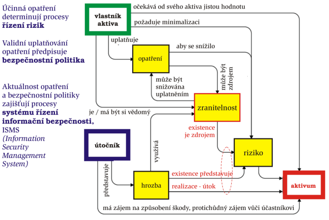
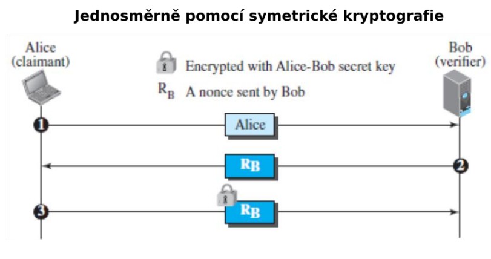
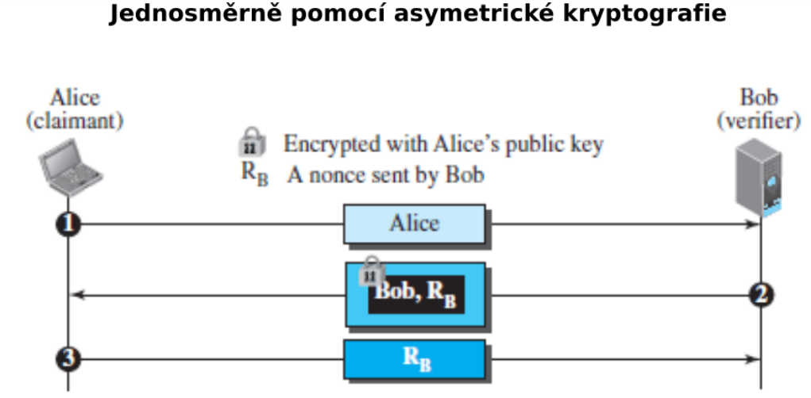
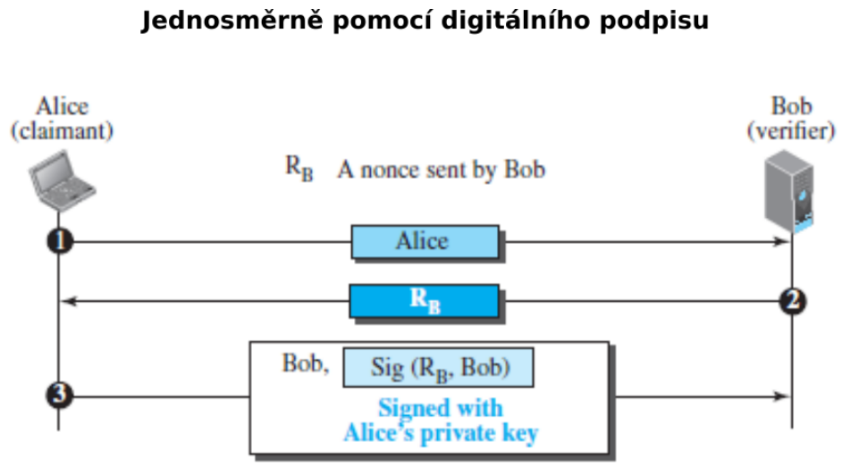

# PV017 Řízení informační bezpečnosti

**Use at your own risk**

# Přednáška #1

- Co se rozumí bezpečností a informační bezpečností zvláště
- Koncept a anatomie informační bezpečnosti

## „Safety“ X „Security“

- Popsáno standardy rodiny ISO/IEC 27xxx a 15408

### Safety, bezpečí

- Stav bytí, ve kterém platí, že za definovaných podmínek někdo či
něco nezpůsobí škodu.
- Bezpečí se mnohdy chápe jako chránění proti nahodilým událostem.

### Security, bezpečnost

- Ochránění proti úmyslným škodám na aktivech.
- Bezpečnost = zajištění, jak něco NEDĚLAT.
- Abychom bezpečnost zajistili efektivně, musíme znát co se nesmí dělat.
- Nelze se bránit proti účinkům škodících akcí realizovaných na bázi dosud
neexistujících/neznámých technologií.

## Informační bezpečnost

- Ochrana proti úmyslným škodám, nežádoucím akcím na informačních aktivech.
- ISO/IEC 27002
  - Dokument, obsahující výčet technologií, standardů, politik a manažerských praktik vhodných pro zajištění informační bezpečnosti
  - Dle standardu je informace je bezpečná, když je:
    - Přístupná pouze oprávněným subjektům
    - Modifikovatelná pouze oprávněnými subjekty
    - Dostupná oprávněným subjektům (do stanovené doby)
- Informace je bezpečná, když je zajištěná její:
  - **Důvěrnost** (confidentiality, C),
    - omezení přístupu k informacím a jejich zpřístupnění pouze oprávněným uživatelům („správným lidem“) a zabránění přístupu k informacím nebo jejich prozrazení neoprávněným uživatelům 
  - **Integrita** (integrity, I),
    - Integrita zdroje - změny zdroje smí provádět pouze autorizované subjekty a autorizované mechanismy
    - Integrita dat - data nesmí být nevhodně, náhodně a/nebo záměrně nějakou škodlivou činností změněna
    - Integrita původu - data skutečně pochází od osoby/subjektu, který je validně poskytuje, nikoli od podvodníka
  - **Dostupnost** (availability, A).
    - Informační zdroje musí být dostupné autorizovaným subjektům
  - Další vlastnosti
    - Autenticita - Subjekt provádějící operace s daty se prokázal - prošel autentizací
    - Zodpovědnost - Každý subjekt, který pracuje s informacemi, má za ně specifickou odpovědnost
    - Nepopiratelnost - Nepopiratelně lze určit subjekt nebo mechanismus, který akci provedl
    - Spolehlivost - Bezporuchovost

### Pojmy informační bezpečnosti

- **Aktivum** (Assets)
  - Data, systémy obsahující data, lidské zdroje k provozu
  - Účastník (informačního) prostředí vlastní/používá něco, co pro něj má nepominutelnou hodnotu, toto je jeho aktivem
  - Hmotná, nehmotná
  - Informační aktivum
    - Informace nebo služba, kterou zpracovává nebo poskytuje informační nebo komunikační systém
    - Technické vybavení, komunikační prostředky
  - Aktivum nelze nahradit bez vynaložení nákladů, času, úsilí
  - Aktiva musí být individuálně identifikovatelná
- **Zranitelnost** (Vulnerability)
  - Slabina využitelná ke způsobení škod
- **Hrozba** (Threat)
  - Potenciální možnost využití zranitelného místa k útoku útočníkem
  - Hrozby je nutné identifikovat, pokud je cílem jejich eliminace
- **Útok** (Attack)
  - Útok provádí útočník využitím zranitelnosti informačního aktiva (realizovaná hrozba)
  - Přírodní katastrofy/Externí útoky/Interní útoky/Lidské chyby
- **Škoda**
  - důsledek útoku na (hodnotu) aktiva 
- **Bezpečnostní incident** (Security incident)
- **Riziko** (Risk)
  - Velikost rizika je daná pravděpodobností provedení útoku a výší škody vzniklé útokem
  - Známe hrozby jimž jsou vystavena aktiva a odpovídající rizika – analýza rizik
  - **Perfektní bezpečnost** - absolutní eliminace všech rizik
- **Opatření** (Control)
  - Nástroj, služba pro snížení/eliminaci rizika
- **Bezpečnost**
  - zamezení škodám eliminací zranitelných míst nebo útočníků
  - **Systém bude úspěšný** (bezpečný), když bude zajišťovat ochranu proti všem možným útokům, a to vč. útoků, které se v době jeho tvorby dosud nevyskytly
  - Útočník bude úspěšný, když pro útok využije jedinou nedokonalost v bezpečnostních ochranách
  - Skutečně dosahovaná úroveň informační bezpečnosti se odvozuje od chápání informační bezpečnosti legislativou uživateli a provozovateli bezpečnostních, operačních, komunikačních a dalších typů systémů
  - Splnění nutné podmínky dosažení bezpečnosti informací je nekonečný proces

### Mechanismy pro implementaci opatření zajišťujících důvěrnost

- Využívá se **šifrování** pomocí klíčů
  - Klíč je rozsáhlý řetězec bitů (náhodné čísla, prvočísla)
- **Symetrické šifrování**
  - Blokové/Proudové
  - Stejný klíč pro Alici i Boba
  - 
- **Asymetrické šifrování**
  - Privátní klíč (Podpis, dešifrování)
  - Veřejný klíč (Ověření podpisu, šifrování)
  - 

### Mechanismy pro implementaci opatření zajišťujících integritu

- **Hashování**
  - Ke zprávě je připojen otisk zprávy
  - Otisk zprávy je vytvořen hashovací funkcí
    - Požadavek na hashovací funkce:
      - rychlost výpočtu, jednosměrnost, bezkoliznost
      - při změně (1 bitu) se změní nejméně 50 % otisku
  - Ochrana proti pasivnímu útoku
- Message authentication code (MAC)
  - Ochrana proti aktivnímu útoku proti integritě a/nebo autentizaci
- Asymetrické šifrování
  - **Digitální podpis** (zajišťuje i nepopiratelnost)

### Mechanismy pro implementaci opatření zajišťujících autentizaci

- Autentizace entit
  - Něco co znám - heslo, klíč kryptografie, PIN
  - Něco co mám - karta, občanka, řidičák
  - Něco co jsem - otisk prstu, zornička, hlas, podpis
  - Dvoufaktorová autentizace
- Autentizace dat
  - šifrování
  - Jednosměrně pomocí symetrické kryptografie
    - Alice zašle požadavek o komunikaci, Bob zašle náhodné číslo Alici, Alice náhodné číslo zašifruje a zašle ho Bobovi. Bob si dešifruje zprávu a pokud je tam dané číslo, Bob ví, že se jedná o držitele klíče (Alice).
    - Aby se prokázal i Bob, tato komunikace se provede zrcadlově opačně
    - 
  - Jednosměrně pomocí asymetrické kryptografie
    - Alice zašle požadavek o komunikaci, Bob zašle náhodné číslo a identifikátor, které jsou zašifrovány veřejným klíčem Alice. Alice si tuto zprávu dešifruje pomocí svého soukromého klíče. Alice odstraní identifikátor a číslo pošle zpět.
    - 
  - Jednosměrně pomocí podpisu
    - Alice zašle požadavek o komunikaci, Bob zašle náhodné číslo. Alice provede podpis identifikátoru a náhodného čísla. Podpis zašle s identifikátorem zpět. Ověření probíhá pomocí věřejného klíče Alice.
    - 

### Správa klíčů

- Pro symetrickou kryptografii
  - Key Distribution Center
  - Drží klíče a generuje klíče pro komunikaci dvou subjektů
- Private Key Infrastructure, Certifikační autorita
  - Pro Asymetrickou kryptografii
    - Private Key Infrastructure
    - Certifikační Autorita
      - Vydává Certifikát -> Dokument držící veřejný klíč a informace o certifikátu, vlastníkovi a certifikačí autoritě
      - Je vytvořena hierarchie certifikačních autorit

### Politika informační bezpečnosti (IT Security Policy)

- Politika
  - pravidla řídicí dosažení cílů určenými způsoby
- Definuje
  - bezpečné používání IT v rámci organizace
  - třídu (sílu) útočníků, vůči kterým se informace organizace zabezpečují
- Stanovuje
  - co jsou citlivá informační aktiva, jejich klasifikaci a odpovědnosti za jejich stav
  - bezpečnostní infrastrukturu organizace z pohledu informační bezpečnosti

### Bezpečnostní procedury

- Dokumenty popisující akce, které se mají provést při útoku, a role osob vystupujících v bezpečnostních procedurách

### Bezpečnostní politika

- Soubor pravidel specifikující uplatňování opatření potřebných pro
dosažení akceptovatelné úrovně rizik
- BP říká
  - co proti čemu/komu se chrání
  - stanovuje bezpečnostní cíle
  - jak se tato ochrana prosazuje
  - určuje způsob dosažení bezpečnostních cílů pomocí implementových opatření
- Pro ověřitelně validní prosazování informační bezpečnosti IS je bezpodmínečně nutné definovat bezpečnostní politiku IS odpovídající hrozbám a rizikům, kterým je IS vystavený
- Detailnost bezpečnostní politiky závisí na účelu a na chráněné oblasti, ve
které je politika uplatňovaná
- Nižší BP
  - Plán zvládání rizik IS
  - Horizont 1 až 2 let
  - Dokument specifikující opatření chránící konkrétní IS
- Vyšší BP
  - Dokument vymezující chráněnou oblast a základní bezpečnostní cíle
  - Horizont 5 až 10 let
- Bezpečnostní politika je **důvěryhodná** (Trustworthy) jestliže se jejím uplatňováním prokazatelně dosahuje požadované úrovně ochrany aktiv
  - Trusted - Má nezasloženou důvěru / Trustworthy - Má zaslouženou důvěru (Spolehlivě splní požadavky)

## Anatomie informační bezpečnosti

### Klasifikace aktiv (zákonem o kybernetické bezpečnosti)
- Dle **důvěrnosti** aktiv
  - Nízká
    - Aktiva veřejně přístupná
    - Není vyžadována žádná ochrana
  - Střední
    - Nejsou veřejně přístupná
    - Není vyžadována žádná ochrana
    - např. Know-how
  - Vysoká
    - Nejsou veřejně přístupná, jejich ochrana je vyžadována právními předpisy
    - Přenosy informací jsou chráněny kryptografickými prostředky
  - Kritická
    - nejsou veřejně přístupná a vyžadují nadstandardní míru ochrany
    - Pro ochranu důvěrnosti je požadována evidence osob, které k aktivům přistoupily, a metody ochrany zabraňující kompromitaci ze strany administrátorů
- Dle **integrity** aktiv
  - Nízká
    - Aktivum nevyžaduje ochranu z hlediska integrity
  - Střední
    - Aktivum může vyžadovat ochranu z hlediska integrity
    - Ochrana integrity: standardní nástroje např. omezení přístupových práv pro zápis
  - Vysoká
    - Aktivum vyžaduje ochranu z hlediska integrity
    - Ochrana integrity: prostředky sledující historii provedených změn a zaznamenat identitu osoby provádějící změnu
  - Kritická
    - Aktivum vyžaduje ochranu z hlediska integrity
    - Ochrana integrity: prostředky jednoznačné identifikace osoby provádějící změnu např. pomocí technologie digitálního podpisu
- Dle **dostupnosti** aktiv
  - Nízká
    - Narušení dostupnosti aktiva není důležité a v případě výpadku je běžně tolerováno delší časové období pro nápravu (cca do 1 týdne)
    - Ochrana dostupnosti: pravidelné zálohování
  - Střední
    - Narušení dostupnosti aktiva by nemělo překročit dobu pracovního dne
    - Ochrana dostupnosti: běžné metody zálohování a obnovy
  - Vysoká
    - Narušení dostupnosti aktiva by nemělo překročit dobu několika málo hodin
    - Ochrana dostupnosti: záložní systémy a obnova poskytování služeb může být podmíněna zásahy obsluhy či výměnou technických aktiv
  - Kritická
    - Narušení dostupnosti aktiva není přípustné
    - Ochrana dostupnosti: záložní systémy a obnova poskytování služeb je krátkodobá a automatizovaná

### Zranitelnosti

- Mohou se nacházet v hardware, v software, v datech, v návrhu architektury, fyzickém uspořádání, personální politice, logických a technických opatření..

### Hrozby

#### Typy

- **Odhalení**
  - Slídění, špehování
  - Analýza komunikačního provozu
- **Podvod**
  - Modifikace dat, falšování identity, popírání autorství
  - Maškaráda - Útočník vystupuje jako legitimní uživate
  - Diseminace zlomyslného software (Planting) - Trojský kůň, vir
  - Modifikace systému, příprava pro příští útoky
- **Narušení**
  - Modifikace (dat, programu, chování technického prostředku, …)
    - Neautorizovaná osoba získá přístup do systému a modifikuje v něm uložená data, neoprávněně používá zdroje,
- **Uchvácení**
  - Zpožďování provedení služby, odmítnutí poskytnutí služby, Denial of Service (DoS)

#### Klasifikace hrozeb pro organizaci

- Vnitřní hrozby
  - Zdroj hrozby (útočník) se nachází uvnitř (zranitelné) organizace
  - Nezkušený zaměstnanec
- Vnější hrozby
  - Zdroj hrozby (útočník) se nachází mimo vnitřní síť organizace
  - Hackeři na Internetu, konkurence, cílení či náhodní nepřátelé

#### Hrozba sémantických útoků

- Nejslabší článěk bezpečnosti je člověk
  - Pouze amatér útočí na počítače a software
  - Profesionál útočí na lidi
- Ochrana proti sémantickým útokům musí být cílená na sociální řešení, ne na matematicko-logická (a technická) řešení
- Nastupuje fenomén kyberprostoru, je nutné fenomén informační bezpečnosti rozšířit na fenomén kyberbezpečnosti
  - Informační bezpečnost řeší narozdíl od kyberbezpečnosti i data na papíře.
  - Kyberbezpečnost řeší i věci nad rámec informační bezpečnosti, neřeší pouze data samotná, ale i lidi

### Ůtočník

#### Model útočníka

#### Klasifikace útočníka

### Opatření

#### Klasifikace

#### Technická opatření

#### Řídicí opatření

#### Provozní opatření

# Přednáška #2

- Jak významná je role standardů, bez nich ani ránu
- Legislativní rámec
- Co se rozumí řízením rizik
- Kdo má v instituci na starosti dosažení informační bezpečnosti

# Přednáška #3

- Politiky jako specifikátory toho co a jak dělat
- Systém procesů zajišťující kontinuální efektivitu zabezpečování
- Jak takový systém procesů projektovat

# Přednáška #4

- Jak zajistit provozní bezpečnost – pohled z praxe

# Přednáška #5

- • Jak zajistit aplikační bezpečnost - pohled z praxe

# Přednáška #6

- Jak hodnotit bezpečnost
- Praktické poznatky z posuzování kyberbezpečnosti – pohled z praxe