# PA103 Object-oriented Methods for Design of Information Systems

**Use at your own risk**

---

# Lecture #1: Introduction to Object-Oriented Design

## Challenges of SW development

- **Maintainability**
  - Ability to maintain/adapt the code due to bug fixes, new feature requirements
- **Quality**
  - Effeciency, security, reliability or another qualitative attributes that we can guarantee with our software
- **Complexity**
  - Current systems are too big to maintain them as whole
  - Solution to this is that we decompose the system into smaller parts and maintain each part separately
- **Changing requirements**
  - User Requirements are changing all the time
  - Possible solutions
    - System decomposition - Better localizing changes thanks to isolated parts with clear responsibilities
    - Process management - Management for every part of change (requirements management, development managent, test management) will improve maintainabilty
    - Quality assurance - We are focusing on quality of changes with regular quality testing to improve overall software quality

### System decomposition

We use modeling to control complexity of system by organizing and decomposing system into smaller parts that then have relationships between each other.

We use divide and manage (divide at impera) principle when modeling.

#### Structured modeling

Models that help us to decompose and organize system can be focused separately on **data** or **functions**

- Context diagram, data flow diagram, events, functional requirements, ...
- Entity-relationship diagram,data vocabulary, ...

Functional hierarchies and data clustering help to organize functional and
data models.

Continuous elaboration of models (e.g. constistency checking) can be **within** (this model is correct)  or **between** (these model corresponds to that model) models

Relationships between functional and data models can still be too complex

#### Object Oriented modeling

Models are focused on objects that encapsulate data and fuctions. Complexity is then hidden inside the object. There are higher requirements on interpart communication protocals.

In OO modeling we have much more diagrams than in structured modeling. These models can be used only in special cases and sometimes they are focused on single phase in software development cycle.

Two key models that are core of object oriented development are **Class Diagram** and **Use Case Diagram**.

Consistency checking are again between and inside the model.

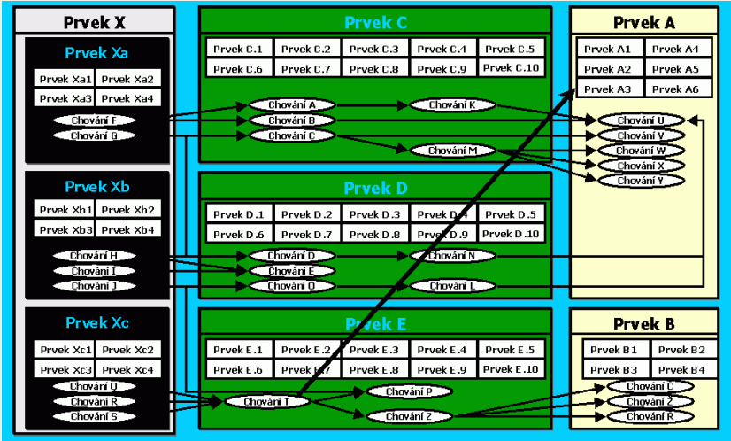

### Quality assurance

Quality consists of many qualitative attributes from different points of view

- User Experience (View of Customer) - Usability, Reliability, Performace, Security
- Code Quality (View of Developer) - Modularity, Complexity, Testability
- Long Term View (View of manager) - Adaptability, Portability, Reusability

These quality attributes can conflict themselves and there is no way to optimaze all at once.

- 
  - Purple relationship - Improving one decreases second
  - Blue relationship - Improving one improves second

Quality can be improved by

- Standardization of processes
- Regular testing and code reviews
- Using software patterns
  - Different paterns can be used to improve different (Functional or nonfuctional) quality attributes

### Process management

Defining and managing development processes - How to do things, how to communicate... (Tactics, methodologies, guidelines)

## OO Fundamentals

Expectations from OO Paradigm are Decomposition into small maintainable parts (Works only if we follow encapsulation rules) and reusability (does not work tell for object and classes)

**Object**

- smallest unit combining (encapsulating) data and functions
- stores data in field behind the “layer” of functions (operations)
- instantiating classes
- Methods define behaviour. Data in object defines object state. Object state can affect behaviour

Classes represent static view (design-time entities), while objects represent dynamic view (run-time entities)

Functions define **responsibility** - Object or class have defined data and methods to manipulate with

### OO decomposition principles

#### Abstraction

Abstraction in modeling is a problem of choosing what object and classes represent in the system. That affects distribution of responsibilities.

Abstraction of a single class is influenced by

- Attributes (possible states)
- Methods (behavior)
- Surrounding context – “neighboring” classes

#### Inheritance

Objects are childs of other objects. Child then inherits behaviour of inherited class.

Objects can never change affiliated class (i.e. the type) during their life time -> Never use inheritance if object’s role can vary in time

Inheritance can be always replaced by association

#### Association

Object consists of parts. Different parts distinguish object between themselves.

Association is more flexible than inheritance because links are created (and can be changed)
at run-time

Real OO decomposition usually mixes both inheritance and association together

#### SOLID Principle

- Single-responsibility principle
  - Every class, function or module should have responsibilty over single part of systems functionality
- Open-closed principle
  - Class, function or module should be open for extension but closed for modification
  - Changes will be hangled as new methods or classes and will involve minimal changes to existing code
- Liskov substitution principle
  - Introduces polymorphism
  - Whenever an instance of a class is expected, one can always substitute an instance of any of its sub-classes
    - If S is a subtype of T, then objects of type T in a program may be replaced with objects of type S without altering any of the desirable properties of that program
  - Liskov principle can be violated by replacing object with a type that has different desired behaviour (e.g. Duck that quacks is replaced with Mechanical duck that quacks only when it has batteries)
  - To preserve substitution, we have to follow several constraints put on
    - method signatures,
    - behavioral conditions of sub-types.
  - **Method signatures**
    - **Arguments** of derived classes must be equally or more generic - less derived than arguments of base class
      - 
    - **Return type** should be equally or less generic - more derived - than those required by the base class
      - 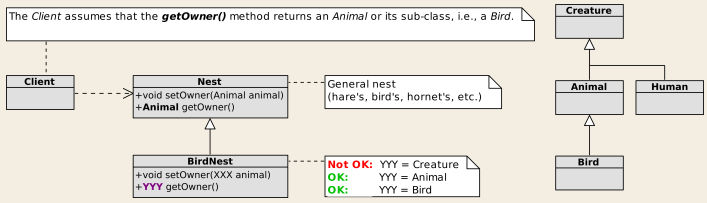
    - No new **exceptions** should be thrown by methods of the sub-type, only existing one or their subtypes
  - **Behavioral conditions of sub-types**
    - **History constraint**: New or modified method or properties should not modify the state of an object in a manner that would not be permitted by the base class.
      - Violation
        - 
        - Mechanical Duck for example
    - **Preconditions** cannot be strengthened in a sub-type
    - **Postconditions** cannot be weakened in a sub-type
    - **Invariants** of the supertype must be preserved in a sub-type
  
- Interface segregation principle
  - Large interfaces are split into smaller ones so client can work only with methods that are of interest to them
- Dependency inversion principle
  - Instead of having direct dependencies it may be better to loosely couple software modules
    - High-level modules should not import anything from low-level modules. Both should depend on abstractions
    - Abstractions should not depend on details. Details (concrete implementations) should depend on abstractions.

## Classes vs. data entities (ERD vs. class diagram)

 (Only showcase of possible implementation solutions to given diagram)

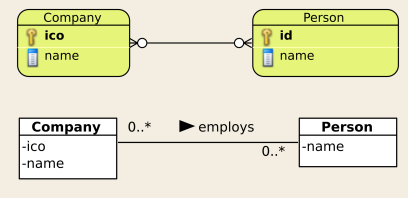

- Identity in ERD = primary key; Identity in OO = address in the memory!
- This model is directly implementable. As opposed to ER model, M:N relationships pose no problem.

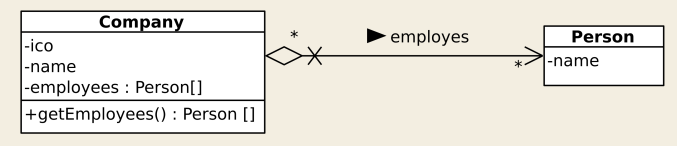

 Approach 1, model 1: We prefer one direction

- Company stores persons (employees) in array
- Person has no link to its companies
- Problem
  - There are many companies registered in the system. Where
they are stored?
  - How we get link to concrete address if we have no query mechanism
- Solution
  - Implement JobsMngr that stores all the companies and mediates access to companies and their employees 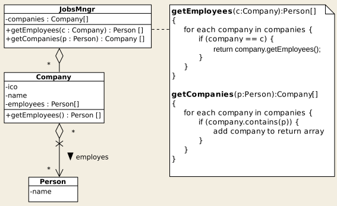

Approach 2, model 1: Bidirectional association

- Pros: Clear responsibilities. Responsibilities are uniformly distributed to all
classes
- Cons: Very complicated memory management and consistency checking,
especially without automatic “garbage collection”

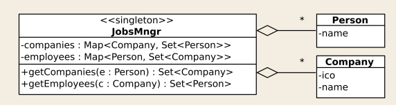

Approach 2, model 2: Preserved bidirectional association, responsibility
located in a big “God” object.

- Pros: Management of instances and then the consistency checking are
localized in the JobsMngr => maintainability.
- Pros: Efficiency
- Problem: Where to put salaries
- Solution
  - 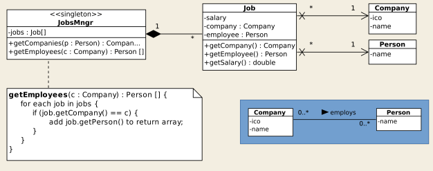
  - Helper class

As shown, there are many solutions. Designer has to choose best solution for given context. Patterns can help designers to make right decisions.

# Lecture #2: Analysis Patterns

## Motivation and history

### Generic Properties of Patterns

Common goal - improve the quality of SW design, either specific (security, reliability, etc.) or maintainability.

When using patterns, designers have to make decisions, usage of pattern is not mechanical -> It is creative process

- Appropriate pattern has to be selectad to reach given goals
- Sometimes we have to combine multiple patterns
- Consequences of pattern usage has to be considered

### History

Christopher Alexander (an architect) defined the pattern term for designing homes, buildings, and towns.

- Pattern: solution of the problem in given context
- “Each pattern describes a problem which occurs over and over again in our environment and
then describes the core of the solution to that problem, in such a way that you can use this
solution a million times over, without ever doing it in the same way twice.”

In 1995 book by Gamma, Helm, Johnson, Vlissideas was issued "Design patterns: Elements of Reusable object oriented software". Book focuses on patterns for generic object oriented programming,

In 1997 Martin Fowler: Analysis patterns book was published.
Fowler’s patterns are

- Intended to be used in the requirements analysis phase of the SW life cycle
- Based on the „data modeling“ (ERD or class diagram)
- Related to the decomposition of the problem domain model

SW Development Life Cycle

1) Requirement Analysis
   - Key UML models are **Use Case Diagram** and **Conceptual class diagram** (problem domain model)
2) Design
3) Development
4) Testing
5) Maintenance

### Conceptual Class Diagram

- Provides basic terms and data that have to be stored in the system
  - Describes the problem domain by terms (**classes**), their basic properties (**attributes**) and contexts (**associations with cardinality**)
- Although the class diagram is a static model, in the analysis phase it’s used primarily for  the clarification of behavior (functional requirements)
- Clarifies terminology

Problem Domain Model Example

- As said, we focus on classes, associations with cardinality and this model is then used for further step by step decomposition
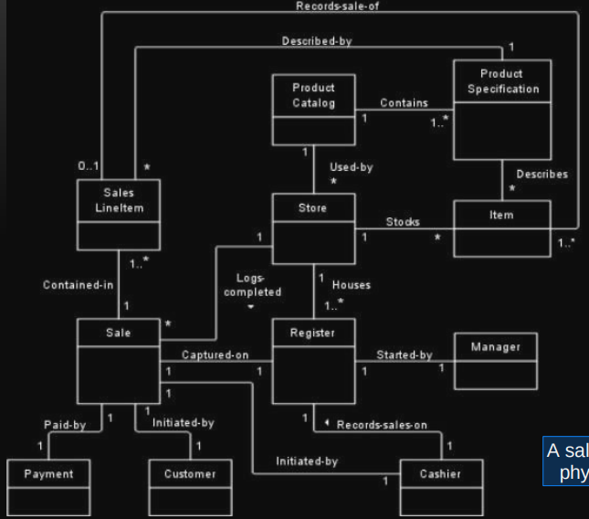

## Analysis Patterns

### Analysis patterns of M. Fowler

Defined 9 basic pattern collections covering various business domains

- **Accountability**
  - organizational structure and responsibilities
  - defines and asociates data with actors
- **Observations and Measurements**
  - measured values
- **Observations for Corporate Finance**
  - analysis of complex financial relationships and results in companies
  - Modules of managers
- **Referring to Objects**
  - objects identification
- **Planning**
  - schedules and protocols for repetitive plans
- Another pattern collections:
  - **Inventory and Accounting** (cashflow and invetorying)
  - Trading
  - Derivative Contracts
  - Trading Packages

Every collection consists of evolutionary sequence of patterns, from very basic to complex solutions

65 analysis patterns and 21 support patterns in total

### Accountability

The concept of accountability applies when a **person or organization is responsible to another person/organization**.

It captures **responsibilities** of **actors** (user roles) that often appear in the class diagram (problem domain model)

List of patterns:

- **Party**
- **Organization Hierarchies**
- **Multiple Organization Hierarchies**
- **Organization Structure**
- **Accountability**
- **Accountability Knowledge Level**
- Party Type Generalization
  - Adding generalization to party types makes it easier to define the knowledge level
- Hierarchic Accountability
  - Improves handling of constrains in organization structures.
- Operating Scopes
  - Define the responsibilities that are taken on when an accountability is created.
- Post
  - Another party type. Posts are used when accountability and scopes are defined by the post and do not change when the holder of the post changes.

#### Party

It is part of other more advanced patterns.

This model creates super type (nadtyp) for two independent analytical classes (Person, Organization) that have some shared context. Supertype then handles this context they share as one.

Use this pattern when:

- There is common behavior between two roles
- There is no need to distinguish between two roles

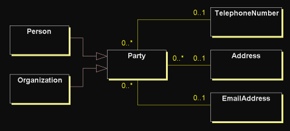

#### Organization Hierarchies

Companies have usually hierarchical organization structure (Operation Unit has Regions, Region has Divisions, Division has Sales Offices)

Pattern uses recursive relationships
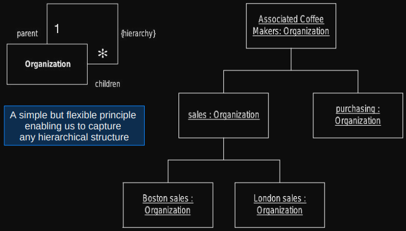
This allows very easy changes on organization structure. Without pattern, changes in model are required. With pattern, only new subclasses and rules are required

The danger with the recursive relationship is that it allows a division to be part of a sales office - we need to specify which type is above and below which => sub-classes and constraints are introduced (as shown in the image)

#### Multiple Organization Hierarchies

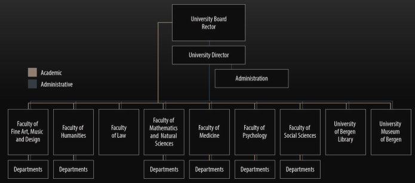

Many types we have parallel organization structures (Academic structure vs Administrative structure of University, Production structure vs Service structure)

Using pattern of Organization Hierarchies for multiple structures gets hard to use with many associations. Organization Structure pattern is introduced

#### Organization Structure

Pattern of Org. Hier. is extended with class insted of self reflection (recursion). Two relationships then describe parent and subsidiary organization structures (Described on university structure image as lines). After introducing extending analytical class, we can associate another data with it (e.g. OrganizationStructuryType for classifying the line, TimePeriod).

Summary for university organization hierarchies image:

- OrganizationStructure represents lines
- OrganizationStructureType represents color (type) of individual lines
- Organization represents rectangles

Example:

- Two organizational structures of the company: sale vs. PR
- From the sale point of view, there are two shops, in Brno and Prague. Brno sales office is subordinated to Moravia division, Prague sale office is subordinated to Bohemia division.
- From the PR point of view, both sale offices are subordinated to the common central office
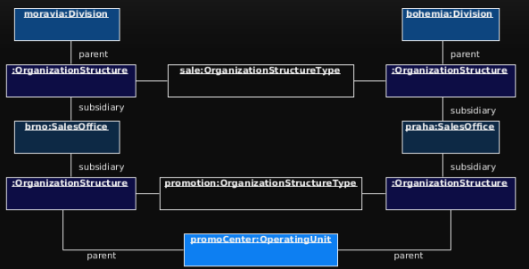

Suitable for **multiple** organizational hierarchies or hierarchies **changing in time** (and we want to capture these changes)

- Overkill for single organizational hierarchy
- Adding a new hierarchy = adding a new instance of OrganizationStructureType
  
TimePeriod allows us to record changes in the organization structure over
time.

Adding a new hierarchy is adding a new instance of
OrganizationStructureType

Constraints to organization structure are expressed by referring to
properties of the organization structure

- Disadvantage: Adding a new structure type can require changing the rules
- Solution: Adding a Rule class

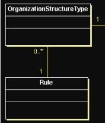

#### Accountability

Accountability helps to define responsibilities between two types of object (object in Party). This can be limited for given time period. The responsibilities are baseod on Commissioner-Responsible relationship (e.g. Employer-employee)

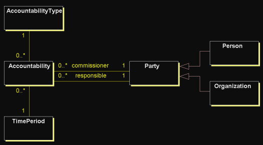

- Idea is to generalize Organizational structure into more generic cases
  - Organization Structure shows relationships between organization units
  - In general people have often similar relationship to other people or organization structures
- Accountability pattern combines a generalizes the principles of Organization Structure and Party

-Each instance of Accountability represents a link between two parties, the AccountabilityType indicates the nature of the link.

This allows you to handle any number of organizational relationships

"Accountability then allows division of work and responsibilities"?

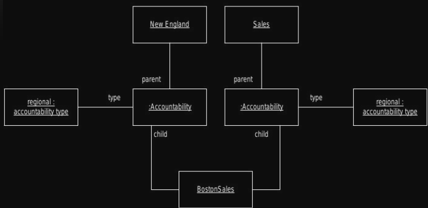

In the example we have 3 parties, New England, Sales and BostonSales. Boston sales is in relationship with New England and Sales with relationship types as regional

Difference to Organization Hierarchy is that instead of saying “who are the parents of Boston
Sales” you can say “who are the regional parents of Boston Sales”.

#### Accountability Knowledge Level

If there are many more accountability types than there would be organization structure types => introducing knowledge level

Allows us to better distribute constraints between parties.

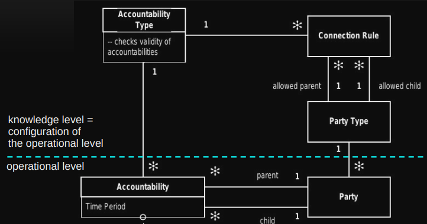

Connection rules says what party types we can connect (if we can connect particular party types).

Each accountability type has a set of connection rules.

Knowledge level: Which accountability types, what party types and connection rules are possible in the system.

Accountability is then relationship between two party types with accountability type.

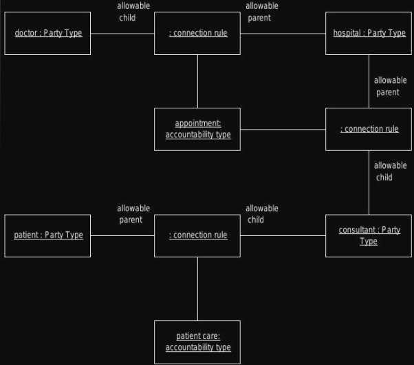

### Observations and Measurements

Storage and maintenance of quantitative and qualitative data

List of patterns:

- **Quantity** – values and their units
- **Conversion Ratio** – conversion ratios between units
- **Compound Units** – compound units e.g. km/h
- **Measurement** – measurement and recording of obtained values
- **Observation** – general observations and their recording
- **Protocol** – protocols of regular measurements
- **Subtyping Observation Concepts**
- Another patterns:
  - Dual Time Record ()
    - Different occurring and recording times/periods of events
  - Reject Observation
    - Observations cannot be deleted if a full audit trail is needed.
  - Active Observation, Hypothesis, and Projection
    - As observations are recorded, many levels of assurance are given.
  - Associated Observation
    - Ways to record the chain of evidence behind a diagnosis
  - Process Observation
    - Behavior models for observations

#### Quantity

Quantity pattern allows to store values with units attached to them.

By combining numbers and their units modeled as objects, we can describe how to convert quantities with conversion ratio
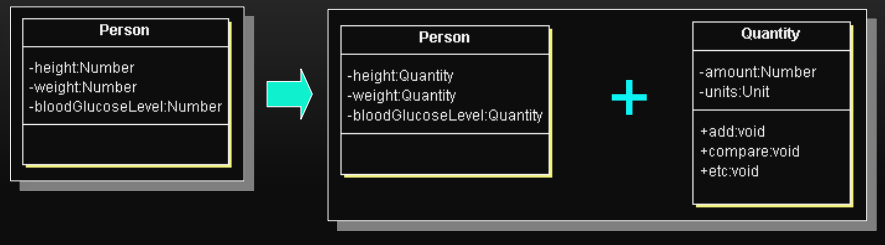

#### Conversion Ratio

If we use more units with one value, we might want to convert between these units. This pattern defines exchange table with multiplication ratio for converting
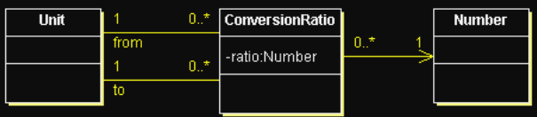

- Problem: How to convert non-linear units, e.g. Celsius to Fahrenheit, days to months, etc.?
- Solution: Employ the Individual Instance Method pattern, e.g. replace ConversionRatio with Strategy GoF pattern.

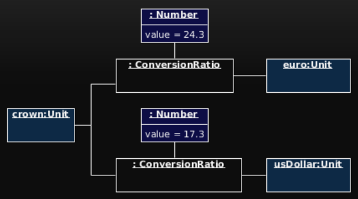

- Problem: How to convert compound units, e.g. km/h to m/s?
- Solution: Compound Units pattern.

#### Compound Unit

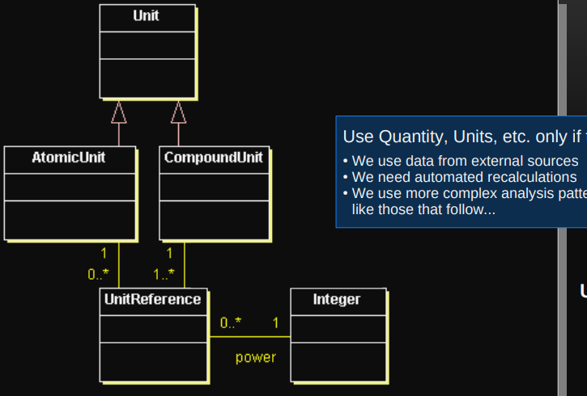

Unit Reference has to have more then one Unit reference or one with exponential >1 or <0

#### Measurement

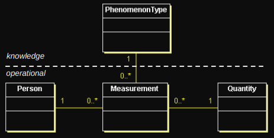

**PhenomenonType**: things to be measured, e.g. height, weight, blood glucose level, etc.
in a hospital.

**Measurement**: concrete measured value

**Person**: example of data assigned to the measurement

This pattern enables to record only quantitive values. To record non-quantitative values (like blood group - A+, A0, A-) we need to introduce **Observation pattern**

#### Observation

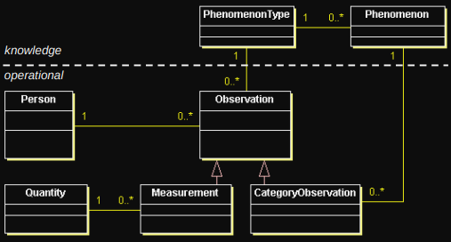

**PhenomenonType**: the same as before, e.g. blood group

**Phenomenon**: possible values, e.g. A+, A-, 0, …

**CategoryObservation**: Concrete observed qualitative value. It is similar to the
measurement but has a general phenomenon instead of quantity.

Pattern is useful for generalizing measurement and clarifying what will be measured.

**Task**: How to model a “low oil level in a car” observed in a car service?

- PhenomenonType = „oil level“
- Phenomenon = „over-full“, „OK“, „low
- Observation = Instance that links the car to the low phenomenon.

Example: We want to record many data about drivers so that we can check their reliability e.g.

- Driving period
- Driven vehicle (car, bus or tram)
- Number of accidents per year

Solution:
PhenonemonTypes - Driven vehicle, driving period, numberofaccident
Phenomenon - car bus or tram
Measurement - hours, kilometers
Quantity - value of record

#### Protocol

the method by which the observation were made.

- person's body temperature can be measured in the mouth, armpit, or rectum

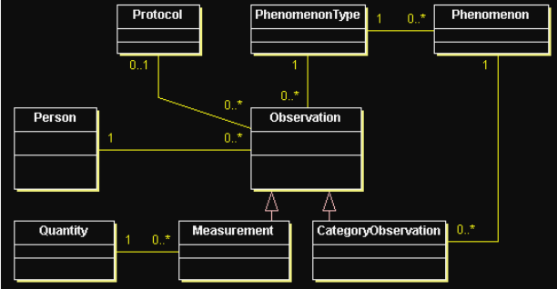

#### Subtyping Observation Concepts

If an observation is made of the presence of the subtype, then all supertypes are also considered to be present.

If an observation is made of the absence of a subtype, then that implies neither presence nor absence of the supertype.

- Diabetes has two subtypes: type I and type II. An observation that type I diabetes is
present for J. Smith implies that diabetes is also present for J. Smith. Absence of type I diabetes does not mean that J. Smith is not diabetic.

### Observations for Corporate Finance

How to analyze, gather something from business domain (data).

The goal of these patterns are not to record values of objects, but to record combinantions and groups of values by given criterias.

Extension of the Observations and Measurements collection of
pattern focused on (financial) balance of companies.

Patterns:

- **Enterprise Segment**
- Measurement Protocol – how measurements can be calculated from other
measurements using formulas that are instances of model types
- Range – range between two quantities + operations with ranges
- Phenomenon with Range

#### Enterprise Segment

Allows to divide enterprise to parts we want to measure - these parts are created dynamically based on defined point of views - **dimensions**.
Point of view can be foe example type of manufactured goods, geographical location, product range...

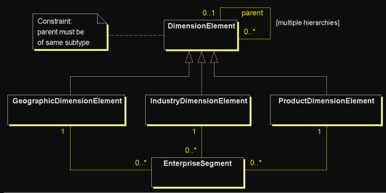

Dimension = hierarchy of dimension elements, i.e. the criteria for dividing enterprise
DimensionElement: Node in the dimension hierarchy, e.g. West Coast area
GeographicDimensionElement, …: root nodes of dimension hierarchies.

Task: We need analytical module in which we can investigate

- significant delays on lines
- Delays by vehicle type (buses, trams, trolleybus)
- Delays by geographic location
- Same for accidents

Solution:

### Inventory and Accounting

We want to track movement of some units (e.g. money) between places (e.g. accounts).
Thanks to this collection of patterns we can declare which accounts to track for changes and causes for this changes.

The entries record each change to the account.

Modeling Principle: To record a history of changes to a value use an account for that value

Patterns:

- **Account**
- **Transaction**
- **Summary Account**
- Memo Account
- Posting Rules
- … and many more

#### Account

This patterns serves as a container with common value change. Thanks to this pattern we have information about current value (account balance) and history of changes.
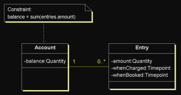

#### Transaction

Account pattern allows tracking of changes only, not causes for the change. This pattern extension of Account allows connection of accounts and tracking movement of values (money). This is used for items that cannot be created or deleted on their own, only moved.

Task: We need to know how many vehicles are located in each depot after the day shift

We can use this to track changes of vehicles located at this depot by tracking leaving and incoming vehicles.

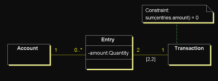

### Referring to Objects

Conceptual thinking about object identity, i.e., references to objects that
humans use.

This collection of patterns addresses naming objects, comparing them based on name, grouping and dividing them.

Patterns:

- **Name** – objects identification by names
- **Identification Scheme** – brings context to objects identification
- **Object Merge** –
- **Object Equivalence**–

#### Name

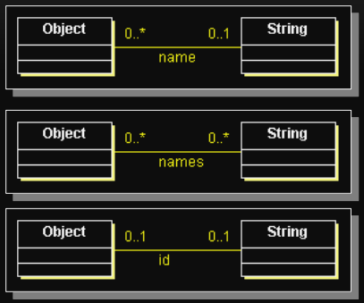

There are 3 ways to name a object.

- First possibility that object has one name.
- Second is that one object can have multiple names.
- Third is that object has one unique identification number.

#### Identification Scheme

Used when object can be referenced from multiple identification schemes. This can happen when integrating system with same type of object evidence and subsystem using their own type of identification.

Example:

- Each hospital assigns a case number to a patient, departments have individual numbers
- Identification schemes for banks: SWIFT, sort codes, CHAPS, etc.
  
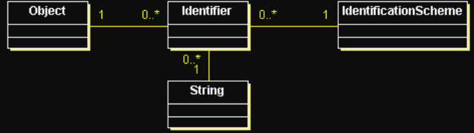

#### Object Merge

When (partially) duplicated objects come into existence in a system

- e.g., we realize that our patient is also an out-patient at another department

If we copy all the properties of one object over to the another and delete the copied object, we introduce problem with references to the deleted copied object -> **Superseeding strategy** that preserves references.

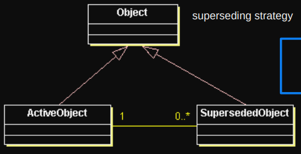

**Superseeding strategy**:  Active object replaces the superseded object. Superseded object delegates all messages to the active object

#### Object Equivalence

When objects can be considered similar (more-or-less the same, sometimes the same, etc.)

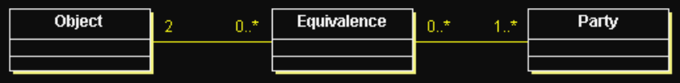

Example:

- Many doctors consider the diseases hepatitis G and hepatitis GBC to be the
same disease, but this is not universal.
- If a doctor wants a list of patients suffering from hepatitis G and that doctor is a party on the equivalence, then those patients suffering from hepatitis GBC are also returned.

Task:
The ministry of transport prepares a new electronic toll system. The system will store a licence plate and weight of the car (under 3.5 tons, 3.5 - 12 tons, above 12 tons), coupon type (10 days, month, year) and vignette validity date (since).

We will use observation pattern.

PhenomenonType - Weight category, Coupon type
Phenomenon - (under 3.5 tons, 3.5 - 12 tons, above 12 tons), (10 days, month, year)
Observation -> VignetteData
Measurement will contain Validity date of vignette and license plate
Quantity - actual free values like validity date and license plate
Person - not needed, might be useful for car data

# Lecture 4-8 Design Patterns

Design patterns are description of effective solution to given problem. These solutions are reusable for problems of similar type.
Primary difference is at the level of abstraction

## Analysis vs. Design Patterns

Analysis patterns

- Analysis patterns capture functional requirements (use cases) on conceptual model (problem domain model) “effectively” (without redrawing the model again and again)
- They do not depend on used technology to implement them
- enable us to pay attention on certain aspects of IS, ask related questions, and
then clarify functional requirements
- use high-level conceptual models of class diagrams (capturing term of the problem domain rather than classes of some programming language);

Design patterns

- Design patterns are general reusable solution to a commonly occurring problems in software design
  - Description or template of how to solve a problem that can be solved in many different situations.
  - Designer needs to choose appropriate design pattern (consider compromises and consequences), implement them and combine them with other patterns
- used for maintainable decomposition of classes at the design level of system
decomposition, i.e., at the level of attributes, methods, and precise relationships
- facilitate reuse of successful software architectures and designs
- capture the static and dynamic structure and collaboration among key participants in software design

## Common problems with design patterns

- Too many patterns applied - use relevent patterns
- Applying pattern to solve wrong problem
- Applying the last learned pattern
- Cost and sources required to re-design software by means of design patterns
- Partial knowledge of patterns

## Essential Elements of Patterns

- **Pattern name**
- **Problem statement**
  - Describes when to apply the pattern.
  - Explains the problem and its context.
- **Solution**
  - Describes the elements that make up the design, relationships, responsibilities and collaborations.
  - Does not describe specific concrete implementation
- **Consequences**
  - Results and trade-offs of applying pattern
  - Critical for evaluating design alternatives, understanding coasts, understanding benefits of applying pattern.

## Basic Classification of GoF Patterns

### Creational patterns

Deal with initializing and configuring classes and objects (initial state).

Hides specifics of the creation process.

Patterns:

- Abstract Factory
  - Factory for building related objects
- Builder
  - Factory for building complex objects incrementally
- Factory Method
  - Method in a derived class creates associates
- Prototype
  - Factory for instantiating new objects by cloning them from a prototype
- Singleton
  - Factory for singular (sole) instance in the system
  
### Structural patterns

Spread functional responsibility across classes. Use inheritance to compose protocols or code.

Deal with decoupling interface and implementation of classes and objects

Patterns:

- Adapter
  - Translator of „server“ interface to our „client“ code
- Bridge
  - Abstraction for binding one of many implementations
- Composite
  - Structure for building recursive aggregations
- Decorator
  - Extends an object transparently
- Facade
  - Simplifies and aggregates the interface for a complex subsystem
- Flayweight
  - Many fine-grained objects shared efficiently
- Proxy
  - One object approximates another, e.g. due to efficiency or memory requirements

### Behavioral patterns

Distribute behavioral responsibility across objects. Deal with dynamic interactions among societies of classes and objects.

Patterns:

- Chain of Responsibility
  - Request delegated to the responsible service provider
- Command
  - Request is first-class object
- Iterator
  - Aggregate elements are accessed sequentially
- Interpreter
  - Language interpreter for a small grammar
- Mediator
  - Coordinates interactions between its associates
- Memento
  - Stores and recovers object state

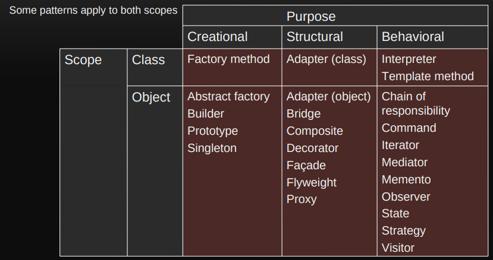

Scope is the domain over which a pattern applies

- **Class scope**: Relations between base classes and their sub-classes (static semantics)
- **Object scope**: Relationships between peer objects

## Case study - Initial model

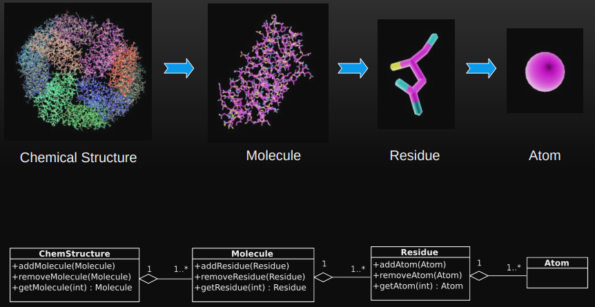

- Every object in running OO system must be referenced
- Every class must be associated with another class or have well-known access point
- Problem
  - Atoms are referenced from Residue, Residues from Molecule and Molecules from ChemStructure. ChemStructure is not referenced from anywhere.
- Solution:
  - Singleton pattern

## Creational Patterns

### Singleton pattern

This creational pattern creates and mediates access to a single shared instance accessible from anywhere (via static variable)

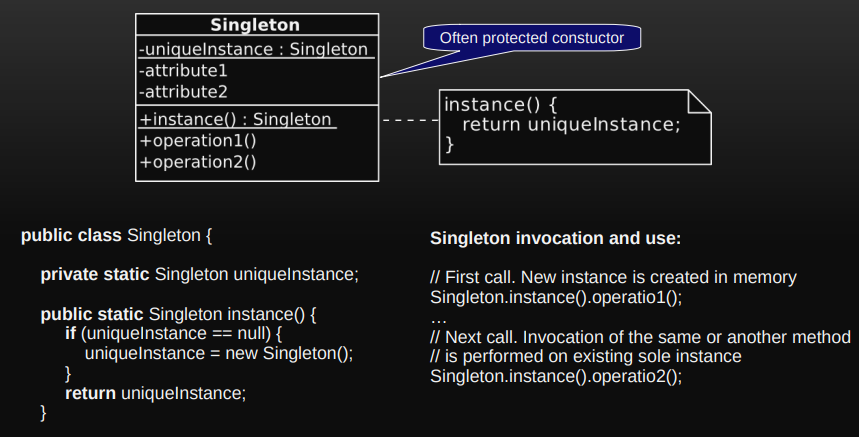

#### Applicability

Use the singleton pattern when there **must be only one instance** of class and this instance must be **accessible** from a well-known access point.

#### Consequences

- Gained a global access point to that instance
- Reduced name space
- Permits refinement of operations and representation
  - The Singleton class may be sub-classed, and it's easy to configure an application with an instance of this extended class
  - You can configure the application with an instance of the class you need at run-time
  - The singleton object is initialized only when it’s requested for the first time

- Permits a variable number of instances.

#### Criticism

- Singletons are sometimes considered anti-patterns
  - They introduce a global instance/state
- They violate the single responsibility principle
  - they control their own creation and lifecycle.
- They are difficult to test. They carry state around for the lifetime of the application.
  - -> Tests need to be ordered (Unit test should be independent)
- Solution: Use **dependency injection** provided by modern frameworks, e.g., Spring

### Factory Method

Creational design pattern that provides an interface for creating objects in a superclass, but allows subclasses to alter the type of objects that will be created (Delegates the creation of products or helper objects to sub-classes)

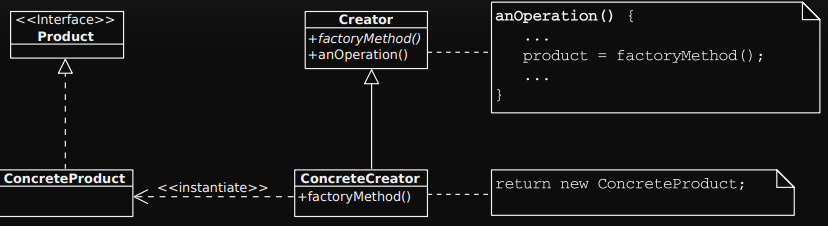

**The Product** declares the interface, which is common to all objects that can be produced by the creator and its subclasses

**Concrete Products** are different implementations of the product interface.

**The Creator** class declares the factory method that returns new product objects. It’s important that the return type of this method matches the product interface.

**Concrete Creators** override the base factory method so it returns a different type of product.

E.g.

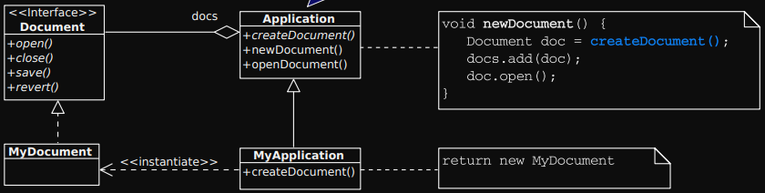

#### Applicability

Use the Factory Method pattern when:

- A class can't anticipate the class of objects it must creat
- A class wants its subclasses to specify the objects it creates
- Classes delegate responsibility to one of several helper subclasses, and you want to
localize the knowledge of which helper subclass is the delegate.

#### Consequences

- Factory methods eliminate the need to bind application-specific classes into your code.
  - The code only deals with the Product interface.
- A potential disadvantage is that clients might have to subclass the Creator class just to create a particular ConcreteProduct object.
  - . Subclassing is fine when the client has to subclass the Creator class anyway, but otherwise the client now must deal with another point of evolution.

### Builder Pattern

Enables to create complex object gradually step by step.

- E.g. creating a tree - create root, create node, create node ....

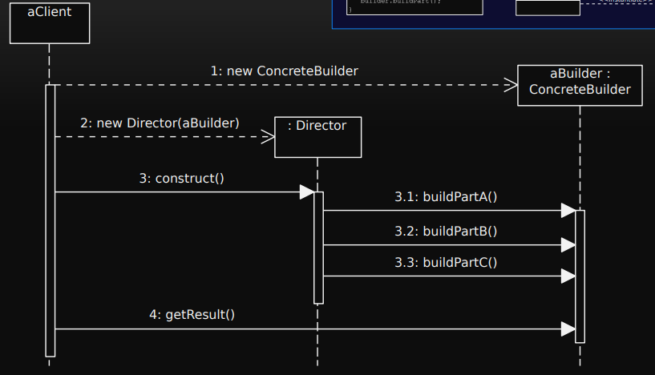

The **Builder** pattern suggests that you extract the object construction code out of its own class and move it to separate objects called builders.

**The Builder interface** declares product construction steps that are common to all types of builders.

Each **ConcreteBuilder** contains all the code to create and assemble a particular kind
of product.  Concrete builders may produce products that don’t follow the common interface.

**Products** are resulting objects. Products constructed by different builders don’t have to belong to the same class hierarchy or interface.

The **director** class defines the order in which to execute the building steps, while the builder provides the implementation for those steps. Having a director class in your program isn’t strictly necessary. You can always call the building steps in a specific order directly from the client code.

To create an object, you execute a series of these steps on a builder object. The important part is that you don’t need to call all of the steps. You can call only those steps that are necessary for producing a particular configuration of an object

The Client must associate one of the builder objects with the director. Usually, it’s done just once, via parameters of the director’s constructor. Then the director uses that builder object for all further construction.

#### Applicability

Use the Builder pattern when:

- the algorithm for creating a complex object should be independent of the parts that make up the object and how they're assembled
- the construction process must allow different representations for the object that's
constructed.

#### Consequences

- It lets you vary a product's internal representation
- It isolates code for construction and representation
- It gives you finer control over the construction process.

### Abstract Factory

Creational design pattern that ensures the creation of compatible products (lets you produce families of related objects without specifying their concrete classes).

**Abstract Products** declare interfaces for a set of distinct but related products which make up a product family.

**Concrete Products** are various implementations of abstract products, grouped by variants. Each abstract product must be implemented in all given variants

**The Abstract Factory** interface declares a set of methods for creating each of the abstract products.

**Concrete Factories** implement creation methods of the abstract factory. Each concrete factory corresponds to a specific variant of products and creates only those product variants.

- Although concrete factories instantiate concrete products, signatures of their creation methods must return corresponding abstract products.
- This way the client code that uses a factory doesn’t get coupled to the specific variant of the product it gets from a factory.

**The Client** can work with any concrete factory/product variant, as long as it communicates with their objects via abstract interfaces.

 Pseudocode

e.g.

#### Applicability

Use the Abstract Factory pattern when

- A system should be independent of how its products are created, composed, and
represented.
- A system should be configured with one of multiple families of products.
  - A family of related product objects is designed to be used together, and you need to enforce this constraint.
- You want to provide a class library of products, and you want to reveal just their interfaces, not their implementations.
  - Client works only with interfaces of abstract factory and products.
  
#### Consequences

- It isolates clients from implementation classes.
- It makes exchanging product families easy.
- It promotes consistency among products.
- Supporting new kinds of products is difficult.
  - We need to add methods for new products to factories

#### Related patterns

- A concrete factory is often a Singleton
- AbstractFactory classes are often implemented with Factory Methods or Prototypes

### Prototype pattern

Prototype is a creational design pattern that lets you copy existing objects without making your code dependent on their classes - cloning existing sample objects

 The pattern declares a common interface for all objects that support cloning

- Usually, such an interface contains just a single clone method.
- The method creates an object of the current class and carries over all of the field values of the old object into the new one.
- You can even copy private fields because most programming languages let objects access private fields of other objects that belong to the same class.

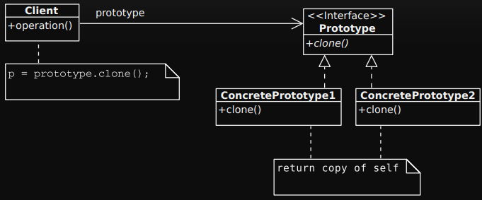

**The Prototype** interface declares the cloning methods.
In most cases, it’s a single clone method.

**The Concrete Prototype** class implements the cloning method. In addition to copying the original object’s data to the clone, this method may also handle some edge cases of the cloning process related to cloning linked objects, untangling recursive dependencies, etc.

**The Client** can produce a copy of any object that follows the prototype interface.

#### Applicability

 Use the Prototype pattern when:

- a system should be independent of how its products are created, composed, and represented; and
- when the classes to instantiate are specified at run-time, for example, by dynamic loading; or
- to avoid building a class hierarchy of factories that parallels the class hierarchy of products; or
- when instances of a class can have one of only a few different combinations of state.
  - It may be more convenient to install a corresponding number of prototypes and clone them rather than instantiating the class manually, each time with the appropriate state.

#### Selected consequences

- Many of the same consequences that Abstract Factory and Builder have.
- Registering and removing products’ prototypes at run-time.
- Specifying new objects by varying values.
- Specifying new objects by varying structure

## Structural Patterns

### Composite Pattern

Model has a lot of duplicate code (similar methods). Thanks to Composite pattern we can generalize classes to parent-child abstraction, unify methods (e.g. addChild, removeChild, etc.), reduce duplicate code and make the model easily extensible and maintainable.

Pattern lets you compose objects into tree structures and then work with these structures as if they were individual objects.

- makes sense only when the core model can be represented as a **tree**.

- Trees consist of composites (nonleaf nodes) and leaf nodes. They are subtypes of Component that has methods add, remove and get.
  - Composite implements operations and agregates instances of Component.
  - Leafs do not implement add, remove and get, only their uniform generic operation().
We can then work with both types of nodes throug a common interface. We dont need to know if it is a node or a leaf.

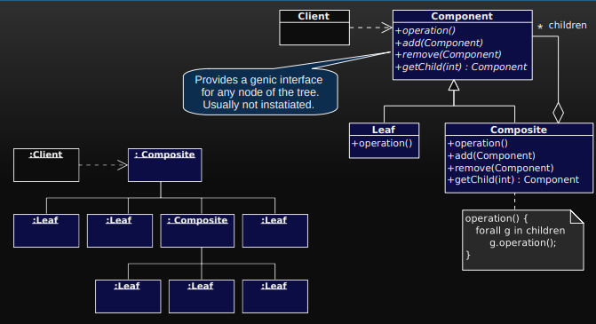

#### Applicability

When we want to represent part-whole hierarchies of objects or when we want the client code to treat the both types of nodes same (uniformly).

#### Consequences

- Defines class hierarchies consisting of primitive objects and composite objects
- Clients will treat all objects in the composite structure uniformly.
- Makes it easier to add new kinds of components
  - Open/Closed Principle. You can introduce new element types into the app without breaking the existing code, which now works with the object tree

#### Criticism

- Harded to restrict possible subtypes in supertype. (what child in parent, components of a composite)
- It might be difficult to provide a common interface for classes whose functionality differs too much

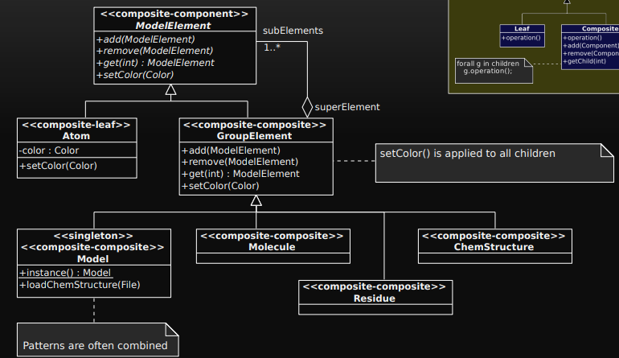

Problem: A mail server enables also sending roup mail besides a single mail delivery Therefore recipient of an email can be either a particular email address or a group alias. A group alias consits of email addresses or other group aliases. The sendmail(recipient, message) service of the mail server takes a message and a recipient and ensures the delivery

Goal: Draw a class diagram using a suitable design pattern. Use stereotypes to show the mapping of pattern clases on this application domain

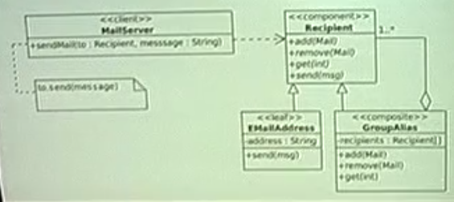

### Adapter Pattern

Adapter is a structural design pattern that allows objects with incompatible interfaces to collaborate.

Adapter is a special object that converts the interface of one object so that another object can understand it.

An adapter wraps one of the objects to hide the complexity of conversion happening behind the scenes. The wrapped object isn’t even aware of the adapter. For example, you can wrap an object that operates in meters and kilometers with an adapter that converts all of the data to imperial units such as feet and miles.

Adapter has two variants - Class and Object.

#### Object Adapter

- request() methods adapted by re-sending to associated adaptee
- The adapter implements the interface of one object and wraps the other one.
  - It can be implemented in all popular programming languages.

- The **Client** is a class that contains the existing business logic of the program.
- The **Target** describes a protocol that other classes must follow to be able to collaborate with the client code
- The **Adaptee** is some useful class (usually 3rd-party or legacy).
  - The client can’t use this class directly because it has an incompatible interface.
- The **Adapter** is a class that’s able to work with both the client and the target

1. The Adapter implements the client interface, while wrapping the target object.
2. The Adapter receives calls from the client via the adapter interface
3. The Adapter translates them into calls to the wrapped service object in a format it can understand.

Two object are called, Adapter by client and Adaptee in the background

#### Class Adapter

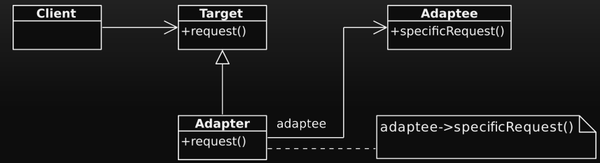

- request() methods adapted by multiple inheritance
- The adapter inherits interfaces from both objects at the same time.  
  - The Class Adapter doesn’t need to wrap any objects
  - The adaptation happens within the **overridden** methods.
  - This approach can only be implemented in programming languages that support multiple inheritance, such as C++.
- Only one object is called - Adapter

#### Applicability

Use the Adapter class when:

- you want to use some existing class, but its interface isn’t compatible with the rest of your code
- reuse several existing subclasses that lack some common functionality that can’t be added to the superclass
  - However, you’ll need to duplicate the code across all of these new classes, which smells really bad.
- (object adapter only) you need to use several existing subclasses, but
it's impractical to adapt their interface by subclassing every one. An object adapter can adapt the interface of its parent class

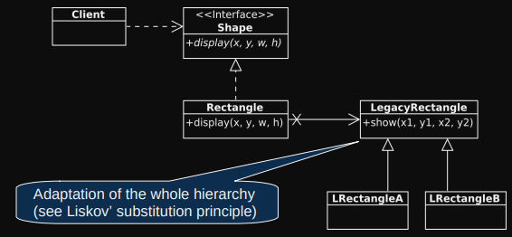

#### Consequences (class adapter)

- adapts Adaptee to Target by committing to a concrete Adapter class.
  - As a consequence, a class adapter won't work when we want to adapt a class and all its subclasses.
- lets Adapter override some of Adaptee's behavior, since Adapter is a subclass of Adaptee.
- introduces only one object, and no additional pointer indirection is needed to get to the adaptee.

#### Consequences (object adapter)

- lets a single Adapter work with many Adaptees
  - that is, the Adaptee itself and all of its subclasses (if any).
- makes it harder to override Adaptee behavior.
  - It will require subclassing Adaptee and making Adapter refer to the subclass rather than the Adaptee itself.

### Bridge Pattern

Structural design that lets you split a large class or a set of closely related classes into two separate hierarchies—abstraction and implementation—which can be developed independently of each other.

- Abstraction (also called interface) is a high-level control layer for some entity. This layer isn’t supposed to do any real work on its own. It should delegate the work to the implementation layer (also called platform).
- abstraction can be represented by a graphical user interface (GUI), and the implementation could be the underlying operating system code (API) which the GUI layer calls in response to user interactions.

Problem: e.g. We have shapes that are colored. When introducing more colors and more shapes we have more and more subclasses like RedCircle, Blue Circle, Red Square...

Solution: We separate the dimensions into a separate class hierarchy.

**Implementor** typically provides multiple subclasses. **The Implementor** declares the interface that’s common for all concrete implementations. An abstraction can only communicate with an Implementor object via methods that are declared here.

**Abstraction** is controlled by client and provides operations. It provides high-level control logic. It relies on the implementation object to do the actual low-level work.

**Concrete Implementations** contain platform-specific code.

**Refined Abstractions** provide variants of control logic. Like their parent, they work with different implementations via the general implementation interface.

Usually, **the Client** is only interested in working with the abstraction. However, it’s the client’s job to link the abstraction object with one of the implementation objects.

#### Applicability

Use the Bridge pattern when:

- you want to avoid a permanent binding between an abstraction and its implementation. (implementation must be selected or switched at run-time)
- both the abstractions and their implementations should be extensible by sub-classing
- changes in the implementation of an abstraction should have no impact on clients (their code should not have to be recompiled)
- you have a proliferation of classes. Such a class hierarchy indicates the need for splitting an object into two parts.

#### Consequences

- Decoupling interface and implementation
- Improved extensibility
- Hiding implementation details from clients

#### Adapter vs. Bridge

- bridge is meant to separate an interface from its implementation so that they can be varied easily and independently
- adapter is meant to change the interface of an existing object (usually applied to systems after they're designed).

### Decorator Pattern

 Structural design pattern that lets you attach new behaviors to objects by placing these objects inside special wrapper objects that contain the behaviors.

 E.g. we have pizza. If we want pizza with sausage, we wont have dedicated class of SausagePizza but rather sausage object that we connect (aggregation) to pizza object. -> Avoids explosion of ”combinatory” sub-classes in the level of objects

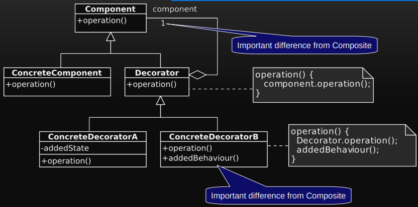

**The Component** declares the common interface for both wrappers and wrapped objects.

**Concrete Component** is a class of objects being wrapped. It defines the basic behavior, which can be altered by decorators.

**The Decorator**  delegates all operations to the wrapped object.

**Concrete Decorators** define extra behaviors that can be added to components dynamically. Concrete decorators override methods of the base decorator and execute their behavior either before or after calling the parent method.

The Client can wrap components in multiple layers of decorators, as long as it works with all objects via the component interface.

#### Applicability

- for responsibilities that can be withdrawn.
- to add responsibilities to individual objects dynamically and transparently, that is without affecting other objects.
- when extension by sub-classing is impractical.
  - Sometimes a large number of independent extensions are possible and would produce an explosion of sub-classes to support every combination.

#### Consequences

- More flexibility than static inheritance
- Avoids feature-laden classes high up in the hierarchy. Instead of trying to support all
- foreseeable features in a complex, customizable class, you can define a simple class and add functionality incrementally with Decorator objects.
- Liability: A decorator and its component aren't identical.
- Liability: Lots of little objects.

#### Case Study

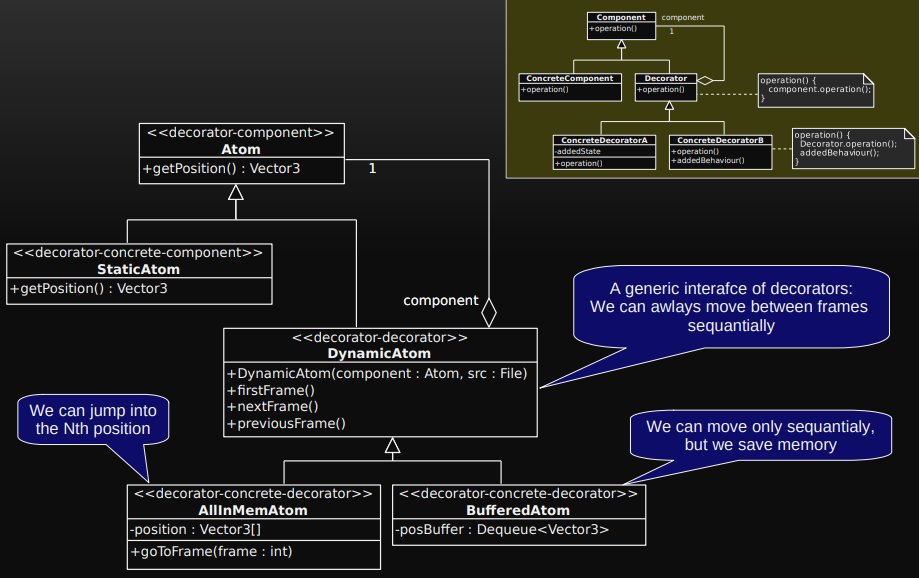

#### Decorator – Related Patterns and Applications

**Adapter**: A decorator is different from an adapter in that a decorator
only changes (or extends) an object's responsibilities, not its interface;
an adapter will give an object a completely new interface.

**Composite**: A decorator can be viewed as a degenerate composite
with only one component. However, a decorator adds additional
responsibilities – change isn't intended for object aggregation

**Strategy**: A decorator lets you change the skin of an object; a strategy
lets you change the guts. These are two alternative ways of changing
an object. Moreover, strategies rather changes behavior while
decorators rather extends behavior of the original object.

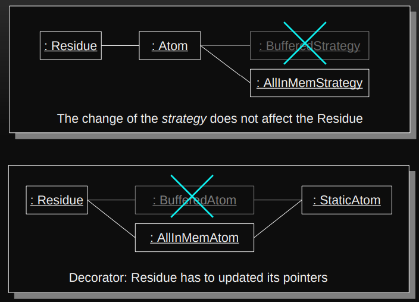

- It’s hard to remove a specific wrapper from the wrappers stack.
- It’s hard to implement a decorator in such a way that its behavior doesn’t depend on the order in the decorators stack.

### Proxy Pattern

Proxy is a structural design pattern that lets you provide a substitute or placeholder for another object.

A proxy controls access to the original object, allowing you to perform something either before or after the request gets through to the original object.

Analogy: A credit card is a proxy for a bank account, which is a proxy for a bundle of cash.

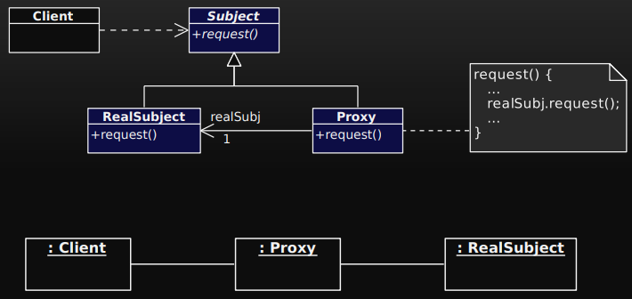

**The Subject** declares the interface of the Service. The proxy must follow this interface to be able to disguise itself as a service object.

**The RealSubject** is a class that provides some useful business logic.

**The Proxy** class has a reference field that points to a RealSubject object. After the proxy finishes its processing (e.g., lazy initialization, logging, access control, caching, etc.), it passes the request to the RealSubject object.

Usually, proxies manage the full lifecycle of their service objects.

**The Client** should work with both services and proxies via the same interface. This way you can pass a proxy into any code that expects a service object.

#### Applicability

Proxy is applicable whenever there is a need for a more versatile or sophisticated reference to an object than a simple pointer

- A smart reference is a replacement for a bare pointer that performs additional actions when an object is accessed
- **Lazy initialization** (virtual proxy)
  - Instead of creating the object when the app launches, you can delay the object’s initialization to a time when it’s really needed.
- **Access control** (protection proxy)
  - The proxy can pass the request to the service object only if the client’s credentials match some criteria
- **Local execution of a remote service** (remote proxy). This is when the service object is located on a remote server.
  - proxy passes the client request over the network, handling all of the nasty details of working with the network.
  - caching proxy
  - Logging requests
    - The proxy can log each request before passing it to the service

#### Consequences

- A remote proxy can hide the fact that an object resides in a different address space.
- A virtual proxy can perform optimizations such as creating an object on demand.
- Both protection proxies and smart references allow additional housekeeping tasks when an object is accessed

### Facade Pattern

 Structural design pattern that provides a simplified interface to a library, a framework, or any other complex set of classes

 A facade might provide limited functionality in comparison to working with the subsystem directly. However, it includes only those features that clients really care about.

 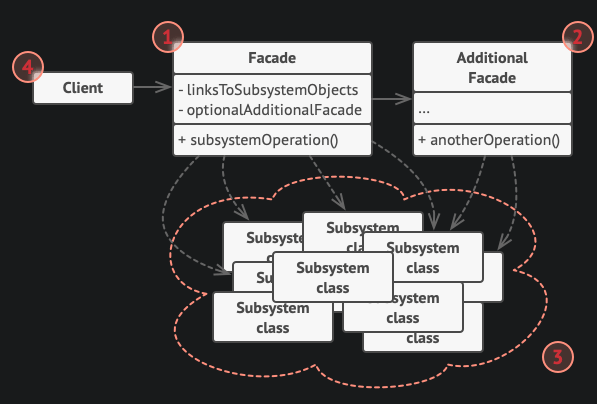

1. **The Facade** provides convenient access to a particular part of the subsystem’s functionality.
   1. It knows where to direct the client’s request and how to operate all the moving parts.
2. An Additional Facade class can be created to prevent polluting a single facade with unrelated features that might make it yet another complex structure.
   1. Additional facades can be used by both clients and other facades.
3. The Complex Subsystem consists of dozens of various objects.
   1. To make them all do something meaningful, you have to dive deep into the subsystem’s implementation details, such as initializing objects in the correct order and supplying them with data in the proper format.
   2. Subsystem classes aren’t aware of the facade’s existence. They operate within the system and work with each other directly.
4. The Client uses the facade instead of calling the subsystem objects directly.

#### Applicability

Use the Facade pattern when:

- You want to provide a simple interface to a complex subsystem.
- There are many dependencies between clients and the implementation classes of an abstraction.
- You want to layer your subsystems. Use a facade to define an entry point to each subsystem level

#### Consequences

- It shields clients from subsystem components, thereby reducing the number of objects
that clients deal with and making the subsystem easier to use.
- It promotes weak coupling between the subsystem and its clients.
- It doesn't prevent applications from using subsystem classes if they need to. Thus you
can choose between ease of use and generality.

### Flyweight Pattern

Structural design pattern that lets you fit more objects into the available amount of RAM by sharing common parts of state between multiple objects instead of keeping all of the data in each object.

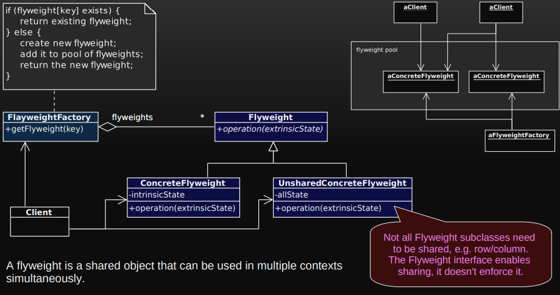

**The Flyweight** class contains the portion of the original object’s state that can be shared between multiple objects. The state stored inside a flyweight is called **intrinsic**. The state passed to the flyweight’s methods is called **extrinsic**.

**Intrinsic state**

- stored in the flyweight
- consists of information that's independent of the flyweight's context, thereby making it sharable.

**Extrinsic state**

- depends on and varies with the flyweight's context and therefore can't be shared.
- Client objects are responsible for passing extrinsic state to the flyweight when it needs it.

**The FlyweightFactory** instantiates flyweights and manages a pool of existing flyweights. The factory looks over previously created flyweights and either returns an existing one that matches search criteria or creates a new one if nothing is found.

Client calls the factory, passing it bits of the intrinsic state of the desired flyweight.

#### Applicability

Apply the Flyweight pattern when all of the following are true:

- An application uses a large number of objects.
  - Storage costs are high because of the sheer quantity of objects.  
  - Many groups of objects may be replaced by relatively few shared objects once extrinsic state is removed.
- The application doesn't depend on object identity. Since flyweight objects may be shared, identity tests will return true for conceptually distinct objects.

#### Consequences

- Flyweights may introduce run-time costs associated with transferring, finding, and/or
computing extrinsic state, especially if it was formerly stored as intrinsic state.
However, such costs are offset by space savings.
- Storage savings are a function of several factors:
  - the reduction in the total number of instances that comes from sharing
  - the amount of intrinsic state per object
  - whether extrinsic state is computed or stored.
- The more flyweights are shared, the greater the storage savings.
- The Flyweight pattern is often combined with the Composite pattern to represent a hierarchical structure as a graph with shared leaf nodes.

## Behavioral Patterns

### Iterator Pattern

We need to support various iterations through children and/or various implementations of children list in subclasses.

Iterator is a behavioral design pattern that lets you traverse elements of a collection without exposing its underlying representation (list, stack, tree, etc.).

We have a agregated object (container, Component in composite pattern), that contains more objects. Instead of the container returning each object one by one we introduce iterator that cycles through each object inside the container. We can then call the iterator to get to the items without knowing the internat implementation of the aggregate object

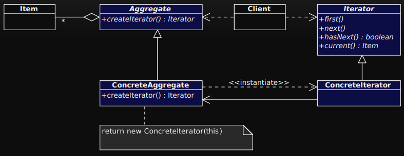

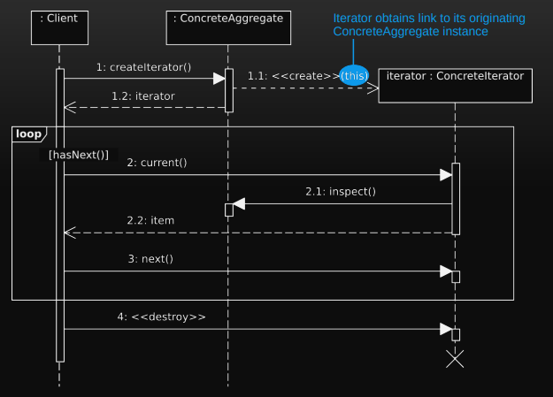

#### Applicability

- to access an aggregate object's contents without exposing its internal representation (hide its complexity from clients)
- to support multiple traversals of aggregate objects
  - multiple iterators - more ways of cycling through the objects (BFS, DFS)
  - provide a uniform interface for traversing different aggregate structures

#### Consequences

- It supports variations in the traversal of an aggregate.
- Iterators simplify the Aggregate interface.
- More than one traversal can be pending on an aggregate
- Open/Closed Principle. You can implement new types of collections and iterators and pass them to existing code without breaking anything
- Single Responsibility Principle. You can clean up the client code and the collections by extracting bulky traversal algorithms into separate classes.

#### Case study

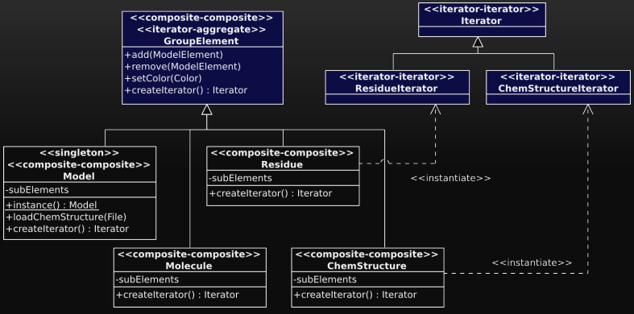

- The subElements attribute has been moved from GroupElement to individual subclasses
- It is not necessary to have a special iterator for each composite class. On the contrary, one iterator can be shared by multiple composites
- We can have different iterators for different classes. Classes then have createIterator method.

### Strategy pattern

- Behavioral design pattern
- The Strategy pattern suggests that you take a class that does something specific in a lot of different ways and extract all of these algorithms into separate classes called strategies
  - define a family of algorithms, put each of them into a separate class, and make their objects interchangeable.

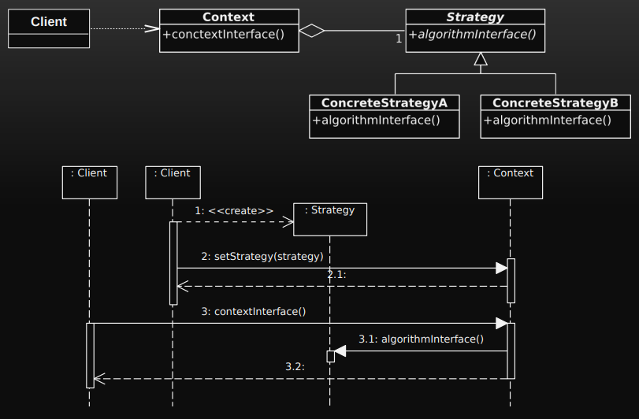

**The Context** maintains a reference to one of the concrete strategies and communicates with this object only via the strategy interface.

**The Strategy** interface is common to all concrete strategies. It declares a method the context uses to execute a strategy.

**Concrete Strategies** implement different variations of an algorithm the context uses.

**The Client** creates a specific strategy object and passes it to the context. The context exposes a setter which lets clients replace the strategy associated with the context at runtime.

The context calls the execution method on the linked strategy object each time it needs to run the algorithm (contextInterface()). The context doesn’t know what type of strategy it works with or how the algorithm is executed.

#### Applicability

Use the Strategy pattern when:

- you want to use different variants of an algorithm within an object and be able to switch from one algorithm to another during runtime.
- you have a lot of similar classes that only differ in the way they execute some behavior.
- class has a massive conditional statement that switches between different variants of the same algorithm

#### Consequences

- Hierarchies of Strategy classes define families of related algorithms
- An alternative to sub-classing
- Strategies eliminate conditional statements (switch-case).
- Different implementations of the same behavior.
- Client must understand how Strategies differ before it can select the appropriate one.
- Communication overhead between Strategy and Context
- Increased number of objects

#### Case study

We have two types of atoms that have common interface but different behavior. This model focuses only on getting atom’s position.

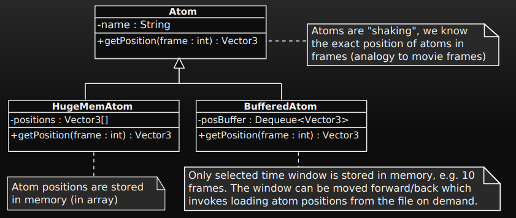

The client of atoms context is the residue, that stores the atom, and any other object/class that traversed the tree.

If we want to change atoms strategy we have to replace the instance of atom with another.

We lose the reference to original atom.

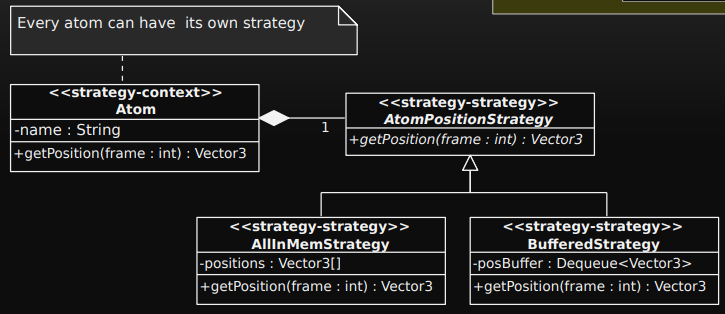

getPosition implementation logic is hidden in the AtomPositionStrategy -> Clients are not affected by changing the strategy.

### State Pattern

Behavioral design pattern that lets an object alter its behavior when its internal state changes. It appears as if the object changed its class.

Similar to the strategy pattern, but the behaviour depends on a state.

The State pattern suggests that you create new classes for all possible states of an object and extract all state-specific behaviors into these classes.

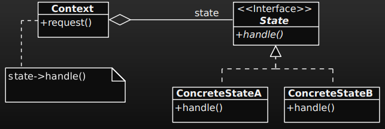

- Context delegates state-specific requests to the current ConcreteState object.
- A Context may pass itself as an argument to the State object handling the request.
This lets the State object access the context if necessary
- Context is the primary interface for clients. Clients can initially configure a Context with State objects.
  - Once a Context is configured, the clients don't have to deal with the State objects directly
- Either Context or the ConcreteState sub-classes can decide which state succeeds
another and under what circumstances

#### Applicability

 Use State when:

- an object's behavior depends on its state, and it must change its behavior at run-time depending on that state.
- operations have large, multipart conditional statements that depend on the object's
state.

#### Consequences

- It localizes state-specific behavior and partitions behavior for different states
- It makes state transitions explicit
- State objects can be shared (see Flyweight pattern later).

#### State vs. Strategy

- States can store a reference to the context object that contains them. Strategies
do not.
- States are allowed to replace themselves (i.e., to change the state of the context
object to something else), while Strategies are not.
- Strategies are passed to the context object as parameters, while States are
created by the context object itself
- Strategies only handle a single, specific task, while States provide the underlying
implementation for everything (or most everything) the context object does.

### Memento Pattern

Behavioral design pattern that lets you save and restore the previous state of an object without revealing the details of its implementation.

Memento is small object that stores saved state
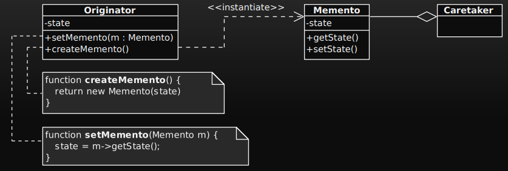

**The Originator** class can produce snapshots of its own state, as well as restore its state from snapshots when needed.

**The Memento** is a value object that acts as a snapshot of the originator’s state.

- It’s a common practice to make the memento immutable and pass it the data only once, via the constructor.

**The Caretaker**

- knows “when” and “why” to capture the originator’s state
- knows when the state should be restored.
  - the caretaker fetches the topmost memento from the stack and passes it to the originator’s restoration method.
- can keep track of the originator’s history by storing a stack of mementos.  

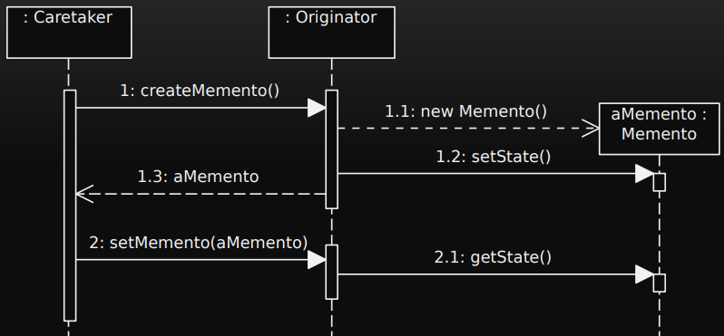

#### Applicability

Use the Memento pattern when

- a snapshot of an object's state must be saved and restored to that state later, and
- a direct interface to obtaining the state would expose implementation details and break the object's encapsulation.

#### Consequences

- Preserving encapsulation boundaries.
- It simplifies Originator.
  - In other encapsulation-preserving designs, Originator keeps the versions of internal state that clients have requested.
  - That puts all the storage management burden on Originator.
- Using mementos might be expensive.
  - Mementos might incur considerable overhead
    - if Originator must copy large amounts of information to store in the memento
    - or if clients create and return mementos to the originator often enough.
- Defining narrow and wide interfaces.
  - It may be difficult in some languages to ensure that only the originator can access the memento's state.
- Hidden costs in caring for mementos.
  - A caretaker is responsible for deleting the mementos it cares for.
  - However, the caretaker has no idea how much state is in the memento.

### Observer Pattern

Behavioral design pattern that lets you define a subscription mechanism to notify multiple objects about any events that happen to the object they’re observing.

All other objects that want to track changes to the **Publisher/Subject**’s state are called **Subscribers/Observers**.

Whenever an important event happens to the publisher, it goes over its subscribers and calls the specific notification method on their objects

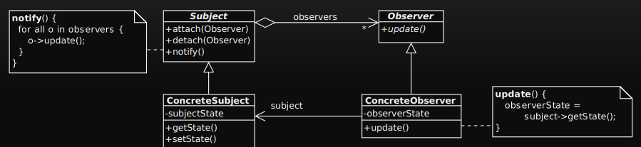

**The Subject** issues events of interest to other objects.

- These events occur when the publisher changes its state or executes some behaviors.
- Publishers contain a subscription infrastructure that lets new subscribers join and current subscribers leave the list.
- When a new event happens, the subject goes over the subscription list and calls the notification method declared in the subscriber interface on each subscriber object.

**The Subscriber** interface declares the notification interface.

- In most cases, it consists of a single update method.
- The method may have several parameters that let the publisher pass some event details along with the update.

**Concrete Subscribers** perform some actions in response to notifications issued by the publisher.

- All of these classes must implement the same interface so the publisher isn’t coupled to concrete classes.

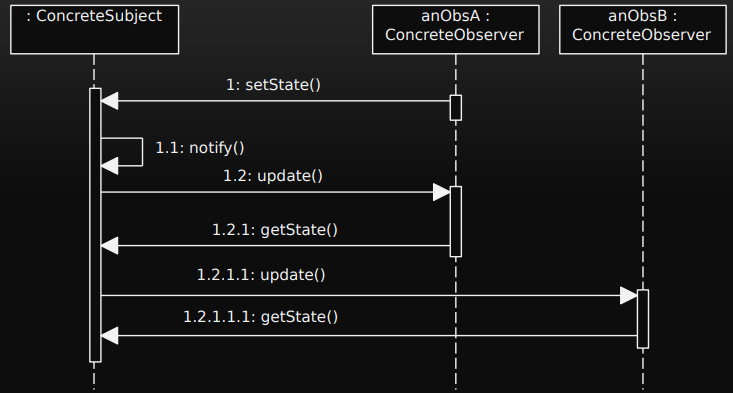

#### Applicability

Use the Observer pattern in any of the following situations:

- When an abstraction has two aspects, one dependent on the other.
  - Encapsulating these aspects in separate objects lets you vary and reuse them independently.
- When a change to one object requires changing others
- When an object should be able to notify other objects  you don't want these objects tightly coupled.

#### Consequences

- Abstract coupling between Subject and Observer.
  - All a subject knows is that it has a list of observers, each conforming to the simple interface of the abstract Observer class.
- Support for broadcast communication.
- Unexpected updates

### Visitor Pattern

Visitor is a behavioral design pattern that lets you separate algorithms from the objects on which they operate.

The Visitor pattern suggests that you place the new behavior into a separate class called visitor, instead of trying to integrate it into existing classes.

The original object that had to perform the behavior is now passed to one of the visitor’s methods as an argument, providing the method access to all necessary data contained within the object.

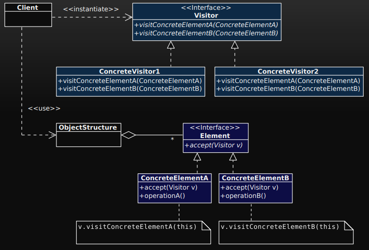

**The Visitor** interface declares a set of visiting methods that can take concrete elements of an object structure as arguments.

Each **Concrete Visitor** implements several versions of the same behaviors, tailored for different concrete element classes.

**The Element** interface declares a method for “accepting” visitors. This method should have one parameter declared with the type of the visitor interface.

Each **Concrete Element** must implement the acceptance method.

- The purpose of this method is to redirect the call to the proper visitor’s method corresponding to the current element class.

**The Client** usually represents a collection or some other complex object

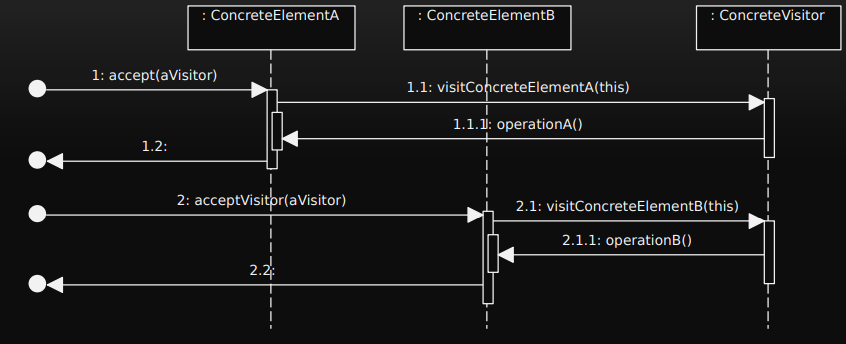

#### Process

1. I want to apply behaviour, i instantiate Visitor that implements this behaviour and call accept method of ConcreteElementA.
2. ConcreteElementsA calls visicConcreteElementA of ConcreteVisitor
3. ConcreteVisitor visits and perform operation specific for ConcreteElementA "operationA"

#### Applicability

Use the Visitor pattern when

- an object structure contains many classes of objects with differing interfaces, and you want to perform operations on these objects that depend on their concrete classes.
- many distinct and unrelated operations need to be performed on objects in an object structure, and you want to avoid "polluting" their classes with these operations.
- the classes defining the object structure rarely change, but you often want to define new operations over the structure.

#### Consequences

- Visitor makes adding new operations easy
- A visitor gathers related operations and separates unrelated ones.
- Adding new ConcreteElement classes is hard.
- Visiting across class hierarchies.
  - Visitor can visit objects that don't have a common parent class.
  - You can add any type of object to a Visitor interface
- Accumulating state
- Breaking encapsulation
